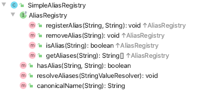
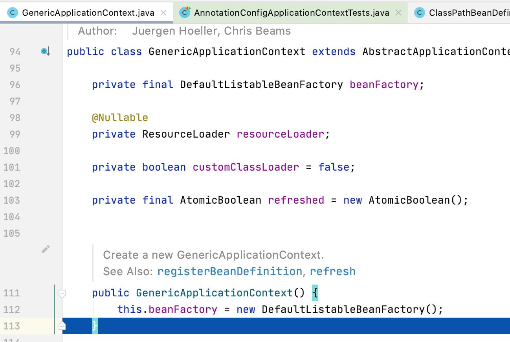

# AnnotationConfigApplicationContext

从上面可以看出 Spring boot中

默认模式使用的context是这个—>AnnotationConfigApplicationContext，

SERVLET模式使用的context --->  AnnotationConfigServletWebServerApplicationContext，

REACTIVE模式使用的context—>AnnotationConfigReactiveWebServerApplicationContext

。

其中AnnotationConfigApplicationContext是spring-framework的，其它的都是spring-boot拓展的context。

所有的web都会实现这个接口ConfigurableWebApplicationContext。


AnnotationConfigServletWebServerApplicationContext 是继承是spring-framework的GenericApplicationContext实现的。

AnnotationConfigReactiveWebServerApplicationContext 是继承spring-framework的GenericWebApplicationContext实现的。


我们先看：AnnotationConfigApplicationContext类。

我找到 `AnnotationConfigApplicationContextTests` 来看看。

例子一：

```java
class AnnotationConfigApplicationContextTests {

	@Test
	void scanAndRefresh() {
		AnnotationConfigApplicationContext context = new AnnotationConfigApplicationContext();
		context.scan("org.springframework.context.annotation6");
		context.refresh();

		context.getBean(uncapitalize(ConfigForScanning.class.getSimpleName()));
		context.getBean("testBean"); // contributed by ConfigForScanning
		context.getBean(uncapitalize(ComponentForScanning.class.getSimpleName()));
		context.getBean(uncapitalize(Jsr330NamedForScanning.class.getSimpleName()));
		Map<String, Object> beans = context.getBeansWithAnnotation(Configuration.class);
		assertThat(beans).hasSize(1);
	}
```

这里先介绍`uncapitalize` 方法：

```java
	public static String capitalize(String str) {
		return changeFirstCharacterCase(str, true);
	}

	//Uncapitalize一个String ，改变第一个字母为小写按照Character.toLowerCase(char) 。 没有其他的字母改变
	public static String uncapitalize(String str) {
		return changeFirstCharacterCase(str, false);
	}
```

这个方法以后可能会用得到记下来。

回归这个测试用例：

居然有这么骚的用法：`Map<String, Object> beans = context.getBeansWithAnnotation(Configuration.class);` 记一下，后面来看这个是怎么实现的。

第一步：

```java
AnnotationConfigApplicationContext context = new AnnotationConfigApplicationContext();
```

先看看这个类的继承体系。


比较一下前面的ClassPathXmlApplicationContext 的继承体系。


两者都是AbstractApplicationContext的继承者。那么我们重点研究GenericApplicationContext和AnnotationConfigApplicationContext。

先看看AnnotationConfigApplicationContext方法。

```java

	/**
	 * Create a new AnnotationConfigApplicationContext that needs to be populated
	 * through {@link #register} calls and then manually {@linkplain #refresh refreshed}.
	 */
	public AnnotationConfigApplicationContext() {
		this.reader = new AnnotatedBeanDefinitionReader(this);
		this.scanner = new ClassPathBeanDefinitionScanner(this);
	}
```

不明白这里怎么使用this的同学可以到看看我前面的文章。

这里的this相当于new GenericApplicationContext()。（GenericApplicationContext是AnnotationConfigApplicationContext的父类。）

```java

	/**
	 * Create a new GenericApplicationContext.
	 * @see #registerBeanDefinition
	 * @see #refresh
	 */
	public GenericApplicationContext() {
		this.beanFactory = new DefaultListableBeanFactory();
	}
```

这里很快就遇到了我们前面的beanfactory体系。

所以这里创建的是一个  DefaultListableBeanFactory 对象。

我们回头看看DefaultListableBeanFactory 对接继承体系。


抛开接口不看，我们先只看class。


# SimpleAliasRegistery

`SimpleAliasRegistry` 简单别名注册。

```java
public class SimpleAliasRegistry implements AliasRegistry {
    
    private final Map<String, String> aliasMap = new ConcurrentHashMap<>(16); //这个差不多是最重要的map，整个类都是对这个map进行操作。
```

整个beanfactory都是对map进行操作，这是我们接触的第一map。

了解这个的时候，我往往想的是作者想实现一个什么样的功能。

如注解所说。

```java

/**
 * Simple implementation of the {@link AliasRegistry} interface.
 * <p>Serves as base class for
 * {@link org.springframework.beans.factory.support.BeanDefinitionRegistry}
 * implementations.
 * 
 */
public class SimpleAliasRegistry implements AliasRegistry {
   
```

这个类只是AliasRegistry interface的简单实现，为的是做BeanDefinitionRegistry 的基类。大白话说就是在这里实现了这个AilasRegistry interface的一些功能，在BeanDefinitionRegistry中就可以不用实现了。

换句话说别名注册的逻辑就在这个class中。

然后我们具体看下面一共有：


7个方法。我们一起看看：

```java
	// 这个方法应该是整个别名注册类中最重要的方法。
	@Override
	public void registerAlias(String name, String alias) {
		Assert.hasText(name, "'name' must not be empty");
		Assert.hasText(alias, "'alias' must not be empty");
		//ConcurrentHashMap为什么还要synchronized
		/*
		 * aliasMap已经定义为ConcurrentHashMap，而ConcurrentHashMap是线程安全的，那为什么还要synchronized ？
		 * 原因是aliasMap只能保证 this.aliasMap.remove(alias)的操作的原子性，
		 * 不能保证如下复合操作的原子性，也就不能保证如下代码的线程安全。
		 */
		synchronized (this.aliasMap) {
			if (alias.equals(name)) {
				// 别名和bean的名称两个名字相同，则不需要处理并删除原有别名。
				// 如果有别的bean取了这个名字，是不是会把别的bean的这个别名给取消掉？经过实验，确实会被取消掉

				this.aliasMap.remove(alias);
				if (logger.isDebugEnabled()) {
					logger.debug("Alias definition '" + alias + "' ignored since it points to same name");
				}
			}
			else {
				String registeredName = this.aliasMap.get(alias);
				if (registeredName != null) {
					if (registeredName.equals(name)) {
						// An existing alias - no need to re-register
						return;
					}
					// alias 处理，如果设置了不允许覆盖则抛出异常。
					if (!allowAliasOverriding()) {
						throw new IllegalStateException("Cannot define alias '" + alias + "' for name '" +
								name + "': It is already registered for name '" + registeredName + "'.");
					}
					if (logger.isDebugEnabled()) {
						logger.debug("Overriding alias '" + alias + "' definition for registered name '" +
								registeredName + "' with new target name '" + name + "'");
					}
				}
				//alias循环检查。当   A->B 存在时，如果载出出现 A -> C -> B 的时候，则会抛出异常。
				checkForAliasCircle(name, alias);
				//注册alias
				this.aliasMap.put(alias, name);
				if (logger.isTraceEnabled()) {
					logger.trace("Alias definition '" + alias + "' registered for name '" + name + "'");
				}
			}
		}
	}
```

上面说到alias的circle 依赖，这是怎么回事呢？

这里看两个例子：

```java
@Test
void aliasChaining() {
    SimpleAliasRegistry registry = new SimpleAliasRegistry();
    registry.registerAlias("test", "testAlias");
    registry.registerAlias("testAlias", "testAlias2");
    registry.registerAlias("testAlias2", "testAlias3");

    assertThat(registry.hasAlias("test", "testAlias")).isTrue();
    assertThat(registry.hasAlias("test", "testAlias2")).isTrue();
    assertThat(registry.hasAlias("test", "testAlias3")).isTrue();
    assertThat(registry.canonicalName("testAlias")).isEqualTo("test");
    assertThat(registry.canonicalName("testAlias2")).isEqualTo("test");
    assertThat(registry.canonicalName("testAlias3")).isEqualTo("test");
}

@Test  // SPR-17191
void aliasChainingWithMultipleAliases() {
    SimpleAliasRegistry registry = new SimpleAliasRegistry();
    registry.registerAlias("name", "alias_a");
    registry.registerAlias("name", "alias_b");
    assertThat(registry.hasAlias("name", "alias_a")).isTrue();
    assertThat(registry.hasAlias("name", "alias_b")).isTrue();

    registry.registerAlias("real_name", "name");
    assertThat(registry.hasAlias("real_name", "name")).isTrue();
    assertThat(registry.hasAlias("real_name", "alias_a")).isTrue();
    assertThat(registry.hasAlias("real_name", "alias_b")).isTrue();

    registry.registerAlias("name", "alias_c");
    assertThat(registry.hasAlias("real_name", "name")).isTrue();
    assertThat(registry.hasAlias("real_name", "alias_a")).isTrue();
    assertThat(registry.hasAlias("real_name", "alias_b")).isTrue();
    assertThat(registry.hasAlias("real_name", "alias_c")).isTrue();
}
```

这两个例子的意思是：如果我test 别名为 testAlias，testAlias别名为testAlias2， 那么是否test是否有别名testAlias2呢？答案是肯定的。

那如果我有name的别名是alias_a，alias_b；那么有real_name的别名为name，是否real_name也有alias_a，alias_b的别名呢？答案是肯定的。

spring要处理的情况非常多，所以设计都很巧妙。实现上面的功能它很复杂。只是在查询是否有这个依赖的时候做了多了一步，增加了查询的复杂度。

```java
/**
	 * 巧妙判断循环依赖的方法<br/>
	 * Determine whether the given name has the given alias registered.
	 * @param name the name to check
	 * @param alias the alias to look for
	 * @since 4.2.1
	 */
public boolean hasAlias(String name, String alias) {
    String registeredName = this.aliasMap.get(alias);
    return ObjectUtils.nullSafeEquals(registeredName, name) || (registeredName != null
                                                                && hasAlias(name, registeredName));
}
```

最重要的是ObjectUtils.nullSafeEquals(registeredName, name) || (registeredName != null && hasAlias(name, registeredName));

这个语句后面的|| 条件接的是如果registerName！=null，则问问name是否有registerName。一直循环找下去。代码简洁，业务上讲alias也不会很深，这个实现确实漂亮。

另外就是

```java
/**
	 * 这里应该是有一种思路，关于这个alias对象的修改，都交给到这里，不会让逻辑流落到别处。 <br/>
	 * aliasMap对有占位符的registerName和alias的策略应该是先put，后面再解析，即后面就会调用这个方法，统一把整个结果集解析了。
	 *
	 * Resolve all alias target names and aliases registered in this
	 * registry, applying the given {@link StringValueResolver} to them.
	 * <p>The value resolver may for example resolve placeholders
	 * in target bean names and even in alias names.
	 * @param valueResolver the StringValueResolver to apply
	 */
	public void resolveAliases(StringValueResolver valueResolver) {
		Assert.notNull(valueResolver, "StringValueResolver must not be null");
		synchronized (this.aliasMap) {
			Map<String, String> aliasCopy = new HashMap<>(this.aliasMap);
			aliasCopy.forEach((alias, registeredName) -> {
				String resolvedAlias = valueResolver.resolveStringValue(alias);
				String resolvedName = valueResolver.resolveStringValue(registeredName);
				if (resolvedAlias == null || resolvedName == null || resolvedAlias.equals(resolvedName)) {
					this.aliasMap.remove(alias);
				}
				else if (!resolvedAlias.equals(alias)) {
					String existingName = this.aliasMap.get(resolvedAlias);
					if (existingName != null) {
						if (existingName.equals(resolvedName)) {
							// Pointing to existing alias - just remove placeholder
							this.aliasMap.remove(alias);
							return;
						}
						throw new IllegalStateException(
								"Cannot register resolved alias '" + resolvedAlias + "' (original: '" + alias +
								"') for name '" + resolvedName + "': It is already registered for name '" +
								registeredName + "'.");
					}
					checkForAliasCircle(resolvedName, resolvedAlias);
					this.aliasMap.remove(alias);
					this.aliasMap.put(resolvedAlias, resolvedName);
				}
				else if (!registeredName.equals(resolvedName)) {
					this.aliasMap.put(alias, resolvedName);
				}
			});
		}
	}
```

这个方法比较巧妙了，首先：这里应该是有一种思路，关于这个alias对象的修改，都交给到这里，不会让逻辑流落到别处。aliasMap对有占位符的registerName和alias的策略应该是先put，后面再解析，即后面就会调用这个方法，统一把整个结果集解析了。


# DefaultSingletonBeanRegistry

然后我们看DefaultSingletonBeanRegistry类。


我们先用这个例子来看看整个方法：

```java
@Test
public void testSingletons() {
    DefaultSingletonBeanRegistry beanRegistry = new DefaultSingletonBeanRegistry();

    TestBean tb = new TestBean();
    beanRegistry.registerSingleton("tb", tb);
    assertThat(beanRegistry.getSingleton("tb")).isSameAs(tb);

    TestBean tb2 = (TestBean) beanRegistry.getSingleton("tb2", new ObjectFactory<Object>() {
        @Override
        public Object getObject() throws BeansException {
            return new TestBean();
        }
    });
    assertThat(beanRegistry.getSingleton("tb2")).isSameAs(tb2);

    assertThat(beanRegistry.getSingleton("tb")).isSameAs(tb);
    assertThat(beanRegistry.getSingleton("tb2")).isSameAs(tb2);
    assertThat(beanRegistry.getSingletonCount()).isEqualTo(2);
    String[] names = beanRegistry.getSingletonNames();
    assertThat(names.length).isEqualTo(2);
    assertThat(names[0]).isEqualTo("tb");
    assertThat(names[1]).isEqualTo("tb2");

    beanRegistry.destroySingletons();
    assertThat(beanRegistry.getSingletonCount()).isEqualTo(0);
    assertThat(beanRegistry.getSingletonNames().length).isEqualTo(0);
}
```

这个用例非常简单，都是非常重要。

```java
DefaultSingletonBeanRegistry beanRegistry = new DefaultSingletonBeanRegistry();

TestBean tb = new TestBean();
beanRegistry.registerSingleton("tb", tb);
assertThat(beanRegistry.getSingleton("tb")).isSameAs(tb);
```

上面这个实现比较简单，如果我们自己单想也很容易想出来：只是往一个map中put数据就好。

```java
// spring 将容器视为缓存，不过确实是个缓存，这里分三个缓存。

/** Cache of singleton objects: bean name to bean instance. */
private final Map<String, Object> singletonObjects = new ConcurrentHashMap<>(256);

/** Cache of singleton factories: bean name to ObjectFactory. */
private final Map<String, ObjectFactory<?>> singletonFactories = new HashMap<>(16);

/** Cache of early singleton objects: bean name to bean instance. */
private final Map<String, Object> earlySingletonObjects = new HashMap<>(16);

/** Set of registered singletons, containing the bean names in registration order. */
private final Set<String> registeredSingletons = new LinkedHashSet<>(256);

@Override
public void registerSingleton(String beanName, Object singletonObject) throws IllegalStateException {
    Assert.notNull(beanName, "Bean name must not be null");
    Assert.notNull(singletonObject, "Singleton object must not be null");
    synchronized (this.singletonObjects) {
        Object oldObject = this.singletonObjects.get(beanName);
        if (oldObject != null) {
            throw new IllegalStateException("Could not register object [" + singletonObject +
                                            "] under bean name '" + beanName + "': there is already object [" + oldObject + "] bound");
        }
        addSingleton(beanName, singletonObject);
    }
}

/**
	 * Add the given singleton object to the singleton cache of this factory.
	 * <p>To be called for eager registration of singletons.
	 * @param beanName the name of the bean
	 * @param singletonObject the singleton object
	 */
protected void addSingleton(String beanName, Object singletonObject) {
    synchronized (this.singletonObjects) {
        this.singletonObjects.put(beanName, singletonObject);
        this.singletonFactories.remove(beanName);
        this.earlySingletonObjects.remove(beanName);
        this.registeredSingletons.add(beanName);
    }
}
```

spring要处理的情况很多，所以容器也有点多，也确实和我们想的一样：往map的里面put数据，上面的代码就是singletonObjects。spring 将容器视为缓存，不过确实是个缓存，这里分三个缓存。这三个cache的顺序从上面的addSingleton，我可以判断singletonObjects是最后put的，singletonObjects进行put之后，singletonFactories，earlySingletonObjects就得remove了。

```java
@Override
@Nullable
public Object getSingleton(String beanName) {
    return getSingleton(beanName, true);
}

/**
	 * Return the (raw) singleton object registered under the given name.
	 * <p>Checks already instantiated singletons and also allows for an early
	 * reference to a currently created singleton (resolving a circular reference).
	 * @param beanName the name of the bean to look for
	 * @param allowEarlyReference whether early references should be created or not
	 * @return the registered singleton object, or {@code null} if none found
	 */
@Nullable
protected Object getSingleton(String beanName, boolean allowEarlyReference) {
    Object singletonObject = this.singletonObjects.get(beanName);
    if (singletonObject == null && isSingletonCurrentlyInCreation(beanName)) { // 首先如果能直接get到对象就返回，否则看看这个对象是否正在销毁，如果不是则进入如下逻辑。
        synchronized (this.singletonObjects) {
            singletonObject = this.earlySingletonObjects.get(beanName); // 看看提前暴露的对象之中是否有这个对象，有则返回。
            if (singletonObject == null && allowEarlyReference) {
                ObjectFactory<?> singletonFactory = this.singletonFactories.get(beanName); // 如果上面两个缓存都没有则去最后一个cache访问，如果它有，那么factory创建一个对象，然后put进earlySingletonObjects中，并且把自己销毁。
                if (singletonFactory != null) {
                    singletonObject = singletonFactory.getObject();
                    this.earlySingletonObjects.put(beanName, singletonObject);
                    this.singletonFactories.remove(beanName);
                }
            }
        }
    }
    return singletonObject;
}
	

// singletonsCurrentlyInCreation 为销毁容器。
/** Names of beans that are currently in creation. */
private final Set<String> singletonsCurrentlyInCreation =
    Collections.newSetFromMap(new ConcurrentHashMap<>(16));
/**
	 * Return whether the specified singleton bean is currently in creation
	 * (within the entire factory).
	 * @param beanName the name of the bean
	 */
public boolean isSingletonCurrentlyInCreation(String beanName) {
    // singletonsCurrentlyInCreation为销毁容器。判断对象是否正在销毁就看这里是否有这个对象。
    return this.singletonsCurrentlyInCreation.contains(beanName);
}
```

如果只是简单的获取某个bean，map.get()就好了，但是不是：首先如果能直接get到对象就返回，否则看看这个对象是否正在销毁，如果不是则进入如下逻辑。

singletonsCurrentlyInCreation为销毁容器，判断对象是否正在销毁就看这里是否有这个对象。

回忆我们之间说的singletonObjects，singletonFactories，earlySingletonObjects三个map，通过`getSingleton` 想一下是不是这个获取方式是不是非常像cache的访问方式，如下图。按这种理解，就可以了解为什么上面的spring官方注解是cache了。而且通过getSingleton我们可以判断：三个缓存里面的key是互斥的。


然后我们看上面测试用例的第二段代码

```java
TestBean tb2 = (TestBean) beanRegistry.getSingleton("tb2", new ObjectFactory<Object>() {
    @Override
    public Object getObject() throws BeansException {
        return new TestBean();
    }
});
assertThat(beanRegistry.getSingleton("tb2")).isSameAs(tb2);
```

其实从调用方式上就能猜出：这个方法是调用看看有没有tb2这个bean，没有就创建一个。

```java
/**
	 * Return the (raw) singleton object registered under the given name,
	 * creating and registering a new one if none registered yet.
	 * 通过给的name返回一个singleton对象，如果没有就创建一个。
	 */
public Object getSingleton(String beanName, ObjectFactory<?> singletonFactory) {
    Assert.notNull(beanName, "Bean name must not be null");
    synchronized (this.singletonObjects) {
        Object singletonObject = this.singletonObjects.get(beanName);
        if (singletonObject == null) {
            if (this.singletonsCurrentlyInDestruction) {
                throw new BeanCreationNotAllowedException(beanName,
                                                          "Singleton bean creation not allowed while singletons of this factory are in destruction " +
                                                          "(Do not request a bean from a BeanFactory in a destroy method implementation!)");
            }
            if (logger.isDebugEnabled()) {
                logger.debug("Creating shared instance of singleton bean '" + beanName + "'");
            }
            beforeSingletonCreation(beanName); //检查是否这个bean之前就创建出错了，如果是之前就创建出错了，则直接抛出异常。
            boolean newSingleton = false;
            boolean recordSuppressedExceptions = (this.suppressedExceptions == null);
            if (recordSuppressedExceptions) { // 压制异常
                this.suppressedExceptions = new LinkedHashSet<>();
            }
            try {
                singletonObject = singletonFactory.getObject();  // 创建对象。
                newSingleton = true;
            }
            catch (IllegalStateException ex) {
                // Has the singleton object implicitly appeared in the meantime ->
                // if yes, proceed with it since the exception indicates that state.
                // 如果对象没有出现在singletonObjects中，则抛出异常，否则bean可能被别的线程已经创建成功。
                singletonObject = this.singletonObjects.get(beanName);
                if (singletonObject == null) {
                    throw ex;
                }
            }
            catch (BeanCreationException ex) {
                //收集异常，这里可以学习一下exception的处理方式： suppressedExceptions。
                if (recordSuppressedExceptions) {
                    for (Exception suppressedException : this.suppressedExceptions) {
                        ex.addRelatedCause(suppressedException);
                    }
                }
                throw ex;
            }
            finally {
                if (recordSuppressedExceptions) {
                    this.suppressedExceptions = null;
                }
                afterSingletonCreation(beanName); //再检查是否这个bean之前就创建出错了，就删除创建异常。
            }
            if (newSingleton) {
                addSingleton(beanName, singletonObject);
            }
        }
        return singletonObject;
    }
}

/**
	 * Callback before singleton creation.
	 * <p>The default implementation register the singleton as currently in creation.
	 * @param beanName the name of the singleton about to be created
	 * @see #isSingletonCurrentlyInCreation
	 */
protected void beforeSingletonCreation(String beanName) {
    if (!this.inCreationCheckExclusions.contains(beanName) && !this.singletonsCurrentlyInCreation.add(beanName)) {
        throw new BeanCurrentlyInCreationException(beanName);
    }
}

/**
	 * Callback after singleton creation.
	 * <p>The default implementation marks the singleton as not in creation anymore.
	 * @param beanName the name of the singleton that has been created
	 * @see #isSingletonCurrentlyInCreation
	 */
protected void afterSingletonCreation(String beanName) {
    if (!this.inCreationCheckExclusions.contains(beanName) && !this.singletonsCurrentlyInCreation.remove(beanName)) {
        throw new IllegalStateException("Singleton '" + beanName + "' isn't currently in creation");
    }
}
```

上面的代码虽然很长，也只是一些检查而已，而且只是对singletonObjects对象操作，其实较为简单。

```java
assertThat(beanRegistry.getSingleton("tb")).isSameAs(tb);
assertThat(beanRegistry.getSingleton("tb2")).isSameAs(tb2);
assertThat(beanRegistry.getSingletonCount()).isEqualTo(2);
String[] names = beanRegistry.getSingletonNames();
assertThat(names.length).isEqualTo(2);
assertThat(names[0]).isEqualTo("tb");
assertThat(names[1]).isEqualTo("tb2");

beanRegistry.destroySingletons();
assertThat(beanRegistry.getSingletonCount()).isEqualTo(0);
assertThat(beanRegistry.getSingletonNames().length).isEqualTo(0);
```

beanRegistry.getSingletonCount() 对象统计较为简单：

```java
@Override
public int getSingletonCount() {
    synchronized (this.singletonObjects) {
        return this.registeredSingletons.size();
    }
}
```

回忆一下registeredSingletons的定义如下：

```java
/** Set of registered singletons, containing the bean names in registration order. */
private final Set<String> registeredSingletons = new LinkedHashSet<>(256);
```

它的使用也非常简单：


起着统计的功能。

销毁方法有一个点比较麻烦：就是应该spring bean之间是可以互相依赖的，则销毁一个bean，那么依赖这个bean的其它bean也需要销毁，这个过程比较复杂。主要是对四个对象进行操作：singletonObjects、singletonFactories、earlySingletonObjects、registeredSingletons。我们可以称为spring单例容器四杰。要理解下面的内容，需要理解什么是disposableBean，我们后面会有补充，这些遇到了，就先讲这部分，后面可以回头看这部分内容。

```java
public void destroySingletons() {
    if (logger.isTraceEnabled()) {
        logger.trace("Destroying singletons in " + this);
    }
    synchronized (this.singletonObjects) {
        // 防止这个线程在销毁对象的时候，某个线程在创建对象。
        this.singletonsCurrentlyInDestruction = true;
    }

    String[] disposableBeanNames;
    synchronized (this.disposableBeans) { // 为了线程安全
        // 看看disposableBeans容器中有哪些disposableBean
        disposableBeanNames = StringUtils.toStringArray(this.disposableBeans.keySet());
    }
    for (int i = disposableBeanNames.length - 1; i >= 0; i--) {
        destroySingleton(disposableBeanNames[i]); // 一个一个销毁。因为不知道那些bean依赖那些bean，而且销毁的时候，如果bean是disposableBean，则需要调用bean的destory方法，所以不能直接clear那么轻松。
    }

    this.containedBeanMap.clear();
    this.dependentBeanMap.clear();
    this.dependenciesForBeanMap.clear();

    clearSingletonCache();
}

/**
	 * Clear all cached singleton instances in this registry.
	 * @since 4.3.15
	 */
protected void clearSingletonCache() {
    synchronized (this.singletonObjects) {
        this.singletonObjects.clear();
        this.singletonFactories.clear();
        this.earlySingletonObjects.clear();
        this.registeredSingletons.clear();
        this.singletonsCurrentlyInDestruction = false;
    }
}

/**
	 * Destroy the given bean. Delegates to {@code destroyBean}
	 * if a corresponding disposable bean instance is found.
	 * @param beanName the name of the bean
	 * @see #destroyBean
	 */
public void destroySingleton(String beanName) {
    // Remove a registered singleton of the given name, if any.
    removeSingleton(beanName);

    // Destroy the corresponding DisposableBean instance.
    DisposableBean disposableBean;
    synchronized (this.disposableBeans) {
        // 出栈
        disposableBean = (DisposableBean) this.disposableBeans.remove(beanName);
    }
    destroyBean(beanName, disposableBean);
}

/**
	 * Remove the bean with the given name from the singleton cache of this factory,
	 * to be able to clean up eager registration of a singleton if creation failed.
	 * @param beanName the name of the bean
	 * @see #getSingletonMutex()
	 */
protected void removeSingleton(String beanName) {
    synchronized (this.singletonObjects) {
        this.singletonObjects.remove(beanName);
        this.singletonFactories.remove(beanName);
        this.earlySingletonObjects.remove(beanName);
        this.registeredSingletons.remove(beanName);
    }
}

/**
	 * Destroy the given bean. Must destroy beans that depend on the given
	 * bean before the bean itself. Should not throw any exceptions.
	 * @param beanName the name of the bean
	 * @param bean the bean instance to destroy
	 */
protected void destroyBean(String beanName, @Nullable DisposableBean bean) {
    // Trigger destruction of dependent beans first...
    Set<String> dependencies;
    synchronized (this.dependentBeanMap) {
        // Within full synchronization in order to guarantee a disconnected Set
        // 看看这个bean有多少bean依赖它，拿出来一个一个得销毁。
        dependencies = this.dependentBeanMap.remove(beanName);
    }
    if (dependencies != null) {
        if (logger.isTraceEnabled()) {
            logger.trace("Retrieved dependent beans for bean '" + beanName + "': " + dependencies);
        }
        for (String dependentBeanName : dependencies) {
            // 一个一个销毁依赖这个bean的其它bean
            destroySingleton(dependentBeanName);
        }
    }

    // Actually destroy the bean now...
    // 这里开始真正开始销毁bean
    if (bean != null) {
        try {
            // 调用bean的destory方法。
            bean.destroy();
        }
        catch (Throwable ex) {
            if (logger.isWarnEnabled()) {
                logger.warn("Destruction of bean with name '" + beanName + "' threw an exception", ex);
            }
        }
    }

    // Trigger destruction of contained beans...
    // 看看这个containedBeanMap包含了什么bean，销毁包含的bean。
    Set<String> containedBeans;
    synchronized (this.containedBeanMap) {
        // Within full synchronization in order to guarantee a disconnected Set
        containedBeans = this.containedBeanMap.remove(beanName);
    }
    if (containedBeans != null) {
        for (String containedBeanName : containedBeans) {
            destroySingleton(containedBeanName);
        }
    }

    // Remove destroyed bean from other beans' dependencies.
    // 删除对应的bean，从别的依赖。
    synchronized (this.dependentBeanMap) {
        for (Iterator<Map.Entry<String, Set<String>>> it = this.dependentBeanMap.entrySet().iterator(); it.hasNext();) {
            Map.Entry<String, Set<String>> entry = it.next();
            Set<String> dependenciesToClean = entry.getValue();
            dependenciesToClean.remove(beanName);
            if (dependenciesToClean.isEmpty()) {
                it.remove();
            }
        }
    }

    // Remove destroyed bean's prepared dependency information.
    this.dependenciesForBeanMap.remove(beanName);
}
```

销毁的bean如果是disposableBean，则需要一个一个销毁。因为不知道那些bean依赖那些bean，而且销毁的时候，需要调用bean的destory方法，所以不能直接clear那么轻松。

然后我们再看看第二个测试用例：

```java
@Test
public void testDisposableBean() {
    DefaultSingletonBeanRegistry beanRegistry = new DefaultSingletonBeanRegistry();

    DerivedTestBean tb = new DerivedTestBean();
    beanRegistry.registerSingleton("tb", tb);
    beanRegistry.registerDisposableBean("tb", tb);
    assertThat(beanRegistry.getSingleton("tb")).isSameAs(tb);

    assertThat(beanRegistry.getSingleton("tb")).isSameAs(tb);
    assertThat(beanRegistry.getSingletonCount()).isEqualTo(1);
    String[] names = beanRegistry.getSingletonNames();
    assertThat(names.length).isEqualTo(1);
    assertThat(names[0]).isEqualTo("tb");
    assertThat(tb.wasDestroyed()).isFalse();

    beanRegistry.destroySingletons();
    assertThat(beanRegistry.getSingletonCount()).isEqualTo(0);
    assertThat(beanRegistry.getSingletonNames().length).isEqualTo(0);
    assertThat(tb.wasDestroyed()).isTrue();
}

```

`Disposable` 这里理解为可丢弃的好一点。下面的代码很简单：

```java

/**
	 * Add the given bean to the list of disposable beans in this registry.
	 * <p>Disposable beans usually correspond to registered singletons,
	 * matching the bean name but potentially being a different instance
	 * (for example, a DisposableBean adapter for a singleton that does not
	 * naturally implement Spring's DisposableBean interface).
	 * @param beanName the name of the bean
	 * @param bean the bean instance
	 */
public void registerDisposableBean(String beanName, DisposableBean bean) {
    synchronized (this.disposableBeans) {
        this.disposableBeans.put(beanName, bean);
    }
}
```

为什么还要创建一个disposableBeans 容器呢？

```java
/** Disposable bean instances: bean name to disposable instance. */
private final Map<String, Object> disposableBeans = new LinkedHashMap<>();
```

先介绍一下一个interface

```java
public interface DisposableBean {
	void destroy() throws Exception;
}
```

再看看DerivedTestBean的实现：

```java
public class DerivedTestBean implements DisposableBean {
	private boolean destroyed;
    @Override
	public void destroy() {
		this.destroyed = true;
	}

	public boolean wasDestroyed() {
		return destroyed;
	}
}
```

结合上面的destroySingletons方法，这个用例想表达的东西很明确了：

**如果注册的bean实现了DisposableBean接口，并且调用registerDisposableBean（这一步应该会在子类中进行）。那么销毁这个bean的时候，会帮我们调用destroy方法。**

那么我们想删除某个bean的时候，帮我们触发某些方法，就有方法了：实现DisposableBean接口即可。

接下来就会接触创建bean最复杂的部分：

循环依赖注册：

看下面的用例：

```java
@Test
public void testDependentRegistration() {
    DefaultSingletonBeanRegistry beanRegistry = new DefaultSingletonBeanRegistry();

    beanRegistry.registerDependentBean("a", "b");
    beanRegistry.registerDependentBean("b", "c");
    beanRegistry.registerDependentBean("c", "b");
    assertThat(beanRegistry.isDependent("a", "b")).isTrue();
    assertThat(beanRegistry.isDependent("b", "c")).isTrue();
    assertThat(beanRegistry.isDependent("c", "b")).isTrue();
    assertThat(beanRegistry.isDependent("a", "c")).isTrue();
    assertThat(beanRegistry.isDependent("c", "a")).isFalse();
    assertThat(beanRegistry.isDependent("b", "a")).isFalse();
    assertThat(beanRegistry.isDependent("a", "a")).isFalse();
    assertThat(beanRegistry.isDependent("b", "b")).isTrue();
    assertThat(beanRegistry.isDependent("c", "c")).isTrue();
}
```

先看看`registerDependentBean` 

```java

	/** Map between dependent bean names: bean name to Set of dependent bean names. */
	private final Map<String, Set<String>> dependentBeanMap = new ConcurrentHashMap<>(64);

	/** Map between depending bean names: bean name to Set of bean names for the bean's dependencies. */
	private final Map<String, Set<String>> dependenciesForBeanMap = new ConcurrentHashMap<>(64);

	/**
	 * Register a dependent bean for the given bean,
	 * to be destroyed before the given bean is destroyed.
	 * @param beanName the name of the bean
	 * @param dependentBeanName the name of the dependent bean
	 */
	public void registerDependentBean(String beanName, String dependentBeanName) {
		String canonicalName = canonicalName(beanName); // 这个方法在SimpleAliasRegistry中提过，能根据beanName追溯到bean的原始bean id。

		synchronized (this.dependentBeanMap) { // 被依赖的bean集合
			Set<String> dependentBeans =
					this.dependentBeanMap.computeIfAbsent(canonicalName, k -> new LinkedHashSet<>(8));
			if (!dependentBeans.add(dependentBeanName)) {
				return;
			}
		}

		synchronized (this.dependenciesForBeanMap) { // 依赖的bean集合
			Set<String> dependenciesForBean =
					this.dependenciesForBeanMap.computeIfAbsent(dependentBeanName, k -> new LinkedHashSet<>(8));
			dependenciesForBean.add(canonicalName);
		}
	}
```

上面的方法其实很简单：beanName 放入bean依赖容器中，dependentBeanName被放入被依赖容器集中。

```java

	/**
	 * Determine whether the specified dependent bean has been registered as
	 * dependent on the given bean or on any of its transitive dependencies.
	 * @param beanName the name of the bean to check
	 * @param dependentBeanName the name of the dependent bean
	 * @since 4.0
	 */
	protected boolean isDependent(String beanName, String dependentBeanName) {
		synchronized (this.dependentBeanMap) {
			return isDependent(beanName, dependentBeanName, null);
		}
	}

	private boolean isDependent(String beanName, String dependentBeanName, @Nullable Set<String> alreadySeen) {
		if (alreadySeen != null && alreadySeen.contains(beanName)) { //第一次alreadySeen == null， alreadySeen是为了防止循环查询某个bean。
			return false;
		}
		String canonicalName = canonicalName(beanName); // 追溯根bean id
		Set<String> dependentBeans = this.dependentBeanMap.get(canonicalName); //到被依赖容器找出这个beanName被依赖的bean有哪些
		if (dependentBeans == null) {
			return false;
		}
		if (dependentBeans.contains(dependentBeanName)) {  // beanName有dependentBeanName的依赖节点。
			return true;
		}
		for (String transitiveDependency : dependentBeans) { //下面的代码是处理循环问被依赖的节点，是否子节点被dependentBeanName依赖。
			if (alreadySeen == null) {
				alreadySeen = new HashSet<>();
			}
			alreadySeen.add(beanName); // 不断往这个set里面添加beanName
			if (isDependent(transitiveDependency, dependentBeanName, alreadySeen)) {
				return true;
			}
		}
		return false;
	}

	/**
	 * Determine whether a dependent bean has been registered for the given name.
	 * @param beanName the name of the bean to check
	 */
	protected boolean hasDependentBean(String beanName) {
		return this.dependentBeanMap.containsKey(beanName);
	}

	/**
	 * Return the names of all beans which depend on the specified bean, if any.
	 * @param beanName the name of the bean
	 * @return the array of dependent bean names, or an empty array if none
	 */
	public String[] getDependentBeans(String beanName) {
		Set<String> dependentBeans = this.dependentBeanMap.get(beanName);
		if (dependentBeans == null) {
			return new String[0];
		}
		synchronized (this.dependentBeanMap) {
			return StringUtils.toStringArray(dependentBeans);
		}
	}

	/**
	 * Return the names of all beans that the specified bean depends on, if any.
	 * @param beanName the name of the bean
	 * @return the array of names of beans which the bean depends on,
	 * or an empty array if none
	 */
	public String[] getDependenciesForBean(String beanName) {
		Set<String> dependenciesForBean = this.dependenciesForBeanMap.get(beanName);
		if (dependenciesForBean == null) {
			return new String[0];
		}
		synchronized (this.dependenciesForBeanMap) {
			return StringUtils.toStringArray(dependenciesForBean);
		}
	}
```

从上面看出，循环依赖是有个alreadySeen的set在记录着哪些bean已经检查了。防止循环访问bean。主要是

看了上面重要的两个方法之后，再回头看这个用例。isDependent方法主要是对dependentBeanMap操作。

```java
@Test
public void testDependentRegistration() {
    DefaultSingletonBeanRegistry beanRegistry = new DefaultSingletonBeanRegistry();

    beanRegistry.registerDependentBean("a", "b");
    beanRegistry.registerDependentBean("b", "c");
    beanRegistry.registerDependentBean("c", "b");
    assertThat(beanRegistry.isDependent("a", "b")).isTrue();
    assertThat(beanRegistry.isDependent("b", "c")).isTrue();
    assertThat(beanRegistry.isDependent("c", "b")).isTrue();
    assertThat(beanRegistry.isDependent("a", "c")).isTrue();
    assertThat(beanRegistry.isDependent("c", "a")).isFalse();
    assertThat(beanRegistry.isDependent("b", "a")).isFalse();
    assertThat(beanRegistry.isDependent("a", "a")).isFalse();
    assertThat(beanRegistry.isDependent("b", "b")).isTrue();
    assertThat(beanRegistry.isDependent("c", "c")).isTrue();
}
```

总结：DefaultSingletonBeanRegistry的循环依赖是用两个bean操作的，dependentBeanMap和dependenciesForBean解决循环依赖。


# FactoryBeanRegistrySupport

在 DefaultSingletonBeanRegistry 的基础上增加了对FactoryBean的特殊处理功能！

```java
/*
 * Copyright 2002-2018 the original author or authors.
 *
 * Licensed under the Apache License, Version 2.0 (the "License");
 * you may not use this file except in compliance with the License.
 * You may obtain a copy of the License at
 *
 *      https://www.apache.org/licenses/LICENSE-2.0
 *
 * Unless required by applicable law or agreed to in writing, software
 * distributed under the License is distributed on an "AS IS" BASIS,
 * WITHOUT WARRANTIES OR CONDITIONS OF ANY KIND, either express or implied.
 * See the License for the specific language governing permissions and
 * limitations under the License.
 */

package org.springframework.beans.factory.support;

import java.security.AccessControlContext;
import java.security.AccessController;
import java.security.PrivilegedAction;
import java.security.PrivilegedActionException;
import java.security.PrivilegedExceptionAction;
import java.util.Map;
import java.util.concurrent.ConcurrentHashMap;

import org.springframework.beans.BeansException;
import org.springframework.beans.factory.BeanCreationException;
import org.springframework.beans.factory.BeanCurrentlyInCreationException;
import org.springframework.beans.factory.FactoryBean;
import org.springframework.beans.factory.FactoryBeanNotInitializedException;
import org.springframework.lang.Nullable;

/**
 * Support base class for singleton registries which need to handle
 * {@link org.springframework.beans.factory.FactoryBean} instances,
 * integrated with {@link DefaultSingletonBeanRegistry}'s singleton management.
 *
 * <br/>
 * 在 DefaultSingletonBeanRegistry 的基础上增加了对FactoryBean的特殊处理功能！
 *
 * <p>Serves as base class for {@link AbstractBeanFactory}.
 *
 * @author Juergen Hoeller
 * @since 2.5.1
 */
public abstract class FactoryBeanRegistrySupport extends DefaultSingletonBeanRegistry {

	/** Cache of singleton objects created by FactoryBeans: FactoryBean name to object. */
	// key: FactoryBean name, value: object
	// 比singletonFactories还要前的cache
	private final Map<String, Object> factoryBeanObjectCache = new ConcurrentHashMap<>(16);


	/**
	 * 获取bean type <br/>
	 * Determine the type for the given FactoryBean.
	 * @param factoryBean the FactoryBean instance to check
	 * @return the FactoryBean's object type,
	 * or {@code null} if the type cannot be determined yet
	 */
	@Nullable
	protected Class<?> getTypeForFactoryBean(final FactoryBean<?> factoryBean) {
		try {
			if (System.getSecurityManager() != null) {
				return AccessController.doPrivileged((PrivilegedAction<Class<?>>)
						factoryBean::getObjectType, getAccessControlContext());
			}
			else {
				return factoryBean.getObjectType();
			}
		}
		catch (Throwable ex) {
			// Thrown from the FactoryBean's getObjectType implementation.
			logger.info("FactoryBean threw exception from getObjectType, despite the contract saying " +
					"that it should return null if the type of its object cannot be determined yet", ex);
			return null;
		}
	}

	/**
	 * 获得factorybean对应的object，从factoryBeanObjectCache中 <br/>
	 * Obtain an object to expose from the given FactoryBean, if available
	 * in cached form. Quick check for minimal synchronization.
	 * @param beanName the name of the bean
	 * @return the object obtained from the FactoryBean,
	 * or {@code null} if not available
	 */
	@Nullable
	protected Object getCachedObjectForFactoryBean(String beanName) {
		return this.factoryBeanObjectCache.get(beanName);
	}

	/**
	 * 获得一个对象，从factorybean <br/>
	 * Obtain an object to expose from the given FactoryBean.
	 * @param factory the FactoryBean instance
	 * @param beanName the name of the bean
	 * @param shouldPostProcess whether the bean is subject to post-processing
	 * @return the object obtained from the FactoryBean
	 * @throws BeanCreationException if FactoryBean object creation failed
	 * @see org.springframework.beans.factory.FactoryBean#getObject()
	 */
	protected Object getObjectFromFactoryBean(FactoryBean<?> factory, String beanName, boolean shouldPostProcess) {
		if (factory.isSingleton() && containsSingleton(beanName)) {
			// 如果factory是单例，并且已经在singletonObjects容器（cache）中创建好了
			// containsSingleton看看是否在 this.singletonObjects.containsKey(beanName) 存在
			//  @Override
			//	public boolean org.springframework.beans.factory.support.DefaultSingletonBeanRegistry.containsSingleton(String beanName) {
			//		return this.singletonObjects.containsKey(beanName);
			//	}
			synchronized (getSingletonMutex()) {
				//  @Override
				//	public final Object getSingletonMutex() {
				//		return this.singletonObjects;
				//	}

				// factoryBeanObjectCache 中已经有factory bean了，表示已经实现了这个bean，直接返回。（为什么说实现了这个bean可以看后面的代码），这里算是一个double checking问题。
				Object object = this.factoryBeanObjectCache.get(beanName);
				if (object == null) {
					// 尝试使用factorybean创建对象
					object = doGetObjectFromFactoryBean(factory, beanName);
					// Only post-process and store if not put there already during getObject() call above
					// (e.g. because of circular reference processing triggered by custom getBean calls)
					// 在这里解决循环依赖的？？？
					Object alreadyThere = this.factoryBeanObjectCache.get(beanName);
					if (alreadyThere != null) {
						object = alreadyThere;
					}
					else {
						if (shouldPostProcess) {
							if (isSingletonCurrentlyInCreation(beanName)) { // 判断这个bean否则正在创建
								// Temporarily return non-post-processed object, not storing it yet..
								return object;
							}
							beforeSingletonCreation(beanName);
							//  放入容器singletonsCurrentlyInCreation 中
							//  protected void beforeSingletonCreation(String beanName) {
							//		if (!this.inCreationCheckExclusions.contains(beanName) && !this.singletonsCurrentlyInCreation.add(beanName)) {
							//			throw new BeanCurrentlyInCreationException(beanName);
							//		}
							//	}
							try {
								// 这里几乎没实现什么，只要是为了给子类实现。
								object = postProcessObjectFromFactoryBean(object, beanName);
								// protected Object postProcessObjectFromFactoryBean(Object object, String beanName) throws BeansException {
								//		return object;
								//	}
							}
							catch (Throwable ex) {
								throw new BeanCreationException(beanName,
										"Post-processing of FactoryBean's singleton object failed", ex);
							}
							finally {
								afterSingletonCreation(beanName);
								// 从 singletonsCurrentlyInCreation中移除。
								//protected void afterSingletonCreation(String beanName) {
								//		if (!this.inCreationCheckExclusions.contains(beanName) && !this.singletonsCurrentlyInCreation.remove(beanName)) {
								//			throw new IllegalStateException("Singleton '" + beanName + "' isn't currently in creation");
								//		}
								//	}
							}
						}
						if (containsSingleton(beanName)) {
							// public boolean containsSingleton(String beanName) {
							//		return this.singletonObjects.containsKey(beanName);
							//	}
							// 把beanName -> object 丢入factoryBeanObjectCache cache中。
							this.factoryBeanObjectCache.put(beanName, object);
						}
					}
				}
				return object;
			}
		}
		else {
			// 走这里表示这个bean不是单例模式。来一次创建一个bean。
			Object object = doGetObjectFromFactoryBean(factory, beanName);
			if (shouldPostProcess) { // 这个是外面传入的参数
				try {
					// 这里几乎没实现什么，只要是为了给子类实现。
					object = postProcessObjectFromFactoryBean(object, beanName);
					// protected Object postProcessObjectFromFactoryBean(Object object, String beanName) throws BeansException {
					//		return object;
					//	}
				}
				catch (Throwable ex) {
					throw new BeanCreationException(beanName, "Post-processing of FactoryBean's object failed", ex);
				}
			}
			return object;
		}
	}

	/**
	 * Obtain an object to expose from the given FactoryBean.
	 * @param factory the FactoryBean instance
	 * @param beanName the name of the bean
	 * @return the object obtained from the FactoryBean
	 * @throws BeanCreationException if FactoryBean object creation failed
	 * @see org.springframework.beans.factory.FactoryBean#getObject()
	 */
	private Object doGetObjectFromFactoryBean(final FactoryBean<?> factory, final String beanName)
			throws BeanCreationException {

		Object object;
		try {
			if (System.getSecurityManager() != null) {
				// 获取权限。
				AccessControlContext acc = getAccessControlContext();
				try {
					// 按权限执行
					object = AccessController.doPrivileged((PrivilegedExceptionAction<Object>) factory::getObject, acc);
				}
				catch (PrivilegedActionException pae) {
					throw pae.getException();
				}
			}
			else {
				// 最重要的方法。
				object = factory.getObject();
			}
		}
		catch (FactoryBeanNotInitializedException ex) {
			throw new BeanCurrentlyInCreationException(beanName, ex.toString());
		}
		catch (Throwable ex) {
			throw new BeanCreationException(beanName, "FactoryBean threw exception on object creation", ex);
		}

		// Do not accept a null value for a FactoryBean that's not fully
		// initialized yet: Many FactoryBeans just return null then.
		if (object == null) {
			// 如果bean还在容器创建阶段，就抛出异常，否则赋值nullBean
			if (isSingletonCurrentlyInCreation(beanName)) {
				throw new BeanCurrentlyInCreationException(
						beanName, "FactoryBean which is currently in creation returned null from getObject");
			}
			object = new NullBean();
		}
		return object;
	}

	/**
	 * Post-process the given object that has been obtained from the FactoryBean.
	 * The resulting object will get exposed for bean references.
	 * <p>The default implementation simply returns the given object as-is.
	 * Subclasses may override this, for example, to apply post-processors.
	 * @param object the object obtained from the FactoryBean.
	 * @param beanName the name of the bean
	 * @return the object to expose
	 * @throws org.springframework.beans.BeansException if any post-processing failed
	 */
	protected Object postProcessObjectFromFactoryBean(Object object, String beanName) throws BeansException {
		return object;
	}

	/**
	 * Get a FactoryBean for the given bean if possible.
	 * @param beanName the name of the bean
	 * @param beanInstance the corresponding bean instance
	 * @return the bean instance as FactoryBean
	 * @throws BeansException if the given bean cannot be exposed as a FactoryBean
	 */
	protected FactoryBean<?> getFactoryBean(String beanName, Object beanInstance) throws BeansException {
		if (!(beanInstance instanceof FactoryBean)) {
			throw new BeanCreationException(beanName,
					"Bean instance of type [" + beanInstance.getClass() + "] is not a FactoryBean");
		}
		return (FactoryBean<?>) beanInstance;
	}

	/**
	 * Overridden to clear the FactoryBean object cache as well.
	 */
	@Override
	protected void removeSingleton(String beanName) {
		synchronized (getSingletonMutex()) {
			super.removeSingleton(beanName);
			this.factoryBeanObjectCache.remove(beanName);
		}
	}

	/**
	 * Overridden to clear the FactoryBean object cache as well.
	 */
	@Override
	protected void clearSingletonCache() {
		synchronized (getSingletonMutex()) {
			super.clearSingletonCache();
			this.factoryBeanObjectCache.clear();
		}
	}

	/**
	 * Return the security context for this bean factory. If a security manager
	 * is set, interaction with the user code will be executed using the privileged
	 * of the security context returned by this method.
	 * @see AccessController#getContext()
	 */
	protected AccessControlContext getAccessControlContext() {
		return AccessController.getContext();
	}

}

```


# AbstractBeanFactory


# BeanDefinition


```java
/**
 * BeanDefinition是一个接口，在Spring中存在三种实现： RootBeanDefinition、ChildBeanDefinition、GenericBeanDefinition。
 * 三种实现均继承了AbstractBeanDefinition。其中BeanDefinition是配置文件<bean>元素标签在容器中的内部表示形式。
 *
 * <bean> 元素标签拥有的class、scope、lazy-init等配置属性，bean definition 则提供了对应的bean class、scope、lazyInit属性，
 * BeanDefinition和<bean>的属性是一一对应的。其中，RootBeanDefinition 是最常用的实现类，它对应一般性的<bean>元素标签，
 * GenericBeanDefinition是自2.5版本之后新加入的bean文件属性配置。
 *
 */
public interface BeanDefinition extends AttributeAccessor, BeanMetadataElement {
```


```java

/**
 * Bean definition for beans which inherit settings from their parent.
 * Child bean definitions have a fixed dependency on a parent bean definition.
 *
 * <p>A child bean definition will inherit constructor argument values,
 * property values and method overrides from the parent, with the option
 * to add new values. If init method, destroy method and/or static factory
 * method are specified, they will override the corresponding parent settings.
 * The remaining settings will <i>always</i> be taken from the child definition:
 * depends on, autowire mode, dependency check, singleton, lazy init.
 *
 * <p><b>NOTE:</b> Since Spring 2.5, the preferred way to register bean
 * definitions programmatically is the {@link GenericBeanDefinition} class,
 * which allows to dynamically define parent dependencies through the
 * {@link GenericBeanDefinition#setParentName} method. This effectively
 * supersedes the ChildBeanDefinition class for most use cases.
 *
 */
@SuppressWarnings("serial")
public class ChildBeanDefinition extends AbstractBeanDefinition {
```


```java

/**
 * GenericBeanDefinition is a one-stop shop for standard bean definition purposes.
 * Like any bean definition, it allows for specifying a class plus optionally
 * constructor argument values and property values. Additionally, deriving from a
 * parent bean definition can be flexibly configured through the "parentName" property.
 *
 * <p>In general, use this {@code GenericBeanDefinition} class for the purpose of
 * registering user-visible (用户可见的) bean definitions (which a post-processor might operate on,
 * potentially even reconfiguring the parent name). Use {@code RootBeanDefinition} /
 * {@code ChildBeanDefinition} where parent/child relationships happen to be pre-determined.
 */
@SuppressWarnings("serial")
public class GenericBeanDefinition extends AbstractBeanDefinition {
```


# AbstractAutowireCapableBeanFactory


实现InitializingBean就会帮忙创建bean之后调afterPropertiesSet的原理

```java
protected void invokeInitMethods(String beanName, final Object bean, @Nullable RootBeanDefinition mbd)
			throws Throwable {

    boolean isInitializingBean = (bean instanceof InitializingBean);
    if (isInitializingBean && (mbd == null || !mbd.isExternallyManagedInitMethod("afterPropertiesSet"))) {
        if (logger.isTraceEnabled()) {
            logger.trace("Invoking afterPropertiesSet() on bean with name '" + beanName + "'");
        }
        if (System.getSecurityManager() != null) {
            try {
                AccessController.doPrivileged((PrivilegedExceptionAction<Object>) () -> {
                    ((InitializingBean) bean).afterPropertiesSet();
                    return null;
                }, getAccessControlContext());
            }
            catch (PrivilegedActionException pae) {
                throw pae.getException();
            }
        }
        else {
            ((InitializingBean) bean).afterPropertiesSet();
        }
    }

    if (mbd != null && bean.getClass() != NullBean.class) {
        String initMethodName = mbd.getInitMethodName();
        if (StringUtils.hasLength(initMethodName) &&
            !(isInitializingBean && "afterPropertiesSet".equals(initMethodName)) &&
            !mbd.isExternallyManagedInitMethod(initMethodName)) {
            invokeCustomInitMethod(beanName, bean, mbd);
        }
    }
}
```

继承Aware能拿到context的原理

```java
private void invokeAwareMethods(final String beanName, final Object bean) {
		if (bean instanceof Aware) {
			if (bean instanceof BeanNameAware) {
				((BeanNameAware) bean).setBeanName(beanName);
			}
			if (bean instanceof BeanClassLoaderAware) {
				ClassLoader bcl = getBeanClassLoader();
				if (bcl != null) {
					((BeanClassLoaderAware) bean).setBeanClassLoader(bcl);
				}
			}
			if (bean instanceof BeanFactoryAware) {
				((BeanFactoryAware) bean).setBeanFactory(AbstractAutowireCapableBeanFactory.this);
			}
		}
	}
```

初始化bean之前一堆操作。会在这里干一堆初始化的事情。

```java
protected Object initializeBean(final String beanName, final Object bean, @Nullable RootBeanDefinition mbd) {
		if (System.getSecurityManager() != null) {
			AccessController.doPrivileged((PrivilegedAction<Object>) () -> {
				invokeAwareMethods(beanName, bean);
				return null;
			}, getAccessControlContext());
		}
		else {
			invokeAwareMethods(beanName, bean);
		}

		Object wrappedBean = bean;
		if (mbd == null || !mbd.isSynthetic()) {
			wrappedBean = applyBeanPostProcessorsBeforeInitialization(wrappedBean, beanName);
		}

		try {
			invokeInitMethods(beanName, wrappedBean, mbd);
		}
		catch (Throwable ex) {
			throw new BeanCreationException(
					(mbd != null ? mbd.getResourceDescription() : null),
					beanName, "Invocation of init method failed", ex);
		}
		if (mbd == null || !mbd.isSynthetic()) {
			wrappedBean = applyBeanPostProcessorsAfterInitialization(wrappedBean, beanName);
		}

		return wrappedBean;
	}
```


# AnnotationConfigApplicationContext

回头看AnnotationConfigApplicationContext。

我们用这个测试用例debug一步一步得看看，AnnotationConfigApplicationContext是如何实现的。

```java
@Component
public class ComponentForScanning {
}

@Configuration
public class ConfigForScanning {
	@Bean
	public TestBean testBean() {
		return new TestBean();
	}
}

@Named
public class Jsr330NamedForScanning {
}


@Test
void scanAndRefresh() {
    AnnotationConfigApplicationContext context = new AnnotationConfigApplicationContext();
    context.scan("org.springframework.context.annotation6");
    context.refresh();

    context.getBean(uncapitalize(ConfigForScanning.class.getSimpleName()));
    context.getBean("testBean"); // contributed by ConfigForScanning
    context.getBean(uncapitalize(ComponentForScanning.class.getSimpleName()));
    context.getBean(uncapitalize(Jsr330NamedForScanning.class.getSimpleName()));
    Map<String, Object> beans = context.getBeansWithAnnotation(Configuration.class);
    assertThat(beans).hasSize(1);
}
```

第一步：AnnotationConfigApplicationContext context = new AnnotationConfigApplicationContext();

第一步进入了这个


之所以进入这个是因为初始化AnnotationConfigApplicationContext，会先初始化父类。初始化父类，会先初始化clinit方法。clinit方法就是静态方法的加载先于对象本身的init方法（即构造函数）。

正如上面说的，在进入AnnotationConfigApplicationContext构造方法之前需要进入父类的构造方法，比如最重要的：


对于这个方法，大家应该比较熟悉：

```java
getResourcePatternResolver();

protected ResourcePatternResolver getResourcePatternResolver() {
    return new PathMatchingResourcePatternResolver(this);
}
```

这里又和我们前面的方法对上了。PathMatchingResourcePatternResolver主要是找资源的一种策略。



然后到这里GenericApplicationContext，获取到默认的DefaultListableBeanFactory。

上面都初始化完成之后，才会进入到这里：


这里的this就不介绍了，之前讲过这个this的原理。

然后`new AnnotatedBeanDefinitionReader(this);` 会执行下面的逻辑

```java
public class AnnotatedBeanDefinitionReader { // AnnotatedBeanDefinitionReader 是spring少数没继承的class

    public AnnotatedBeanDefinitionReader(BeanDefinitionRegistry registry) {
        this(registry, getOrCreateEnvironment(registry));
    }
    
    public AnnotatedBeanDefinitionReader(BeanDefinitionRegistry registry, Environment environment) {
		Assert.notNull(registry, "BeanDefinitionRegistry must not be null");
		Assert.notNull(environment, "Environment must not be null");
		this.registry = registry;
		this.conditionEvaluator = new ConditionEvaluator(registry, environment, null); // 条件评估器
		AnnotationConfigUtils.registerAnnotationConfigProcessors(this.registry); //
	}
    
    private static Environment getOrCreateEnvironment(BeanDefinitionRegistry registry) {
		Assert.notNull(registry, "BeanDefinitionRegistry must not be null");
		if (registry instanceof EnvironmentCapable) {  
            //这个会进这里。原因如下：
            // public interface ApplicationContext extends EnvironmentCapable, ListableBeanFactory, HierarchicalBeanFactory, MessageSource, ApplicationEventPublisher, ResourcePatternResolver {
            // ApplicationContext 实现了EnvironmentCapable
            
			return ((EnvironmentCapable) registry).getEnvironment();
		}
		return new StandardEnvironment();
	}
```

`new ClassPathBeanDefinitionScanner(this);` 会执行下面的逻辑：

```java
public class ClassPathBeanDefinitionScanner extends ClassPathScanningCandidateComponentProvider {
    
    public ClassPathBeanDefinitionScanner(BeanDefinitionRegistry registry) {
		this(registry, true);
	}
    
    public ClassPathBeanDefinitionScanner(BeanDefinitionRegistry registry, boolean useDefaultFilters) {
		this(registry, useDefaultFilters, getOrCreateEnvironment(registry));
	}
    
    public ClassPathBeanDefinitionScanner(BeanDefinitionRegistry registry, boolean useDefaultFilters,
			Environment environment) {

		this(registry, useDefaultFilters, environment,
				(registry instanceof ResourceLoader ? (ResourceLoader) registry : null));
	}
    
    public ClassPathBeanDefinitionScanner(BeanDefinitionRegistry registry, boolean useDefaultFilters,
			Environment environment, @Nullable ResourceLoader resourceLoader) {

		Assert.notNull(registry, "BeanDefinitionRegistry must not be null");
		this.registry = registry;

		if (useDefaultFilters) {
			registerDefaultFilters();
		}
		setEnvironment(environment);
		setResourceLoader(resourceLoader);
	}
    
    // 这里执行这个方法有什么用？不知道，mark一下留下一个疑惑。
    protected void registerDefaultFilters() {
		this.includeFilters.add(new AnnotationTypeFilter(Component.class));
		ClassLoader cl = ClassPathScanningCandidateComponentProvider.class.getClassLoader();
		try {
			this.includeFilters.add(new AnnotationTypeFilter(
					((Class<? extends Annotation>) ClassUtils.forName("javax.annotation.ManagedBean", cl)), false));
			logger.trace("JSR-250 'javax.annotation.ManagedBean' found and supported for component scanning");
		}
		catch (ClassNotFoundException ex) {
			// JSR-250 1.1 API (as included in Java EE 6) not available - simply skip.
		}
		try {
			this.includeFilters.add(new AnnotationTypeFilter(
					((Class<? extends Annotation>) ClassUtils.forName("javax.inject.Named", cl)), false));
			logger.trace("JSR-330 'javax.inject.Named' annotation found and supported for component scanning");
		}
		catch (ClassNotFoundException ex) {
			// JSR-330 API not available - simply skip.
		}
	}
```

创建了两个大对象之后，终于可以进入第二步了。（有些步骤省略了。）

第二步：context.scan("org.springframework.context.annotation6");

```java
public class AnnotationConfigApplicationContext extends GenericApplicationContext implements AnnotationConfigRegistry {
    public void scan(String... basePackages) {
        Assert.notEmpty(basePackages, "At least one base package must be specified");
        this.scanner.scan(basePackages);
    }
```

进入ClassPathBeanDefinitionScanner。

```java
public class ClassPathBeanDefinitionScanner extends ClassPathScanningCandidateComponentProvider {
    
    public int scan(String... basePackages) {
		int beanCountAtScanStart = this.registry.getBeanDefinitionCount();

		doScan(basePackages);   // 最重要的看这里。

		// Register annotation config processors, if necessary.
		if (this.includeAnnotationConfig) {
			AnnotationConfigUtils.registerAnnotationConfigProcessors(this.registry);
		}

		return (this.registry.getBeanDefinitionCount() - beanCountAtScanStart);
	}
    
    /
    protected Set<BeanDefinitionHolder> doScan(String... basePackages) {
		Assert.notEmpty(basePackages, "At least one base package must be specified");
		Set<BeanDefinitionHolder> beanDefinitions = new LinkedHashSet<>();
		for (String basePackage : basePackages) {
			Set<BeanDefinition> candidates = findCandidateComponents(basePackage);  //最重要的看这里
            //  private ResourcePatternResolver getResourcePatternResolver() {
			//		if (this.resourcePatternResolver == null) {
			//			this.resourcePatternResolver = new PathMatchingResourcePatternResolver();
			//		}
			//		return this.resourcePatternResolver;
			//	}
            
            //这里candidates的返回值可以看下面的图：
            
            // 下面是一步一步解析并注册BeanDefinition
			for (BeanDefinition candidate : candidates) {
				ScopeMetadata scopeMetadata = this.scopeMetadataResolver.resolveScopeMetadata(candidate);
				candidate.setScope(scopeMetadata.getScopeName());
				String beanName = this.beanNameGenerator.generateBeanName(candidate, this.registry);
				if (candidate instanceof AbstractBeanDefinition) {
					postProcessBeanDefinition((AbstractBeanDefinition) candidate, beanName); // BeanDefinition的一些默认处理，比如把init方法，destory方法，lazy等设置为null，false。
				}
				if (candidate instanceof AnnotatedBeanDefinition) {
					AnnotationConfigUtils.processCommonDefinitionAnnotations((AnnotatedBeanDefinition) candidate); //注解方式的BeanDefinition处理。比如
				}
				if (checkCandidate(beanName, candidate)) {
					BeanDefinitionHolder definitionHolder = new BeanDefinitionHolder(candidate, beanName);
					definitionHolder =
							AnnotationConfigUtils.applyScopedProxyMode(scopeMetadata, definitionHolder, this.registry);
					beanDefinitions.add(definitionHolder);
					registerBeanDefinition(definitionHolder, this.registry); // 这里调用context的registerBeanDefinition，最终会调用org.springframework.context.support.GenericApplicationContext#registerBeanDefinition
				}
			}
		}
		return beanDefinitions;
	}
    
    // 为了寻找候选的bean，这里需要扫描候选的组件。
    public Set<BeanDefinition> findCandidateComponents(String basePackage) {
		if (this.componentsIndex != null && indexSupportsIncludeFilters()) {
			return addCandidateComponentsFromIndex(this.componentsIndex, basePackage);
		}
		else {
			return scanCandidateComponents(basePackage); // 这个用例进这里
		}
	}
    
    private Set<BeanDefinition> scanCandidateComponents(String basePackage) {
		Set<BeanDefinition> candidates = new LinkedHashSet<>();
		try {
			String packageSearchPath = ResourcePatternResolver.CLASSPATH_ALL_URL_PREFIX +
					resolveBasePackage(basePackage) + '/' + this.resourcePattern;
            // 上面的结果是classpath*:org/springframework/context/annotation6/**/*.class
            
			Resource[] resources = getResourcePatternResolver().getResources(packageSearchPath);
            
            
            
			boolean traceEnabled = logger.isTraceEnabled();
			boolean debugEnabled = logger.isDebugEnabled();
			for (Resource resource : resources) {
				if (traceEnabled) {
					logger.trace("Scanning " + resource);
				}
				if (resource.isReadable()) {
					try {
						MetadataReader metadataReader = getMetadataReaderFactory().getMetadataReader(resource);
						if (isCandidateComponent(metadataReader)) {
							ScannedGenericBeanDefinition sbd = new ScannedGenericBeanDefinition(metadataReader);
							sbd.setSource(resource);
							if (isCandidateComponent(sbd)) {
								if (debugEnabled) {
									logger.debug("Identified candidate component class: " + resource);
								}
								candidates.add(sbd);
							}
							else {
								if (debugEnabled) {
									logger.debug("Ignored because not a concrete top-level class: " + resource);
								}
							}
						}
						else {
							if (traceEnabled) {
								logger.trace("Ignored because not matching any filter: " + resource);
							}
						}
					}
					catch (Throwable ex) {
						throw new BeanDefinitionStoreException(
								"Failed to read candidate component class: " + resource, ex);
					}
				}
				else {
					if (traceEnabled) {
						logger.trace("Ignored because not readable: " + resource);
					}
				}
			}
		}
		catch (IOException ex) {
			throw new BeanDefinitionStoreException("I/O failure during classpath scanning", ex);
		}
		return candidates;
	}
```

candidates的返回值可以看下面的图：


我们再看看org.springframework.context.support.GenericApplicationContext#registerBeanDefinition

```java
@Override
public void registerBeanDefinition(String beanName, BeanDefinition beanDefinition)
    throws BeanDefinitionStoreException {

    this.beanFactory.registerBeanDefinition(beanName, beanDefinition);
}
```

`this.beanFactory.registerBeanDefinition(beanName, beanDefinition);` 会调用org.springframework.beans.factory.support.DefaultListableBeanFactory#registerBeanDefinition。

这样整个系统就对接，起来了。

感觉context和factory像是策略模式。后面context不想要DefaultListableBeanFactory 这种策略的工厂，就可以换一个。

然后回来这里：

```java
public int scan(String... basePackages) {
    int beanCountAtScanStart = this.registry.getBeanDefinitionCount();

    doScan(basePackages);   // 最重要的看这里。
    //上面的方法会扫描所有的文件类型的class

    // Register annotation config processors, if necessary.
    if (this.includeAnnotationConfig) {
        // 如果上面扫描的文件class有config这种类型的注解，就会进入这里。比如
			//@Configuration
			//public class ConfigForScanning {
			//	@Bean
			//	public TestBean testBean() {
			//		return new TestBean();
			//	}
			//}
			//这里会处理各种annotation类型的Processors，比如：internalConfigurationAnnotationProcessor
			//internalConfigurationBeanNameGenerator，internalAutowiredAnnotationProcessor，
			//internalRequiredAnnotationProcessor，internalCommonAnnotationProcessor
			//internalPersistenceAnnotationProcessor，PersistenceAnnotationBeanPostProcessor
			//internalEventListenerProcessor，internalEventListenerFactory
        AnnotationConfigUtils.registerAnnotationConfigProcessors(this.registry);
    }

    return (this.registry.getBeanDefinitionCount() - beanCountAtScanStart);
}
```

第三步：context.refresh();

到这一步其实有个问题。

```java
@Configuration
public class ConfigForScanning {
	@Bean
	public TestBean testBean() {
		return new TestBean();
	}
}
```

上面这个class被扫描，但是testBean还没放入容器中。

我们先一起来看看`context.refresh()`

看org.springframework.context.support.AbstractApplicationContext#refresh。

```java
@Override
public void refresh() throws BeansException, IllegalStateException {
    synchronized (this.startupShutdownMonitor) {
        // Prepare this context for refreshing.
        prepareRefresh();

        // Tell the subclass to refresh the internal bean factory.
        ConfigurableListableBeanFactory beanFactory = obtainFreshBeanFactory();

        // Prepare the bean factory for use in this context.
        prepareBeanFactory(beanFactory);

        try {
            // Allows post-processing of the bean factory in context subclasses.
            postProcessBeanFactory(beanFactory);

            // Invoke factory processors registered as beans in the context.
            invokeBeanFactoryPostProcessors(beanFactory);

            // Register bean processors that intercept bean creation.
            registerBeanPostProcessors(beanFactory);

            // Initialize message source for this context.
            initMessageSource();

            // Initialize event multicaster for this context.
            initApplicationEventMulticaster();

            // Initialize other special beans in specific context subclasses.
            onRefresh();

            // Check for listener beans and register them.
            registerListeners();

            // Instantiate all remaining (non-lazy-init) singletons.
            finishBeanFactoryInitialization(beanFactory);

            // Last step: publish corresponding event.
            finishRefresh();
        }

        catch (BeansException ex) {
            if (logger.isWarnEnabled()) {
                logger.warn("Exception encountered during context initialization - " +
                            "cancelling refresh attempt: " + ex);
            }

            // Destroy already created singletons to avoid dangling resources.
            destroyBeans();

            // Reset 'active' flag.
            cancelRefresh(ex);

            // Propagate exception to caller.
            throw ex;
        }

        finally {
            // Reset common introspection caches in Spring's core, since we
            // might not ever need metadata for singleton beans anymore...
            resetCommonCaches();
        }
    }
}


protected void prepareRefresh() {
    // Switch to active.
    this.startupDate = System.currentTimeMillis();
    this.closed.set(false);
    this.active.set(true);

    if (logger.isDebugEnabled()) {
        if (logger.isTraceEnabled()) {
            logger.trace("Refreshing " + this);
        }
        else {
            logger.debug("Refreshing " + getDisplayName());
        }
    }

    // Initialize any placeholder property sources in the context environment.
    initPropertySources();

    // Validate that all properties marked as required are resolvable:
    // see ConfigurablePropertyResolver#setRequiredProperties
    getEnvironment().validateRequiredProperties();

    // Store pre-refresh ApplicationListeners...
    if (this.earlyApplicationListeners == null) {
        this.earlyApplicationListeners = new LinkedHashSet<>(this.applicationListeners);
    }
    else {
        // Reset local application listeners to pre-refresh state.
        this.applicationListeners.clear();
        this.applicationListeners.addAll(this.earlyApplicationListeners);
    }

    // Allow for the collection of early ApplicationEvents,
    // to be published once the multicaster is available...
    this.earlyApplicationEvents = new LinkedHashSet<>();
}
```


# BeanPostProcessor

```java
@Test
void nullReturningBeanPostProcessor() {
    AnnotationConfigApplicationContext context = new AnnotationConfigApplicationContext();
    context.register(AutowiredConfig.class);
    context.getBeanFactory().addBeanPostProcessor(new BeanPostProcessor() {
        @Override
        public Object postProcessBeforeInitialization(Object bean, String beanName) {
            return (bean instanceof TestBean ? null : bean);
        }
    });
    context.getBeanFactory().addBeanPostProcessor(new BeanPostProcessor() {
        @Override
        public Object postProcessBeforeInitialization(Object bean, String beanName) {
            System.out.println("bpostProcessBeforeInitialization = " + bean.getClass().getName());
            return bean;
        }
        @Override
        public Object postProcessAfterInitialization(Object bean, String beanName) {
            System.out.println("postProcessAfterInitialization = " + bean.getClass().getName());
            return bean;
        }
    });
    context.refresh();
}
```

所有的bean加载之后都会执行BeanPostProcessor


如何自定义spring注解，让spring主动帮你加载到spring容器去。

```java
@Target({ElementType.TYPE, ElementType.ANNOTATION_TYPE})
@Retention(RetentionPolicy.RUNTIME)
@Documented
@Component
public @interface XiaoheiAnnotation {
}
```


```java
@XiaoheiAnnotation
public class XiaoheiScanTestBean {
	@Override
	public String toString() {
		return "袁小黑包扫描bean测试";
	}
}
```


```java
@Test
	void scanXiaoheiBeanAndRefresh() {
		// 这个测试用例如果没@Component就失败了。spring的扫描加载注册是扫描阶段控制好那些bean扫描到map中。@Service，@Controller，@Respository都是这样实现的。
		AnnotationConfigApplicationContext context = new AnnotationConfigApplicationContext();
		context.scan("org.springframework.context.ydh");
		context.refresh();

		Object xiaoheiScanTestBean = context.getBean(uncapitalize(XiaoheiScanTestBean.class.getSimpleName()));// contributed by ConfigForScanning
		System.out.println(xiaoheiScanTestBean);
		Map<String, Object> beans = context.getBeansWithAnnotation(XiaoheiAnnotation.class);
		System.out.println(beans.toString());
		assertThat(beans).hasSize(1);
	}
```

原理请看：org.springframework.context.annotation.ClassPathBeanDefinitionScanner#doScan


这个注解和BeanPostProcessorh合一起有不少的妙用。

参考这篇文章：https://zhuanlan.zhihu.com/p/29750396


# AnnotationConfigServletWebServerApplicationContext

SERVLET模式使用的context --->  AnnotationConfigServletWebServerApplicationContext

我们先看这个：AnnotationConfigServletWebServerApplicationContext


# AnnotationConfigReactiveWebServerApplicationContext

看了这个，理解了一下什么是ReactiveWeb

REACTIVE模式使用的context—>AnnotationConfigReactiveWebServerApplicationContext

https://blog.csdn.net/ystgx/article/details/85038075