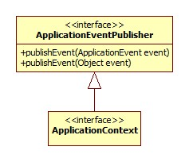
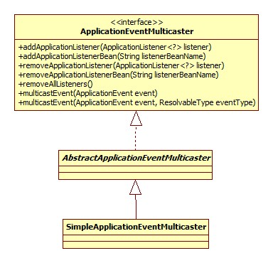

### 事件驱动

此接口代表了Spring的事件驱动(监听器)模式。一个事件驱动包含三部分:

#### 事件

java的所有事件对象一般都是java.util.EventObject的子类，Spring的整个继承体系如下:


#### 发布者

##### ApplicationEventPublisher



一目了然。

##### ApplicationEventMulticaster

ApplicationEventPublisher实际上正是将请求委托给ApplicationEventMulticaster来实现的。其继承体系:



#### 监听器

所有的监听器是jdk EventListener的子类，这是一个mark接口。继承体系:


可以看出SmartApplicationListener和GenericApplicationListener是高度相似的，都提供了事件类型检测和顺序机制，而后者是从Spring4.2加入的，Spring官方文档推荐使用后者代替前者。

#### 初始化

前面说过ApplicationEventPublisher是通过委托给ApplicationEventMulticaster实现的，所以refresh方法中完成的是对ApplicationEventMulticaster的初始化:

```java
// Initialize event multicaster for this context.
initApplicationEventMulticaster();
```

initApplicationEventMulticaster则首先在BeanFactory中寻找ApplicationEventMulticaster的bean，如果找到，那么调用getBean方法将其初始化，如果找不到那么使用SimpleApplicationEventMulticaster。

#### 事件发布

AbstractApplicationContext.publishEvent核心代码:

```java
protected void publishEvent(Object event, ResolvableType eventType) {
    getApplicationEventMulticaster().multicastEvent(applicationEvent, eventType);
}
```

SimpleApplicationEventMulticaster.multicastEvent:

```java
@Override
public void multicastEvent(final ApplicationEvent event, ResolvableType eventType) {
    ResolvableType type = (eventType != null ? eventType : resolveDefaultEventType(event));
    for (final ApplicationListener<?> listener : getApplicationListeners(event, type)) {
        Executor executor = getTaskExecutor();
        if (executor != null) {
            executor.execute(new Runnable() {
                @Override
                public void run() {
                    invokeListener(listener, event);
                }
            });
        } else {
            invokeListener(listener, event);
        }
    }
}
```

##### 监听器获取

获取当然还是通过beanFactory的getBean来完成的，值得注意的是Spring在此处使用了缓存(ConcurrentHashMap)来加速查找的过程。

##### 同步/异步

可以看出，如果executor不为空，那么监听器的执行实际上是异步的。那么如何配置同步/异步呢?

###### 全局

```xml
<task:executor id="multicasterExecutor" pool-size="3"/>
<bean class="org.springframework.context.event.SimpleApplicationEventMulticaster">
    <property name="taskExecutor" ref="multicasterExecutor"></property>
</bean>
```

task schema是Spring从3.0开始加入的，使我们可以不再依赖于Quartz实现定时任务，源码在org.springframework.core.task包下，使用需要引入schema：

```xml
xmlns:task="http://www.springframework.org/schema/task"
xsi:schemaLocation="http://www.springframework.org/schema/task http://www.springframework.org/schema/task/spring-task-4.0.xsd"
```

可以参考: [Spring定时任务的几种实现](http://gong1208.iteye.com/blog/1773177)

###### 注解

开启注解支持:

```xml
<!-- 开启@AspectJ AOP代理 -->  
<aop:aspectj-autoproxy proxy-target-class="true"/>  
<!-- 任务调度器 -->  
<task:scheduler id="scheduler" pool-size="10"/>  
<!-- 任务执行器 -->  
<task:executor id="executor" pool-size="10"/>  
<!--开启注解调度支持 @Async @Scheduled-->  
<task:annotation-driven executor="executor" scheduler="scheduler" proxy-target-class="true"/>  
```

在代码中使用示例:

```java
@Component  
public class EmailRegisterListener implements ApplicationListener<RegisterEvent> {  
    @Async  
    @Override  
    public void onApplicationEvent(final RegisterEvent event) {  
        System.out.println("注册成功，发送确认邮件给：" + ((User)event.getSource()).getUsername());  
    }  
}  
```

参考: [详解Spring事件驱动模型](http://jinnianshilongnian.iteye.com/blog/1902886)

测试用例：`AnnotationDrivenEventListenerTests`, `ApplicationContextEventTests`, `EventPublishingTestExecutionListenerTests`, `StompSubProtocolHandlerTests`。


# 简单的event-driven 设计模式：

```java
public interface Event {
  Class<? extends Event> getType();
}

public interface Handler<E extends Event> {
  void onEvent(E event);
}

public class EventDispatcher {

  private Map<Class<? extends Event>, Handler<? extends Event>> handlers;

  public EventDispatcher() {
    handlers = new HashMap<>();
  }

  public <E extends Event> void registerHandler(
      Class<E> eventType,
      Handler<E> handler
  ) {
    handlers.put(eventType, handler);
  }

  @SuppressWarnings("unchecked")
  public <E extends Event> void dispatch(E event) {
    Handler handler = (Handler<E>) handlers.get(event.getClass());
    if (handler != null) {
      handler.onEvent(event);
    }
  }
}

/////////////////////////event////////////////////////

public abstract class AbstractEvent implements Event {
  public Class<? extends Event> getType() {
    return getClass();
  }
}

public class UserCreatedEvent extends AbstractEvent {

  private User user;

  public UserCreatedEvent(User user) {
    this.user = user;
  }

  public User getUser() {
    return user;
  }
}

public class UserUpdatedEvent extends AbstractEvent {

  private User user;

  public UserUpdatedEvent(User user) {
    this.user = user;
  }

  public User getUser() {
    return user;
  }
}

public class User {

  private String username;

  public User(String username) {
    this.username = username;
  }

  public String getUsername() {
    return username;
  }
}

/////////////////////////handle////////////////////////

public class UserCreatedEventHandler implements Handler<UserCreatedEvent> {

  private static final Logger LOGGER = LoggerFactory.getLogger(UserCreatedEventHandler.class);

  @Override
  public void onEvent(UserCreatedEvent event) {
    LOGGER.info("User '{}' has been Created!", event.getUser().getUsername());
  }

}

public class UserUpdatedEventHandler implements Handler<UserUpdatedEvent> {

  private static final Logger LOGGER = LoggerFactory.getLogger(UserUpdatedEventHandler.class);

  @Override
  public void onEvent(UserUpdatedEvent event) {
    LOGGER.info("User '{}' has been Updated!", event.getUser().getUsername());
  }
}

///////////////////////////////////////////////////
public class App {

  public static void main(String[] args) {

    EventDispatcher dispatcher = new EventDispatcher();
    dispatcher.registerHandler(UserCreatedEvent.class, new UserCreatedEventHandler());
    dispatcher.registerHandler(UserUpdatedEvent.class, new UserUpdatedEventHandler());

    User user = new User("iluwatar");
    dispatcher.dispatch(new UserCreatedEvent(user));
    dispatcher.dispatch(new UserUpdatedEvent(user));
  }

}
```

关键点：1. event，2. handler 3. dispatch

参数之间的传递。

