<!-- START doctoc generated TOC please keep comment here to allow auto update -->
<!-- DON'T EDIT THIS SECTION, INSTEAD RE-RUN doctoc TO UPDATE -->
**Table of Contents**  *generated with [DocToc](https://github.com/thlorenz/doctoc)*

- [基本](#%E5%9F%BA%E6%9C%AC)
  - [ClassPathXmlApplicationContext](#classpathxmlapplicationcontext)
    - [构造器](#%E6%9E%84%E9%80%A0%E5%99%A8)
    - [设置配置文件路径](#%E8%AE%BE%E7%BD%AE%E9%85%8D%E7%BD%AE%E6%96%87%E4%BB%B6%E8%B7%AF%E5%BE%84)
      - [Environment接口](#environment%E6%8E%A5%E5%8F%A3)
        - [Profile](#profile)
        - [Property](#property)
      - [Environment构造器](#environment%E6%9E%84%E9%80%A0%E5%99%A8)
        - [PropertySources接口](#propertysources%E6%8E%A5%E5%8F%A3)
        - [PropertySource接口](#propertysource%E6%8E%A5%E5%8F%A3)
      - [路径Placeholder处理](#%E8%B7%AF%E5%BE%84placeholder%E5%A4%84%E7%90%86)
        - [PropertyResolver接口](#propertyresolver%E6%8E%A5%E5%8F%A3)
        - [解析](#%E8%A7%A3%E6%9E%90)
  - [refresh](#refresh)
    - [prepareRefresh](#preparerefresh)
      - [属性校验](#%E5%B1%9E%E6%80%A7%E6%A0%A1%E9%AA%8C)
    - [BeanFactory创建](#beanfactory%E5%88%9B%E5%BB%BA)
      - [BeanFactory接口](#beanfactory%E6%8E%A5%E5%8F%A3)
      - [BeanFactory定制](#beanfactory%E5%AE%9A%E5%88%B6)
      - [Bean加载](#bean%E5%8A%A0%E8%BD%BD)
        - [EntityResolver](#entityresolver)
        - [BeanDefinitionReader](#beandefinitionreader)
        - [路径解析(Ant)](#%E8%B7%AF%E5%BE%84%E8%A7%A3%E6%9E%90ant)
        - [配置文件加载](#%E9%85%8D%E7%BD%AE%E6%96%87%E4%BB%B6%E5%8A%A0%E8%BD%BD)
        - [Bean解析](#bean%E8%A7%A3%E6%9E%90)
      - [默认命名空间解析](#%E9%BB%98%E8%AE%A4%E5%91%BD%E5%90%8D%E7%A9%BA%E9%97%B4%E8%A7%A3%E6%9E%90)
        - [import](#import)
        - [alias](#alias)
        - [bean](#bean)
          - [id & name处理](#id--name%E5%A4%84%E7%90%86)
          - [beanName生成](#beanname%E7%94%9F%E6%88%90)
          - [bean解析](#bean%E8%A7%A3%E6%9E%90)
          - [Bean装饰](#bean%E8%A3%85%E9%A5%B0)
          - [Bean注册](#bean%E6%B3%A8%E5%86%8C)
          - [BeanDefiniton数据结构](#beandefiniton%E6%95%B0%E6%8D%AE%E7%BB%93%E6%9E%84)
        - [beans](#beans)
      - [其它命名空间解析](#%E5%85%B6%E5%AE%83%E5%91%BD%E5%90%8D%E7%A9%BA%E9%97%B4%E8%A7%A3%E6%9E%90)
        - [NamespaceHandler继承体系](#namespacehandler%E7%BB%A7%E6%89%BF%E4%BD%93%E7%B3%BB)
        - [init](#init)
        - [BeanFactory数据结构](#beanfactory%E6%95%B0%E6%8D%AE%E7%BB%93%E6%9E%84)
    - [prepareBeanFactory](#preparebeanfactory)
      - [BeanExpressionResolver](#beanexpressionresolver)
      - [PropertyEditorRegistrar](#propertyeditorregistrar)
      - [环境注入](#%E7%8E%AF%E5%A2%83%E6%B3%A8%E5%85%A5)
      - [依赖解析忽略](#%E4%BE%9D%E8%B5%96%E8%A7%A3%E6%9E%90%E5%BF%BD%E7%95%A5)
      - [bean伪装](#bean%E4%BC%AA%E8%A3%85)
      - [LoadTimeWeaver](#loadtimeweaver)
      - [注册环境](#%E6%B3%A8%E5%86%8C%E7%8E%AF%E5%A2%83)
    - [postProcessBeanFactory](#postprocessbeanfactory)
    - [invokeBeanFactoryPostProcessors](#invokebeanfactorypostprocessors)
    - [BeanPostProcessor注册](#beanpostprocessor%E6%B3%A8%E5%86%8C)
    - [MessageSource](#messagesource)
    - [事件驱动](#%E4%BA%8B%E4%BB%B6%E9%A9%B1%E5%8A%A8)
      - [事件](#%E4%BA%8B%E4%BB%B6)
      - [发布者](#%E5%8F%91%E5%B8%83%E8%80%85)
        - [ApplicationEventPublisher](#applicationeventpublisher)
        - [ApplicationEventMulticaster](#applicationeventmulticaster)
      - [监听器](#%E7%9B%91%E5%90%AC%E5%99%A8)
      - [初始化](#%E5%88%9D%E5%A7%8B%E5%8C%96)
      - [事件发布](#%E4%BA%8B%E4%BB%B6%E5%8F%91%E5%B8%83)
        - [监听器获取](#%E7%9B%91%E5%90%AC%E5%99%A8%E8%8E%B7%E5%8F%96)
        - [同步/异步](#%E5%90%8C%E6%AD%A5%E5%BC%82%E6%AD%A5)
          - [全局](#%E5%85%A8%E5%B1%80)
          - [注解](#%E6%B3%A8%E8%A7%A3)
    - [onRefresh](#onrefresh)
    - [ApplicationListener注册](#applicationlistener%E6%B3%A8%E5%86%8C)
    - [singleton初始化](#singleton%E5%88%9D%E5%A7%8B%E5%8C%96)
      - [ConversionService](#conversionservice)
      - [StringValueResolver](#stringvalueresolver)
      - [LoadTimeWeaverAware](#loadtimeweaveraware)
      - [初始化](#%E5%88%9D%E5%A7%8B%E5%8C%96-1)
- [getBean](#getbean)
  - [beanName转化](#beanname%E8%BD%AC%E5%8C%96)
  - [手动注册bean检测](#%E6%89%8B%E5%8A%A8%E6%B3%A8%E5%86%8Cbean%E6%A3%80%E6%B5%8B)
  - [检查父容器](#%E6%A3%80%E6%9F%A5%E7%88%B6%E5%AE%B9%E5%99%A8)
  - [依赖初始化](#%E4%BE%9D%E8%B5%96%E5%88%9D%E5%A7%8B%E5%8C%96)
  - [Singleton初始化](#singleton%E5%88%9D%E5%A7%8B%E5%8C%96)
    - [getSingleton方法](#getsingleton%E6%96%B9%E6%B3%95)
      - [是否存在](#%E6%98%AF%E5%90%A6%E5%AD%98%E5%9C%A8)
      - [bean创建](#bean%E5%88%9B%E5%BB%BA)
        - [lookup-method检测](#lookup-method%E6%A3%80%E6%B5%8B)
        - [InstantiationAwareBeanPostProcessor触发](#instantiationawarebeanpostprocessor%E8%A7%A6%E5%8F%91)
        - [doCreateBean](#docreatebean)
          - [创建(createBeanInstance)](#%E5%88%9B%E5%BB%BAcreatebeaninstance)
          - [MergedBeanDefinitionPostProcessor](#mergedbeandefinitionpostprocessor)
          - [属性解析](#%E5%B1%9E%E6%80%A7%E8%A7%A3%E6%9E%90)
          - [属性设置](#%E5%B1%9E%E6%80%A7%E8%AE%BE%E7%BD%AE)
          - [初始化](#%E5%88%9D%E5%A7%8B%E5%8C%96-2)
    - [getObjectForBeanInstance](#getobjectforbeaninstance)
  - [Prototype初始化](#prototype%E5%88%9D%E5%A7%8B%E5%8C%96)
    - [beforePrototypeCreation](#beforeprototypecreation)
    - [createBean](#createbean)
    - [afterPrototypeCreation](#afterprototypecreation)
    - [总结](#%E6%80%BB%E7%BB%93)
  - [其它Scope初始化](#%E5%85%B6%E5%AE%83scope%E5%88%9D%E5%A7%8B%E5%8C%96)

<!-- END doctoc generated TOC please keep comment here to allow auto update -->

# 基本

本部分从最基本的Spring开始。配置文件:

spring 原生代码：org.springframework.context.support.ClassPathXmlApplicationContextTests#testSingleConfigLocation


```xml
<?xml version="1.0" encoding="UTF-8"?>
<!DOCTYPE beans PUBLIC "-//SPRING//DTD BEAN 2.0//EN" "https://www.springframework.org/dtd/spring-beans-2.0.dtd">

<beans>

	<bean id="someMessageSource" name="yourMessageSource"
			class="org.springframework.context.support.StaticMessageSource"/>

	<bean class="org.springframework.context.support.ClassPathXmlApplicationContext" lazy-init="true">
		<constructor-arg value="someNonExistentFile.xml"/>
	</bean>

</beans>
```

启动代码:

```java
private static final String PATH = "/org/springframework/context/support/";
private static final String FQ_SIMPLE_CONTEXT = PATH + "simpleContext.xml";
@Test
public void testSingleConfigLocation() {
    ClassPathXmlApplicationContext ctx = new ClassPathXmlApplicationContext(FQ_SIMPLE_CONTEXT);
    assertThat(ctx.containsBean("someMessageSource")).isTrue();
    ctx.close();
}
```

SimpleBean:

```java
public class SimpleBean {
    public void send() {
        System.out.println("I am send method from SimpleBean!");
    }
}
```

## ClassPathXmlApplicationContext

整个继承体系如下:


PathMatchingResourcePatternResolver代表了**加载资源的一种方式，正是策略模式的实现**。

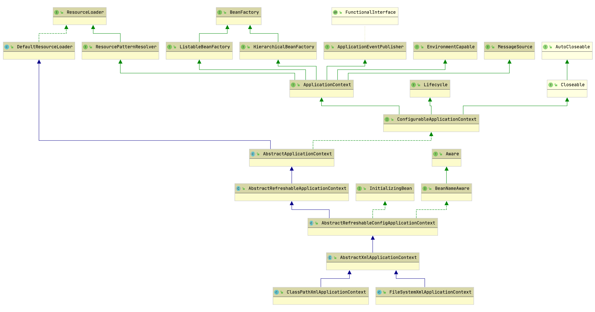

构造器源码:

```java
public ClassPathXmlApplicationContext(String[] configLocations, boolean refresh, ApplicationContext 	         parent) {
    //null
    super(parent);
    setConfigLocations(configLocations);
    //默认true
    if (refresh) {
        refresh();
    }
}
```

### 构造器

首先看父类构造器，沿着继承体系一直向上调用，直到AbstractApplicationContext:

```java
public AbstractApplicationContext(ApplicationContext parent) {
    this();
    setParent(parent);
}

public AbstractApplicationContext() {
    this.resourcePatternResolver = getResourcePatternResolver();
}

protected ResourcePatternResolver getResourcePatternResolver() {
    return new PathMatchingResourcePatternResolver(this);
}
```

PathMatchingResourcePatternResolver支持Ant风格的路径解析。

这里对new PathMatchingResourcePatternResolver(this);产生了一个疑问🤔️。

```java
# 为什么 这个class都没跑完初始化方法就可以使用this了。
    
使用的这个this到底是什么？

然后做了一下的例子。
public class Constructor {

    String o;

    Constructor() {
        System.out.println(this);
    }

    static class Test extends Constructor{
        Test() {
            System.out.println(this);
        }
    }

    static class Test2 extends Test {
        Test2() {
            System.out.println(this);
        }
    }

    public static void main(String[] args) {
        System.out.println(new Constructor());
        System.out.println(new Test());
        System.out.println(new Test2());
    }
}    
```

先来看看执行的效果：

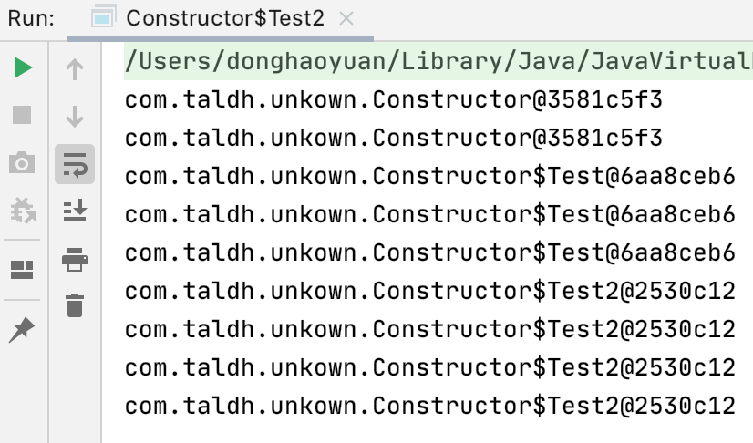

这个例子发现this都可以在构造函数中使用，为什么能在构造函数中使用呢？我们看看这个文件的编译的结果：这里看看编译的路径下面会有三个文件(java内部类会自动帮我们切割好)：

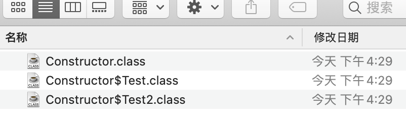

反编译这三个文件可以得到：

```java
Constructor文件，这里只是贴出来构造方法的文件
{
  java.lang.String o;
    descriptor: Ljava/lang/String;
    flags: (0x0000)

  com.taldh.unkown.Constructor();
    descriptor: ()V
    flags: (0x0000)
    Code:
      stack=2, locals=1, args_size=1
         0: aload_0
         1: invokespecial #1                  // Method java/lang/Object."<init>":()V
         4: getstatic     #7                  // Field java/lang/System.out:Ljava/io/PrintStream;
         7: aload_0
         8: invokevirtual #13                 // Method java/io/PrintStream.println:(Ljava/lang/Object;)V
        11: return
      LineNumberTable:
        line 14: 0
        line 15: 4
        line 16: 11
      LocalVariableTable:
        Start  Length  Slot  Name   Signature
            0      12     0  this   Lcom/taldh/unkown/Constructor;
    
Constructor$Test 字节码指令解析
{
  com.taldh.unkown.Constructor$Test();
    descriptor: ()V
    flags: (0x0000)
    Code:
      stack=2, locals=1, args_size=1
         0: aload_0
         1: invokespecial #1                  // Method com/taldh/unkown/Constructor."<init>":()V
         4: getstatic     #7                  // Field java/lang/System.out:Ljava/io/PrintStream;
         7: aload_0
         8: invokevirtual #13                 // Method java/io/PrintStream.println:(Ljava/lang/Object;)V
        11: return
      LineNumberTable:
        line 19: 0
        line 20: 4
        line 21: 11
      LocalVariableTable:
        Start  Length  Slot  Name   Signature
            0      12     0  this   Lcom/taldh/unkown/Constructor$Test
Constructor$Test2 字节码指令解析            
{
  com.taldh.unkown.Constructor$Test();
    descriptor: ()V
    flags: (0x0000)
    Code:
      stack=2, locals=1, args_size=1
         0: aload_0
         1: invokespecial #1                  // Method com/taldh/unkown/Constructor."<init>":()V
         4: getstatic     #7                  // Field java/lang/System.out:Ljava/io/PrintStream;
         7: aload_0
         8: invokevirtual #13                 // Method java/io/PrintStream.println:(Ljava/lang/Object;)V
        11: return
      LineNumberTable:
        line 19: 0
        line 20: 4
        line 21: 11
      LocalVariableTable:
        Start  Length  Slot  Name   Signature
            0      12     0  this   Lcom/taldh/unkown/Constructor$Test;
}            
```

这里发现一个规律：构造函数第一个都是aload_0。然后invokespecial 父类

查阅资料可以知道：https://docs.oracle.com/javase/specs/jvms/se8/html/jvms-6.html#jvms-6.5.aload_n

总结起来就是：在非静态方法中， aload_0 表示对this的操作，在static 方法中，aload_0表示对方法的第一参数的操作。

所以构造函数第一步都是从寄存器中load出this，然后对this进行赋值（invokespecial 父类的init方法。）。

因此我们看看AbstractApplicationContext无参构造函数字节码：

```java
 0 aload_0
 1 invokespecial #2 <org/springframework/core/io/DefaultResourceLoader.<init>>
 4 aload_0
 5 aload_0
 6 invokevirtual #3 <java/lang/Object.getClass>
 9 invokestatic #4 <org/apache/commons/logging/LogFactory.getLog>
12 putfield #5 <org/springframework/context/support/AbstractApplicationContext.logger>
15 aload_0
16 aload_0
17 invokestatic #6 <org/springframework/util/ObjectUtils.identityToString>
20 putfield #7 <org/springframework/context/support/AbstractApplicationContext.id>
23 aload_0
24 aload_0
25 invokestatic #6 <org/springframework/util/ObjectUtils.identityToString>
28 putfield #8 <org/springframework/context/support/AbstractApplicationContext.displayName>
31 aload_0
32 new #9 <java/util/ArrayList>
35 dup
36 invokespecial #10 <java/util/ArrayList.<init>>
39 putfield #11 <org/springframework/context/support/AbstractApplicationContext.beanFactoryPostProcessors>
42 aload_0
43 new #12 <java/util/concurrent/atomic/AtomicBoolean>
46 dup
47 invokespecial #13 <java/util/concurrent/atomic/AtomicBoolean.<init>>
50 putfield #14 <org/springframework/context/support/AbstractApplicationContext.active>
53 aload_0
54 new #12 <java/util/concurrent/atomic/AtomicBoolean>
57 dup
58 invokespecial #13 <java/util/concurrent/atomic/AtomicBoolean.<init>>
61 putfield #15 <org/springframework/context/support/AbstractApplicationContext.closed>
64 aload_0
65 new #16 <java/lang/Object>
68 dup
69 invokespecial #17 <java/lang/Object.<init>>
72 putfield #1 <org/springframework/context/support/AbstractApplicationContext.startupShutdownMonitor>
75 aload_0
76 new #18 <java/util/LinkedHashSet>
79 dup
80 invokespecial #19 <java/util/LinkedHashSet.<init>>
83 putfield #20 <org/springframework/context/support/AbstractApplicationContext.applicationListeners>
86 aload_0
87 aload_0
88 invokevirtual #21 <org/springframework/context/support/AbstractApplicationContext.getResourcePatternResolver>
91 putfield #22 <org/springframework/context/support/AbstractApplicationContext.resourcePatternResolver>
94 return

```

可以看到非常复杂，不过第一步还是对this进行了父类初始化的给值。这样new PathMatchingResourcePatternResolver(this);就能拿到有效的DefaultResourceLoader的值了。

继续看！

回顾一下之前的new PathMatchingResourcePatternResolver(this);

```java
AbstractApplicationContext文件##########################
适配器模式，ResourcePatternResolver -> AbstractApplicationContext。
public AbstractApplicationContext() {
    this.resourcePatternResolver = getResourcePatternResolver();
}    
protected ResourcePatternResolver getResourcePatternResolver() {
    return new PathMatchingResourcePatternResolver(this);
}
```

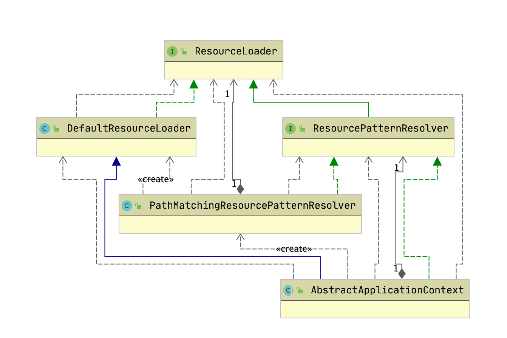

```java
//构造函数

	/**
	 * Create a new PathMatchingResourcePatternResolver with a DefaultResourceLoader.
	 * <p>ClassLoader access will happen via the thread context class loader.
	 * @see org.springframework.core.io.DefaultResourceLoader
	 */
	public PathMatchingResourcePatternResolver() {
		this.resourceLoader = new DefaultResourceLoader();
	}

	public PathMatchingResourcePatternResolver(ResourceLoader resourceLoader) {
		Assert.notNull(resourceLoader, "ResourceLoader must not be null");
		this.resourceLoader = resourceLoader;
	}
```

这里调用的是第二个，不过和第一个在这个案例也没什么区别。这样AbstractApplicationContext就能拿到这个资源解析器。

这里开启新的篇章ApplicationContext的第一个重要部分：DefaultResourceLoader

```java

/**
 * Default implementation of the {@link ResourceLoader} interface.
 * Used by {@link ResourceEditor}, and serves as base class for
 * {@link org.springframework.context.support.AbstractApplicationContext}.
 * Can also be used standalone.
 *
 * <p>Will return a {@link UrlResource} if the location value is a URL,
 * and a {@link ClassPathResource} if it is a non-URL path or a
 * "classpath:" pseudo-URL.
 *
 * @author Juergen Hoeller
 * @since 10.03.2004
 * @see FileSystemResourceLoader
 * @see org.springframework.context.support.ClassPathXmlApplicationContext
 */
public class DefaultResourceLoader implements ResourceLoader {
    
```

根据上面可知，这个DefaultResourceLoader类在PropertyEditor有用到，我们先试试这个类。

看看这个类的源码，没多少就全贴上吧

```java

/**
 * {@link java.beans.PropertyEditor Editor} for {@link Resource}
 * descriptors, to automatically convert {@code String} locations
 * e.g. {@code file:C:/myfile.txt} or {@code classpath:myfile.txt} to
 * {@code Resource} properties instead of using a {@code String} location property.
 *
 * <p>The path may contain {@code ${...}} placeholders, to be
 * resolved as {@link org.springframework.core.env.Environment} properties:
 * e.g. {@code ${user.dir}}. Unresolvable placeholders are ignored by default.
 *
 * <p>Delegates to a {@link ResourceLoader} to do the heavy lifting,
 * by default using a {@link DefaultResourceLoader}.
 *
 * @author Juergen Hoeller
 * @author Dave Syer
 * @author Chris Beams
 * @since 28.12.2003
 * @see Resource
 * @see ResourceLoader
 * @see DefaultResourceLoader
 * @see PropertyResolver#resolvePlaceholders
 */
public class ResourceEditor extends PropertyEditorSupport {

	private final ResourceLoader resourceLoader;

	@Nullable
	private PropertyResolver propertyResolver;

	private final boolean ignoreUnresolvablePlaceholders;


	/**
	 * Create a new instance of the {@link ResourceEditor} class
	 * using a {@link DefaultResourceLoader} and {@link StandardEnvironment}.
	 */
	public ResourceEditor() {
		this(new DefaultResourceLoader(), null);
	}

	/**
	 * Create a new instance of the {@link ResourceEditor} class
	 * using the given {@link ResourceLoader} and {@link PropertyResolver}.
	 * @param resourceLoader the {@code ResourceLoader} to use
	 * @param propertyResolver the {@code PropertyResolver} to use
	 */
	public ResourceEditor(ResourceLoader resourceLoader, @Nullable PropertyResolver propertyResolver) {
		this(resourceLoader, propertyResolver, true);
	}

	/**
	 * Create a new instance of the {@link ResourceEditor} class
	 * using the given {@link ResourceLoader}.
	 * @param resourceLoader the {@code ResourceLoader} to use
	 * @param propertyResolver the {@code PropertyResolver} to use
	 * @param ignoreUnresolvablePlaceholders whether to ignore unresolvable placeholders
	 * if no corresponding property could be found in the given {@code propertyResolver}
	 */
	public ResourceEditor(ResourceLoader resourceLoader, @Nullable PropertyResolver propertyResolver,
			boolean ignoreUnresolvablePlaceholders) {

		Assert.notNull(resourceLoader, "ResourceLoader must not be null");
		this.resourceLoader = resourceLoader;
		this.propertyResolver = propertyResolver;
		this.ignoreUnresolvablePlaceholders = ignoreUnresolvablePlaceholders;
	}


	@Override
	public void setAsText(String text) {
		if (StringUtils.hasText(text)) {
			String locationToUse = resolvePath(text).trim();
			setValue(this.resourceLoader.getResource(locationToUse));
		}
		else {
			setValue(null);
		}
	}

	/**
	 * Resolve the given path, replacing placeholders with corresponding
	 * property values from the {@code environment} if necessary.
	 * @param path the original file path
	 * @return the resolved file path
	 * @see PropertyResolver#resolvePlaceholders
	 * @see PropertyResolver#resolveRequiredPlaceholders
	 */
	protected String resolvePath(String path) {
		if (this.propertyResolver == null) {
			this.propertyResolver = new StandardEnvironment();
		}
		return (this.ignoreUnresolvablePlaceholders ? this.propertyResolver.resolvePlaceholders(path) :
				this.propertyResolver.resolveRequiredPlaceholders(path));
	}


	@Override
	@Nullable
	public String getAsText() {
		Resource value = (Resource) getValue();
		try {
			// Try to determine URL for resource.
			return (value != null ? value.getURL().toExternalForm() : "");
		}
		catch (IOException ex) {
			// Couldn't determine resource URL - return null to indicate
			// that there is no appropriate text representation.
			return null;
		}
	}

}
```

看上面的描述，只要我们给他一个地址，类似{@code file:C:/myfile.txt} 或者 {@code classpath:myfile.txt}这样格式的代码，它就会自动给我们解析成对应的Resource。使用的ResourceLoader是我们关注的DefaultResourceLoader。

```java
// spring测试的源码
class ResourceEditorTests {

	@Test
	void sunnyDay() {
		PropertyEditor editor = new ResourceEditor();
		editor.setAsText("classpath:org/springframework/core/io/ResourceEditorTests.class");
		Resource resource = (Resource) editor.getValue();
		assertThat(resource).isNotNull();
		assertThat(resource.exists()).isTrue();
	}
```

跟踪这个代码。进入setAsText方法

```java
@Override
public void setAsText(String text) {
    if (StringUtils.hasText(text)) {  // 判断输入是不是空串
        String locationToUse = resolvePath(text).trim();  // 看下面的调用可知：propertyResolver是StandardEnvironment类型解析。这里只用它解决了占位符的问题
        setValue(this.resourceLoader.getResource(locationToUse));
    }
    else {
        setValue(null);
    }
}


/**
	 * Resolve the given path, replacing placeholders with corresponding
	 * property values from the {@code environment} if necessary.
	 * @param path the original file path
	 * @return the resolved file path
	 * @see PropertyResolver#resolvePlaceholders
	 * @see PropertyResolver#resolveRequiredPlaceholders
	 */
protected String resolvePath(String path) {
    if (this.propertyResolver == null) {
        this.propertyResolver = new StandardEnvironment();
    }
    return (this.ignoreUnresolvablePlaceholders ? this.propertyResolver.resolvePlaceholders(path) :
            this.propertyResolver.resolveRequiredPlaceholders(path));
}

//setValue来自父类的java.beans.PropertyEditorSupport
private Object value;
/**
     * Set (or change) the object that is to be edited.
     *
     * @param value The new target object to be edited.  Note that this
     *     object should not be modified by the PropertyEditor, rather
     *     the PropertyEditor should create a new object to hold any
     *     modified value.
     */
public void setValue(Object value) {
    this.value = value;
    firePropertyChange();
}

// 最重点的部分：this.resourceLoader.getResource(locationToUse)
// 这个是调用了org.springframework.core.io.DefaultResourceLoader#getResource 
// DefaultResourceLoader 就是我们最关注的类了。
@Override
public Resource getResource(String location) {
    Assert.notNull(location, "Location must not be null");

    for (ProtocolResolver protocolResolver : getProtocolResolvers()) {
        Resource resource = protocolResolver.resolve(location, this);
        if (resource != null) {
            return resource;
        }
    }

    if (location.startsWith("/")) {
        return getResourceByPath(location);
    }
    else if (location.startsWith(CLASSPATH_URL_PREFIX)) { // CLASSPATH_URL_PREFIX = "classpath:";
        return new ClassPathResource(location.substring(CLASSPATH_URL_PREFIX.length()), getClassLoader());
    }
    else {
        try {
            // Try to parse the location as a URL...
            URL url = new URL(location);
            return (ResourceUtils.isFileURL(url) ? new FileUrlResource(url) : new UrlResource(url));
        }
        catch (MalformedURLException ex) {
            // No URL -> resolve as resource path.
            return getResourceByPath(location);
        }
    }
}

```

这里可以看出最后只是返回了一个ClassPathResource实现给前端。其实这里使用的是策略模式：

策略：1. 网络策略，2. “/”开头策略，3. “classpath:”开头策略 4. 输入的字符串能指定到对应的文件。所以`DefaultResourceLoader` 最精华的部分就是getResource了。

看到这里就完了吗？不会！回头再看看这个测试用例：

```java
@Test
void sunnyDay() {
    PropertyEditor editor = new ResourceEditor();
    editor.setAsText("classpath:org/springframework/core/io/ResourceEditorTests.class");
    Resource resource = (Resource) editor.getValue(); //获取value，能根据名字猜到实现，就不说了。
    assertThat(resource).isNotNull(); // 资源是空判断。
    assertThat(resource.exists()).isTrue();  // 直接看到这里。
}
```

`resource.exists()` 这个方法的执行如下：

```java
ClassPathResource文件

@Override
public boolean exists() {
    return (resolveURL() != null);
}

/**
	 * Resolves a URL for the underlying class path resource.
	 * @return the resolved URL, or {@code null} if not resolvable
	 */
@Nullable
protected URL resolveURL() {
    if (this.clazz != null) { //这个为null，我们 使用的构造函数没对clazz赋值。
        return this.clazz.getResource(this.path);
    }
    else if (this.classLoader != null) {
        return this.classLoader.getResource(this.path); //最根本的查找资源的方法。
    }
    else {
        return ClassLoader.getSystemResource(this.path);
    }
}
```

终于找到源头了：

```java

    /**
     * Finds the resource with the given name.  A resource is some data
     * (images, audio, text, etc) that can be accessed by class code in a way
     * that is independent of the location of the code.
     *
     * <p> The name of a resource is a '<tt>/</tt>'-separated path name that
     * identifies the resource.
     *
     * <p> This method will first search the parent class loader for the
     * resource; if the parent is <tt>null</tt> the path of the class loader
     * built-in to the virtual machine is searched.  That failing, this method
     * will invoke {@link #findResource(String)} to find the resource.  </p>
     *
     * @apiNote When overriding this method it is recommended that an
     * implementation ensures that any delegation is consistent with the {@link
     * #getResources(java.lang.String) getResources(String)} method.
     *
     * @param  name
     *         The resource name
     *
     * @return  A <tt>URL</tt> object for reading the resource, or
     *          <tt>null</tt> if the resource could not be found or the invoker
     *          doesn't have adequate  privileges to get the resource.
     *
     * @since  1.1
     */
    public URL getResource(String name) {
        URL url;
        if (parent != null) {
            url = parent.getResource(name); // 双亲委托机制模式。
        } else {
            url = getBootstrapResource(name); //到达系统启动类加载器
        }
        if (url == null) {
            url = findResource(name); //系统启动类加载器没有加载到，递归回退到第一次调用然后是扩展类加载器//最后如果都没有加载到，双亲委派加载失败，则加载应用本身自己的加载器。
        }
        return url;
    }
```

class.getResources 和classLoader.getResources两者使用及区别可以看这里：https://cloud.tencent.com/developer/article/1425180。原理还不大懂。

先记下这个能找资源，其它的后面再查找原理。


### 回头看PathMatchingResourcePatternResolver

PathMatchingResourcePatternResolver是ResourceLoader继承体系的一部分。这部分在上面分析过了。其中最主要的方法如下：

```java
@Override
public Resource[] getResources(String locationPattern) throws IOException {
    Assert.notNull(locationPattern, "Location pattern must not be null");
    //classpath:
    if (locationPattern.startsWith(CLASSPATH_ALL_URL_PREFIX)) {
        // a class path resource (multiple resources for same name possible)
        //matcher是一个AntPathMatcher对象
        if (getPathMatcher().isPattern(locationPattern
            .substring(CLASSPATH_ALL_URL_PREFIX.length()))) {
            // a class path resource pattern
            return findPathMatchingResources(locationPattern);
        } else {
            // all class path resources with the given name
            return findAllClassPathResources(locationPattern
                .substring(CLASSPATH_ALL_URL_PREFIX.length()));
        }
    } else {
        // Only look for a pattern after a prefix here
        // (to not get fooled by a pattern symbol in a strange prefix).
        int prefixEnd = locationPattern.indexOf(":") + 1;
        if (getPathMatcher().isPattern(locationPattern.substring(prefixEnd))) {
            // a file pattern
            return findPathMatchingResources(locationPattern);
        }
        else {
            // a single resource with the given name
            return new Resource[] {getResourceLoader().getResource(locationPattern)};
        }
    }
}

// 比如locationPattern=classpath*:org/springframework/context/annotation6/**/*.class
protected Resource[] findPathMatchingResources(String locationPattern) throws IOException {
    //rootDirPath=classpath*:org/springframework/context/annotation6/
    String rootDirPath = determineRootDir(locationPattern);
    //subPattern = **/*.class
    String subPattern = locationPattern.substring(rootDirPath.length());
    Resource[] rootDirResources = getResources(rootDirPath);  // 这里调用自身，然后通过classpath*:org/springframework/context/annotation6/ 回去找这个目录下所有的文件夹资源。通过findAllClassPathResources方法。
    Set<Resource> result = new LinkedHashSet<>(16);
    for (Resource rootDirResource : rootDirResources) {
        rootDirResource = resolveRootDirResource(rootDirResource); //
        URL rootDirUrl = rootDirResource.getURL();
        if (equinoxResolveMethod != null && rootDirUrl.getProtocol().startsWith("bundle")) {
            URL resolvedUrl = (URL) ReflectionUtils.invokeMethod(equinoxResolveMethod, null, rootDirUrl);
            if (resolvedUrl != null) {
                rootDirUrl = resolvedUrl;
            }
            rootDirResource = new UrlResource(rootDirUrl);
        }
        if (rootDirUrl.getProtocol().startsWith(ResourceUtils.URL_PROTOCOL_VFS)) {
            result.addAll(VfsResourceMatchingDelegate.findMatchingResources(rootDirUrl, subPattern, getPathMatcher()));
        }
        else if (ResourceUtils.isJarURL(rootDirUrl) || isJarResource(rootDirResource)) {
            result.addAll(doFindPathMatchingJarResources(rootDirResource, rootDirUrl, subPattern));
        }
        else {
            result.addAll(doFindPathMatchingFileResources(rootDirResource, subPattern)); // 一般情况的寻找文件夹下所有文件会进入这里，这里面的逻辑很深，就不举行扩张了。
        }
    }
    if (logger.isTraceEnabled()) {
        logger.trace("Resolved location pattern [" + locationPattern + "] to resources " + result);
    }
    // 这里的返回值可以给大家看看，如下：
    return result.toArray(new Resource[0]);
}


protected Resource[] findAllClassPathResources(String location) throws IOException {
    String path = location;
    if (path.startsWith("/")) {
        path = path.substring(1);
    }
    Set<Resource> result = doFindAllClassPathResources(path);
    if (logger.isTraceEnabled()) {
        logger.trace("Resolved classpath location [" + location + "] to resources " + result);
    }
    return result.toArray(new Resource[0]);
}

protected Set<Resource> doFindAllClassPathResources(String path) throws IOException {
    Set<Resource> result = new LinkedHashSet<>(16);
    ClassLoader cl = getClassLoader();
    Enumeration<URL> resourceUrls = (cl != null ? cl.getResources(path) : ClassLoader.getSystemResources(path));
    while (resourceUrls.hasMoreElements()) {
        URL url = resourceUrls.nextElement();
        result.add(convertClassLoaderURL(url));
    }
    if ("".equals(path)) {
        // The above result is likely to be incomplete, i.e. only containing file system references.
        // We need to have pointers to each of the jar files on the classpath as well...
        addAllClassLoaderJarRoots(cl, result);
    }
    return result;
}
```

findPathMatchingResources的返回值：

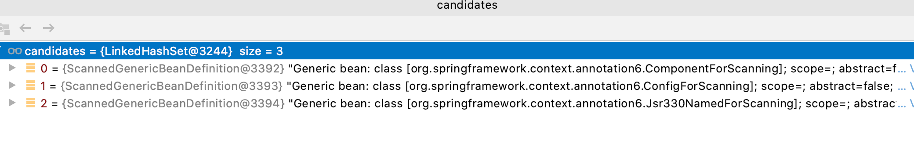


从上面可以看出其实最主要的就是通过ClassLoader.getResources找资源。

isPattern:

```java
@Override
public boolean isPattern(String path) {
    return (path.indexOf('*') != -1 || path.indexOf('?') != -1);
}
```


```java
class PathMatchingResourcePatternResolverTests {

	private static final String[] CLASSES_IN_CORE_IO_SUPPORT =
			new String[] {"EncodedResource.class", "LocalizedResourceHelper.class",
					"PathMatchingResourcePatternResolver.class", "PropertiesLoaderSupport.class",
					"PropertiesLoaderUtils.class", "ResourceArrayPropertyEditor.class",
					"ResourcePatternResolver.class", "ResourcePatternUtils.class"};

	private static final String[] TEST_CLASSES_IN_CORE_IO_SUPPORT =
			new String[] {"PathMatchingResourcePatternResolverTests.class"};

	private static final String[] CLASSES_IN_REACTOR_UTIL_ANNOTATIONS =
			new String[] {"NonNull.class", "NonNullApi.class", "Nullable.class"};

	private PathMatchingResourcePatternResolver resolver = new PathMatchingResourcePatternResolver();


	@Test
	void invalidPrefixWithPatternElementInIt() throws IOException {
		assertThatExceptionOfType(FileNotFoundException.class).isThrownBy(() ->
				resolver.getResources("xx**:**/*.xy"));
	}

	@Test
	void singleResourceOnFileSystem() throws IOException {
		Resource[] resources =
				resolver.getResources("org/springframework/core/io/support/PathMatchingResourcePatternResolverTests.class");
		assertThat(resources.length).isEqualTo(1);
		assertProtocolAndFilenames(resources, "file", "PathMatchingResourcePatternResolverTests.class");
	}

	@Test
	void singleResourceInJar() throws IOException {
		Resource[] resources = resolver.getResources("org/reactivestreams/Publisher.class");
		assertThat(resources.length).isEqualTo(1);
		assertProtocolAndFilenames(resources, "jar", "Publisher.class");
	}

	@Disabled
	@Test
	void classpathStarWithPatternOnFileSystem() throws IOException {
		Resource[] resources = resolver.getResources("classpath*:org/springframework/core/io/sup*/*.class");
		// Have to exclude Clover-generated class files here,
		// as we might be running as part of a Clover test run.
		List<Resource> noCloverResources = new ArrayList<>();
		for (Resource resource : resources) {
			if (!resource.getFilename().contains("$__CLOVER_")) {
				noCloverResources.add(resource);
			}
		}
		resources = noCloverResources.toArray(new Resource[0]);
		assertProtocolAndFilenames(resources, "file",
				StringUtils.concatenateStringArrays(CLASSES_IN_CORE_IO_SUPPORT, TEST_CLASSES_IN_CORE_IO_SUPPORT));
	}

	@Test
	void getResourcesOnFileSystemContainingHashtagsInTheirFileNames() throws IOException {
		Resource[] resources = resolver.getResources("classpath*:org/springframework/core/io/**/resource#test*.txt");
		assertThat(resources).extracting(Resource::getFile).extracting(File::getName)
			.containsExactlyInAnyOrder("resource#test1.txt", "resource#test2.txt");
	}

	@Test
	void classpathWithPatternInJar() throws IOException {
		Resource[] resources = resolver.getResources("classpath:reactor/util/annotation/*.class");
		assertProtocolAndFilenames(resources, "jar", CLASSES_IN_REACTOR_UTIL_ANNOTATIONS);
	}

	@Test
	void classpathStarWithPatternInJar() throws IOException {
		Resource[] resources = resolver.getResources("classpath*:reactor/util/annotation/*.class");
		assertProtocolAndFilenames(resources, "jar", CLASSES_IN_REACTOR_UTIL_ANNOTATIONS);
	}

	@Test
	void rootPatternRetrievalInJarFiles() throws IOException {
		Resource[] resources = resolver.getResources("classpath*:*.dtd");
		boolean found = false;
		for (Resource resource : resources) {
			if (resource.getFilename().equals("aspectj_1_5_0.dtd")) {
				found = true;
				break;
			}
		}
		assertThat(found).as("Could not find aspectj_1_5_0.dtd in the root of the aspectjweaver jar").isTrue();
	}


	private void assertProtocolAndFilenames(Resource[] resources, String protocol, String... filenames)
			throws IOException {

		// Uncomment the following if you encounter problems with matching against the file system
		// It shows file locations.
//		String[] actualNames = new String[resources.length];
//		for (int i = 0; i < resources.length; i++) {
//			actualNames[i] = resources[i].getFilename();
//		}
//		List sortedActualNames = new LinkedList(Arrays.asList(actualNames));
//		List expectedNames = new LinkedList(Arrays.asList(fileNames));
//		Collections.sort(sortedActualNames);
//		Collections.sort(expectedNames);
//
//		System.out.println("-----------");
//		System.out.println("Expected: " + StringUtils.collectionToCommaDelimitedString(expectedNames));
//		System.out.println("Actual: " + StringUtils.collectionToCommaDelimitedString(sortedActualNames));
//		for (int i = 0; i < resources.length; i++) {
//			System.out.println(resources[i]);
//		}

		assertThat(resources.length).as("Correct number of files found").isEqualTo(filenames.length);
		for (Resource resource : resources) {
			String actualProtocol = resource.getURL().getProtocol();
			assertThat(actualProtocol).isEqualTo(protocol);
			assertFilenameIn(resource, filenames);
		}
	}

	private void assertFilenameIn(Resource resource, String... filenames) {
		String filename = resource.getFilename();
		assertThat(Arrays.stream(filenames).anyMatch(filename::endsWith)).as(resource + " does not have a filename that matches any of the specified names").isTrue();
	}

}
```


### 设置配置文件路径

即AbstractRefreshableConfigApplicationContext.setConfigLocations:

```java
public void setConfigLocations(String... locations) {
    if (locations != null) {
        Assert.noNullElements(locations, "Config locations must not be null");
        this.configLocations = new String[locations.length];
        for (int i = 0; i < locations.length; i++) {
            this.configLocations[i] = resolvePath(locations[i]).trim();
        }
    } else {
        this.configLocations = null;
    }
}
```

resolvePath:

```java
environment 是 ApplicationContext的一个重要属性。
/** Environment used by this context. */
@Nullable
private ConfigurableEnvironment environment;

protected String resolvePath(String path) {
    return getEnvironment().resolveRequiredPlaceholders(path);
}
```

此方法的目的在于将占位符(placeholder)解析成实际的地址。比如可以这么写: `new ClassPathXmlApplicationContext("classpath:config.xml");`那么classpath:就是需要被解析的。

getEnvironment方法来自于ConfigurableApplicationContext接口，源码很简单，如果为空就调用createEnvironment创建一个。AbstractApplicationContext.createEnvironment:

```java
protected ConfigurableEnvironment createEnvironment() {
    return new StandardEnvironment();
}
```

#### Environment接口

环境主要分类为两大部分：profile，properties

继承体系:


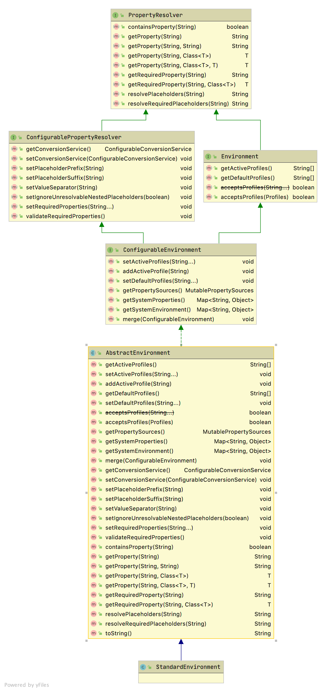

Environmen接口**代表了当前应用所处的环境。**从此接口的方法可以看出，其主要和**profile**、**Property**相关。

##### Profile

Spring Profile特性是从3.1开始的，其主要是为了解决这样一种问题: 线上环境和测试环境使用不同的配置或是数据库或是其它。有了Profile便可以在 不同环境之间无缝切换。**Spring容器管理的所有bean都是和一个profile绑定在一起的。**使用了Profile的配置文件示例:

```xml
<beans profile="develop">  
    <context:property-placeholder location="classpath*:jdbc-develop.properties"/>  
</beans>  
<beans profile="production">  
    <context:property-placeholder location="classpath*:jdbc-production.properties"/>  
</beans>  
<beans profile="test">  
    <context:property-placeholder location="classpath*:jdbc-test.properties"/>  
</beans>
```

在启动代码中可以用如下代码设置活跃(当前使用的)Profile:

```java
context.getEnvironment().setActiveProfiles("dev");
```

当然使用的方式还有很多(比如注解)，参考:

[spring3.1 profile 配置不同的环境](http://radiumxie.iteye.com/blog/1851919)

[Spring Profiles example](http://www.mkyong.com/spring/spring-profiles-example/)


Envirnment体系最重要的方法就是org.springframework.core.env.AbstractEnvironment#customizePropertySources

子类负责继承这个方法之后进行定制自己的PropertySources

这里看看StandardEnvironment，超级简单。

```java
public class StandardEnvironment extends AbstractEnvironment {

	/** System environment property source name: {@value}. */
	public static final String SYSTEM_ENVIRONMENT_PROPERTY_SOURCE_NAME = "systemEnvironment";

	/** JVM system properties property source name: {@value}. */
	public static final String SYSTEM_PROPERTIES_PROPERTY_SOURCE_NAME = "systemProperties";


	/**
	 * Customize the set of property sources with those appropriate for any standard
	 * Java environment:
	 * <ul>
	 * <li>{@value #SYSTEM_PROPERTIES_PROPERTY_SOURCE_NAME}
	 * <li>{@value #SYSTEM_ENVIRONMENT_PROPERTY_SOURCE_NAME}
	 * </ul>
	 * <p>Properties present in {@value #SYSTEM_PROPERTIES_PROPERTY_SOURCE_NAME} will
	 * take precedence over those in {@value #SYSTEM_ENVIRONMENT_PROPERTY_SOURCE_NAME}.
	 * @see AbstractEnvironment#customizePropertySources(MutablePropertySources)
	 * @see #getSystemProperties()
	 * @see #getSystemEnvironment()
	 */
	@Override
	protected void customizePropertySources(MutablePropertySources propertySources) {
		propertySources.addLast(
				new PropertiesPropertySource(SYSTEM_PROPERTIES_PROPERTY_SOURCE_NAME, getSystemProperties()));
		propertySources.addLast(
				new SystemEnvironmentPropertySource(SYSTEM_ENVIRONMENT_PROPERTY_SOURCE_NAME, getSystemEnvironment()));
	}

}
```

其中getSystemProperties()和getSystemEnvironment()是父类AbstractEnvironment的。

```java
org.springframework.core.env.AbstractEnvironment#getSystemProperties
    
@Override
@SuppressWarnings({"rawtypes", "unchecked"})
public Map<String, Object> getSystemProperties() {
    try {
        return (Map) System.getProperties();
    }
    catch (AccessControlException ex) {
        return (Map) new ReadOnlySystemAttributesMap() {
            @Override
            @Nullable
            protected String getSystemAttribute(String attributeName) {
                try {
                    return System.getProperty(attributeName);
                }
                catch (AccessControlException ex) {
                    if (logger.isInfoEnabled()) {
                        logger.info("Caught AccessControlException when accessing system property '" +
                                    attributeName + "'; its value will be returned [null]. Reason: " + ex.getMessage());
                    }
                    return null;
                }
            }
        };
    }
} 

@Override
@SuppressWarnings({"rawtypes", "unchecked"})
public Map<String, Object> getSystemEnvironment() {
    if (suppressGetenvAccess()) {
        return Collections.emptyMap();
    }
    try {
        return (Map) System.getenv();
    }
    catch (AccessControlException ex) {
        return (Map) new ReadOnlySystemAttributesMap() {
            @Override
            @Nullable
            protected String getSystemAttribute(String attributeName) {
                try {
                    return System.getenv(attributeName);
                }
                catch (AccessControlException ex) {
                    if (logger.isInfoEnabled()) {
                        logger.info("Caught AccessControlException when accessing system environment variable '" +
                                    attributeName + "'; its value will be returned [null]. Reason: " + ex.getMessage());
                    }
                    return null;
                }
            }
        };
    }
}

下面是具体jvm的实现
public static Properties getProperties() {
    SecurityManager sm = getSecurityManager();
    if (sm != null) {
        sm.checkPropertiesAccess();
    }

    return props;
}
```

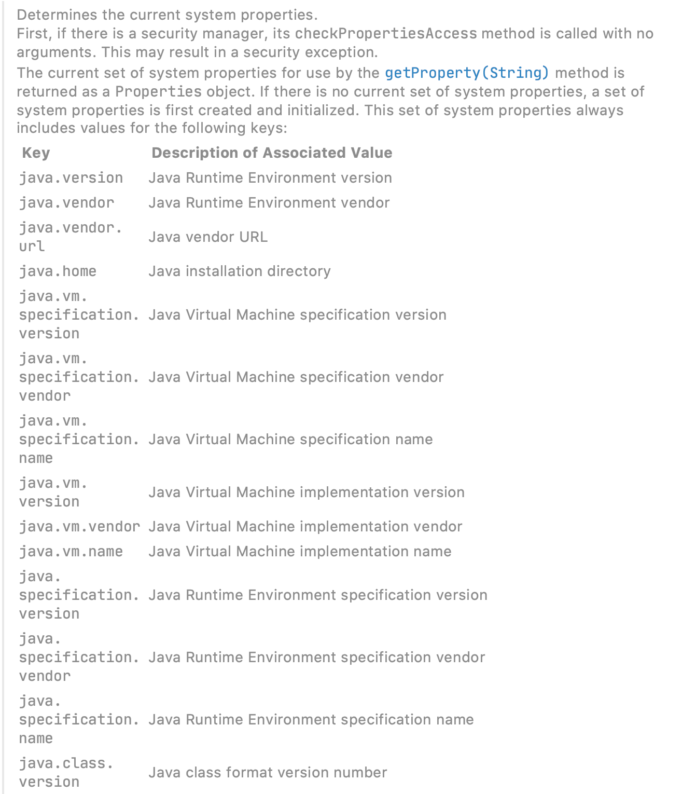


这是上面的类的说明。

这里的实现很有意思，如果安全管理器阻止获取全部的系统属性，那么会尝试获取单个属性的可能性，如果还不行就抛异常了。

getSystemEnvironment方法也是一个套路，不过最终调用的是System.getenv，可以获取jvm和OS的一些版本信息。


```
返回当前系统环境的不可修改的字符串映射视图。 环境是从名字依赖于系统的映射，这是从父母传给子进程的值。
如果系统不支持环境变量，则返回一个空映射。
返回的映射永远不会包含null键或值。 试图查询null键或值的存在将抛出一个NullPointerException 。 试图查询的键或值是类型的不存在String将抛出ClassCastException 。
返回的映射及其集合视图不能遵守的一般合同Object.equals和Object.hashCode方法。
返回的映射通常是区分大小写的所有平台。
如果存在安全管理器，它checkPermission方法被调用了RuntimePermission ("getenv.*")权限。 这可能导致SecurityException被抛出。
当将信息传递给一个Java子进程， 系统性能通常优于环境变量


    /**
     * Returns an unmodifiable string map view of the current system environment.
     * The environment is a system-dependent mapping from names to
     * values which is passed from parent to child processes.
     *
     * <p>If the system does not support environment variables, an
     * empty map is returned.
     *
     * <p>The returned map will never contain null keys or values.
     * Attempting to query the presence of a null key or value will
     * throw a {@link NullPointerException}.  Attempting to query
     * the presence of a key or value which is not of type
     * {@link String} will throw a {@link ClassCastException}.
     *
     * <p>The returned map and its collection views may not obey the
     * general contract of the {@link Object#equals} and
     * {@link Object#hashCode} methods.
     *
     * <p>The returned map is typically case-sensitive on all platforms.
     *
     * <p>If a security manager exists, its
     * {@link SecurityManager#checkPermission checkPermission}
     * method is called with a
     * <code>{@link RuntimePermission}("getenv.*")</code>
     * permission.  This may result in a {@link SecurityException} being
     * thrown.
     *
     * <p>When passing information to a Java subprocess,
     * <a href=#EnvironmentVSSystemProperties>system properties</a>
     * are generally preferred over environment variables.
     *
     * @return the environment as a map of variable names to values
     * @throws SecurityException
     *         if a security manager exists and its
     *         {@link SecurityManager#checkPermission checkPermission}
     *         method doesn't allow access to the process environment
     * @see    #getenv(String)
     * @see    ProcessBuilder#environment()
     * @since  1.5
     */
    public static java.util.Map<String,String> getenv() {
        SecurityManager sm = getSecurityManager();
        if (sm != null) {
            sm.checkPermission(new RuntimePermission("getenv.*"));
        }

        return ProcessEnvironment.getenv();
    }
```

##### Property

这里的Property指的是程序运行时的一些参数，引用注释:

> > properties files, JVM system properties, system environment variables, JNDI, servlet context parameters, ad-hoc Properties objects,Maps, and so on.

#### Environment构造器

```java
private final MutablePropertySources propertySources = new MutablePropertySources(this.logger);
public AbstractEnvironment() {
    customizePropertySources(this.propertySources);
}
```

#####  PropertySources接口

MutablePropertySources和PropertySource，组合模式。


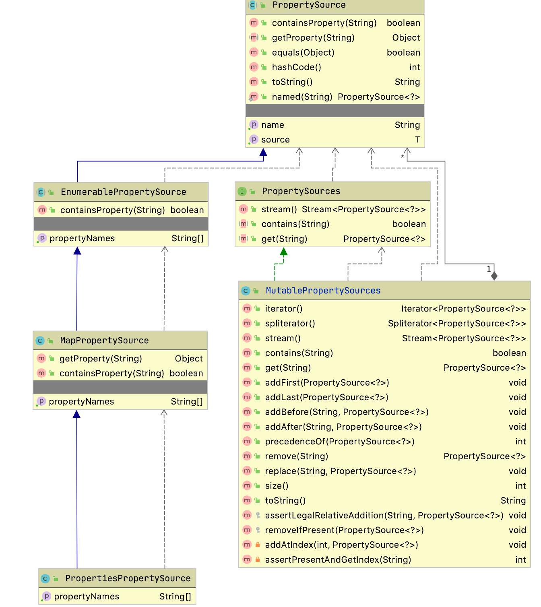

此接口实际上是PropertySource的容器，默认的MutablePropertySources实现内部含有一个CopyOnWriteArrayList作为存储载体。

StandardEnvironment.customizePropertySources:

```java
/** System environment property source name: {@value} */
public static final String SYSTEM_ENVIRONMENT_PROPERTY_SOURCE_NAME = "systemEnvironment";
/** JVM system properties property source name: {@value} */
public static final String SYSTEM_PROPERTIES_PROPERTY_SOURCE_NAME = "systemProperties";
@Override
protected void customizePropertySources(MutablePropertySources propertySources) {
    propertySources.addLast(new MapPropertySource
        (SYSTEM_PROPERTIES_PROPERTY_SOURCE_NAME, getSystemProperties()));
    propertySources.addLast(new SystemEnvironmentPropertySource
        (SYSTEM_ENVIRONMENT_PROPERTY_SOURCE_NAME, getSystemEnvironment()));
}
```


##### PropertySource接口

PropertySource接口代表了键值对的Property来源。继承体系：


AbstractEnvironment.getSystemProperties:

```java
@Override
public Map<String, Object> getSystemProperties() {
    try {
        return (Map) System.getProperties();
    }
    catch (AccessControlException ex) {
        return (Map) new ReadOnlySystemAttributesMap() {
            @Override
            protected String getSystemAttribute(String attributeName) {
                try {
                    return System.getProperty(attributeName);
                }
                catch (AccessControlException ex) {
                    if (logger.isInfoEnabled()) {
                        logger.info(format("Caught AccessControlException when accessing system " +
                                "property [%s]; its value will be returned [null]. Reason: %s",
                                attributeName, ex.getMessage()));
                    }
                    return null;
                }
            }
        };
    }
}
```

这里的实现很有意思，如果安全管理器阻止获取全部的系统属性，那么会尝试获取单个属性的可能性，如果还不行就抛异常了。

getSystemEnvironment方法也是一个套路，不过最终调用的是System.getenv，可以获取jvm和OS的一些版本信息。

#### 路径Placeholder处理

AbstractEnvironment.resolveRequiredPlaceholders:

```java
@Override
public String resolveRequiredPlaceholders(String text) throws IllegalArgumentException {
    //text即配置文件路径，比如classpath:config.xml
    return this.propertyResolver.resolveRequiredPlaceholders(text);
}
```

propertyResolver是一个PropertySourcesPropertyResolver对象:

```java
private final ConfigurablePropertyResolver propertyResolver =
            new PropertySourcesPropertyResolver(this.propertySources);
```

##### PropertyResolver接口

PropertyResolver继承体系(排除Environment分支):

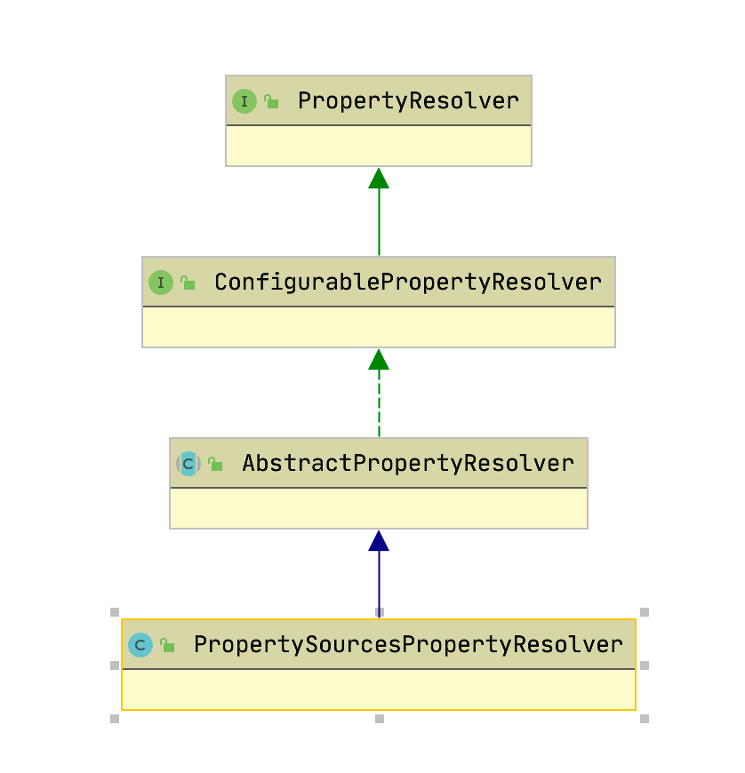

此接口正是用来解析PropertyResource。

##### 解析

AbstractPropertyResolver.resolveRequiredPlaceholders:

```java
@Override
public String resolveRequiredPlaceholders(String text) throws IllegalArgumentException {
    if (this.strictHelper == null) {
        this.strictHelper = createPlaceholderHelper(false);
    }
    return doResolvePlaceholders(text, this.strictHelper);
}
```

```java
private PropertyPlaceholderHelper createPlaceholderHelper(boolean ignoreUnresolvablePlaceholders) {
    //三个参数分别是${, }, :
    return new PropertyPlaceholderHelper(this.placeholderPrefix, this.placeholderSuffix,
        this.valueSeparator, ignoreUnresolvablePlaceholders);
}
```

doResolvePlaceholders：

```java
private String doResolvePlaceholders(String text, PropertyPlaceholderHelper helper) {
    //PlaceholderResolver接口依然是策略模式的体现
    return helper.replacePlaceholders(text, new PropertyPlaceholderHelper.PlaceholderResolver() {
        @Override
        public String resolvePlaceholder(String placeholderName) {
            return getPropertyAsRawString(placeholderName);
        }
    });
}
```

其实代码执行到这里的时候还没有进行xml配置文件的解析，那么这里的解析placeHolder是什么意思呢，原因在于可以这么写:

```java
System.setProperty("spring", "classpath");
ClassPathXmlApplicationContext context = new ClassPathXmlApplicationContext("${spring}:config.xml");
SimpleBean bean = context.getBean(SimpleBean.class);
```

这样就可以正确解析。placeholder的替换其实就是字符串操作，这里只说一下正确的属性是怎么来的。实现的关键在于PropertySourcesPropertyResolver.getProperty:

```java
@Override
protected String getPropertyAsRawString(String key) {
    return getProperty(key, String.class, false);
}
protected <T> T getProperty(String key, Class<T> targetValueType, boolean resolveNestedPlaceholders) {
    if (this.propertySources != null) {
        for (PropertySource<?> propertySource : this.propertySources) {
            Object value = propertySource.getProperty(key);
            return value;
        }
    }
    return null;
}
```

很明显了，就是从System.getProperty和System.getenv获取，但是由于环境变量是无法自定义的，所以其实此处只能通过System.setProperty指定。

占位符的真正实现在这里：

```java
	protected String parseStringValue(
			String value, PlaceholderResolver placeholderResolver, @Nullable Set<String> visitedPlaceholders) {

		int startIndex = value.indexOf(this.placeholderPrefix);
		if (startIndex == -1) {
			return value;
		}

		StringBuilder result = new StringBuilder(value);
		while (startIndex != -1) {
			int endIndex = findPlaceholderEndIndex(result, startIndex);
			if (endIndex != -1) {
				String placeholder = result.substring(startIndex + this.placeholderPrefix.length(), endIndex);
				String originalPlaceholder = placeholder;
				if (visitedPlaceholders == null) {
					visitedPlaceholders = new HashSet<>(4);
				}
				if (!visitedPlaceholders.add(originalPlaceholder)) {
					throw new IllegalArgumentException(
							"Circular placeholder reference '" + originalPlaceholder + "' in property definitions");
				}
				// Recursive invocation, parsing placeholders contained in the placeholder key.
				placeholder = parseStringValue(placeholder, placeholderResolver, visitedPlaceholders);
				// Now obtain the value for the fully resolved key...
				String propVal = placeholderResolver.resolvePlaceholder(placeholder);
				if (propVal == null && this.valueSeparator != null) {
					int separatorIndex = placeholder.indexOf(this.valueSeparator);
					if (separatorIndex != -1) {
						String actualPlaceholder = placeholder.substring(0, separatorIndex);
						String defaultValue = placeholder.substring(separatorIndex + this.valueSeparator.length());
						propVal = placeholderResolver.resolvePlaceholder(actualPlaceholder);
						if (propVal == null) {
							propVal = defaultValue;
						}
					}
				}
				if (propVal != null) {
					// Recursive invocation, parsing placeholders contained in the
					// previously resolved placeholder value.
					propVal = parseStringValue(propVal, placeholderResolver, visitedPlaceholders);
					result.replace(startIndex, endIndex + this.placeholderSuffix.length(), propVal);
					if (logger.isTraceEnabled()) {
						logger.trace("Resolved placeholder '" + placeholder + "'");
					}
					startIndex = result.indexOf(this.placeholderPrefix, startIndex + propVal.length());
				}
				else if (this.ignoreUnresolvablePlaceholders) {
					// Proceed with unprocessed value.
					startIndex = result.indexOf(this.placeholderPrefix, endIndex + this.placeholderSuffix.length());
				}
				else {
					throw new IllegalArgumentException("Could not resolve placeholder '" +
							placeholder + "'" + " in value \"" + value + "\"");
				}
				visitedPlaceholders.remove(originalPlaceholder);
			}
			else {
				startIndex = -1;
			}
		}
		return result.toString();
	}
```


注意，classpath:XXX这种写法的classpath前缀到目前为止还没有被处理。

占位符体系尝试

```java
PropertyPlaceholderHelper propertyPlaceholderHelper = new PropertyPlaceholderHelper("${", "}");
MutablePropertySources propertySources = new MutablePropertySources();
Properties properties = new Properties();
properties.put("test", "ydonghao");
System.out.println(propertyPlaceholderHelper.replacePlaceholders("${test}", properties));
```

output:

```
this is a placeholder : ydonghao
```

然后试试environment使用方法：

```
public class EsEnvironment extends AbstractEnvironment{

	private static final String WDPH_ES_PROPERTIES = "wdphEsProperties";

	@Override
	protected void customizePropertySources(MutablePropertySources propertySources) {
		Properties properties = new Properties();
		properties.put("test", "ydonghao");
		properties.put("test1", "ydonghao1");
		properties.put("test2", "ydonghao2");
		propertySources.addLast(
				new PropertiesPropertySource(WDPH_ES_PROPERTIES, properties));

	}

	public static void main(String[] args) {
		EsEnvironment esEnvironment = new EsEnvironment();
		System.out.println(esEnvironment.resolvePlaceholders("This is a placeholder : ${test33:wewrwe}..."));
		System.out.println(esEnvironment.resolveRequiredPlaceholders("This is a placeholder : ${test33:wewrwe}..."));
		System.out.println(esEnvironment.resolveRequiredPlaceholders("This is a placeholder : ${test33}..."));   //这个会抛出异常。
	}

}
```

output

```
This is a placeholder : wewrwe...
This is a placeholder : wewrwe...
Exception in thread "main" java.lang.IllegalArgumentException: Could not resolve placeholder 'test33' in value "This is a placeholder : ${test33}..."
	at org.springframework.util.PropertyPlaceholderHelper.parseStringValue(PropertyPlaceholderHelper.java:178)
	at org.springframework.util.PropertyPlaceholderHelper.replacePlaceholders(PropertyPlaceholderHelper.java:124)
	at org.springframework.core.env.AbstractPropertyResolver.doResolvePlaceholders(AbstractPropertyResolver.java:239)
	at org.springframework.core.env.AbstractPropertyResolver.resolveRequiredPlaceholders(AbstractPropertyResolver.java:210)
	at org.springframework.core.env.AbstractEnvironment.resolveRequiredPlaceholders(AbstractEnvironment.java:578)
	at org.springframework.core.env.EsEnvironment.main(EsEnvironment.java:32)
```

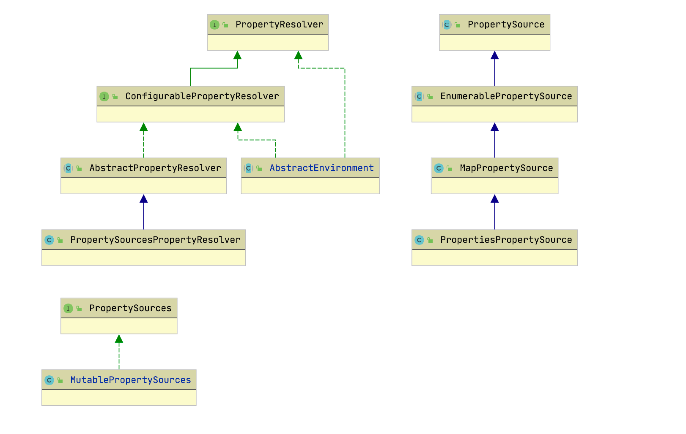

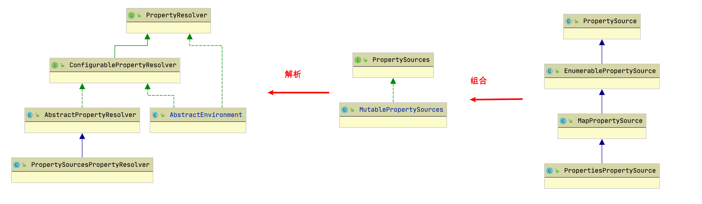

结论：propertiesSources/propertiesSource是spring对jdk的property的一个封装。

## refresh

把关注里集中在AbstractApplicationContext一下：

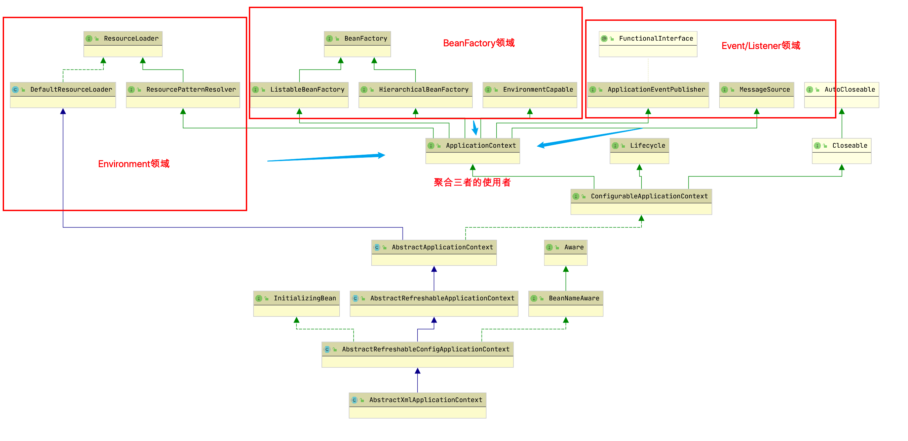

以上图回顾一下，我们已经讲了environment领域，接下来顺着ApplicationContext去讲其它领域。

从上图可以看出：

```java
public abstract class AbstractApplicationContext extends DefaultResourceLoader
		implements ConfigurableApplicationContext {
    ....
```

`AbstractApplicationContext` 继承的是 DefaultResourceLoader，那么这里先打个基础：

```java
public interface A {
    void testA();
}

public class B implements A {
    public void testA() {
        //..
    }
}

public interface C extends A {
    void testC();
}

public class D extends B implements C {
    
    // 这里实现testC即刻，不用实现testA
    public void testC() {
        //..
    }
}

即D默认使用了B实现的testA();
```

按以上案例：AbstractApplicationContext使用了

Spring bean解析就在此方法，所以单独提出来。（最重要的大餐。）

AbstractApplicationContext.refresh:

这个方法使用的模版模式。整个方法的执行由AbstractApplicationContext 及其子类完成。

这个例子由AbstractApplicationContext，AbstractRefreshableApplicationContext ，AbstractXmlApplicationContext，ClassPathXmlApplicationContext共同完成。

```java
@Override
public void refresh() throws BeansException, IllegalStateException {
    synchronized (this.startupShutdownMonitor) {
        // Prepare this context for refreshing.
        prepareRefresh();
        // Tell the subclass to refresh the internal bean factory.
        ConfigurableListableBeanFactory beanFactory = obtainFreshBeanFactory();
        // Prepare the bean factory for use in this context.
        prepareBeanFactory(beanFactory);
        try {
            // Allows post-processing of the bean factory in context subclasses.
            postProcessBeanFactory(beanFactory);
            // Invoke factory processors registered as beans in the context.
            invokeBeanFactoryPostProcessors(beanFactory);
            // Register bean processors that intercept bean creation.
            registerBeanPostProcessors(beanFactory);
            // Initialize message source for this context.
            initMessageSource();
            // Initialize event multicaster for this context.
            initApplicationEventMulticaster();
            // Initialize other special beans in specific context subclasses.
            onRefresh();
            // Check for listener beans and register them.
            registerListeners();
            // Instantiate all remaining (non-lazy-init) singletons.
            finishBeanFactoryInitialization(beanFactory);
            // Last step: publish corresponding event.
            finishRefresh();
        } catch (BeansException ex) {
            // Destroy already created singletons to avoid dangling resources.
            destroyBeans();
            // Reset 'active' flag.
            cancelRefresh(ex);
            // Propagate exception to caller.
            throw ex;
        } finally {
            // Reset common introspection caches in Spring's core, since we
            // might not ever need metadata for singleton beans anymore...
            resetCommonCaches();
        }
    }
}
```

### prepareRefresh

```java
protected void prepareRefresh() {
    this.startupDate = System.currentTimeMillis();
    this.closed.set(false);
    this.active.set(true);
    
    if (logger.isDebugEnabled()) {
        if (logger.isTraceEnabled()) {
            logger.trace("Refreshing " + this);
        }
        else {
            logger.debug("Refreshing " + getDisplayName());
        }
    }
    
    // Initialize any placeholder property sources in the context environment
    //空实现
    initPropertySources();
    // Validate that all properties marked as required are resolvable
    // see ConfigurablePropertyResolver#setRequiredProperties
    getEnvironment().validateRequiredProperties();
    
    // Store pre-refresh ApplicationListeners...
    if (this.earlyApplicationListeners == null) {
        this.earlyApplicationListeners = new LinkedHashSet<>(this.applicationListeners);
    } else {
        // Reset local application listeners to pre-refresh state.
        this.applicationListeners.clear();
        this.applicationListeners.addAll(this.earlyApplicationListeners);
    }

    // Allow for the collection of early ApplicationEvents,
    // to be published once the multicaster is available...
    this.earlyApplicationEvents = new LinkedHashSet<>();
}
```

#### 属性校验

AbstractEnvironment.validateRequiredProperties:

```java
@Override
public void validateRequiredProperties() throws MissingRequiredPropertiesException {
    this.propertyResolver.validateRequiredProperties();
}
```

AbstractPropertyResolver.validateRequiredProperties:

```java
@Override
public void validateRequiredProperties() {
    MissingRequiredPropertiesException ex = new MissingRequiredPropertiesException();
    for (String key : this.requiredProperties) {
        if (this.getProperty(key) == null) {
            ex.addMissingRequiredProperty(key);
        }
    }
    if (!ex.getMissingRequiredProperties().isEmpty()) {
        throw ex;
    }
}
```

requiredProperties是通过setRequiredProperties方法设置的，保存在一个list里面，默认是空的，也就是不需要校验任何属性。

### BeanFactory创建

由obtainFreshBeanFactory调用AbstractRefreshableApplicationContext.refreshBeanFactory:

```java
AbstractApplicationContext文件##########################
	/**
	 * Tell the subclass to refresh the internal bean factory.
	 * @return the fresh BeanFactory instance
	 * @see #refreshBeanFactory()
	 * @see #getBeanFactory()
	 */
protected ConfigurableListableBeanFactory obtainFreshBeanFactory() {
    refreshBeanFactory();
    return getBeanFactory();
}

	/**
	 * Subclasses must implement this method to perform the actual configuration load.
	 * The method is invoked by {@link #refresh()} before any other initialization work.
	 * <p>A subclass will either create a new bean factory and hold a reference to it,
	 * or return a single BeanFactory instance that it holds. In the latter case, it will
	 * usually throw an IllegalStateException if refreshing the context more than once.
	 * @throws BeansException if initialization of the bean factory failed
	 * @throws IllegalStateException if already initialized and multiple refresh
	 * attempts are not supported
	 */
protected abstract void refreshBeanFactory() throws BeansException, IllegalStateException;

AbstractRefreshableApplicationContext文件#######################
/*
	 * This implementation performs an actual refresh of this context's underlying
	 * bean factory, shutting down the previous bean factory (if any) and
	 * initializing a fresh bean factory for the next phase of the context's lifecycle.
	 */
@Override
protected final void refreshBeanFactory() throws BeansException {
    //如果已经存在，那么销毁之前的
    if (hasBeanFactory()) {
        destroyBeans();
        closeBeanFactory();
    }
    try {
        //创建了一个DefaultListableBeanFactory对象
        DefaultListableBeanFactory beanFactory = createBeanFactory();
        beanFactory.setSerializationId(getId());
        customizeBeanFactory(beanFactory);
        loadBeanDefinitions(beanFactory);
        this.beanFactory = beanFactory;
    } catch (IOException ex) {
        throw new ApplicationContextException("I/O error parsing bean definition source for " + getDisplayName(), ex);
    }
}

protected final boolean hasBeanFactory() {
    return (this.beanFactory != null);
}

这个是AbstractApplicationContext文件##########################
	/**
	 * Template method for destroying all beans that this context manages.
	 * The default implementation destroy all cached singletons in this context,
	 * invoking {@code DisposableBean.destroy()} and/or the specified
	 * "destroy-method".
	 * <p>Can be overridden to add context-specific bean destruction steps
	 * right before or right after standard singleton destruction,
	 * while the context's BeanFactory is still active.
	 * @see #getBeanFactory()
	 * @see org.springframework.beans.factory.config.ConfigurableBeanFactory#destroySingletons()
	 */
	protected void destroyBeans() {
		getBeanFactory().destroySingletons();
	}

这个是AbstractRefreshableApplicationContext文件####################################
@Override
	protected final void closeBeanFactory() {
		DefaultListableBeanFactory beanFactory = this.beanFactory;
		if (beanFactory != null) {
			beanFactory.setSerializationId(null);
			this.beanFactory = null;
		}
	}


```

`createBeanFactory(); ` 就要带大家去了解一下什么是BeanFactory家族了。

#### BeanFactory接口

此接口实际上就是Bean容器，其继承体系:


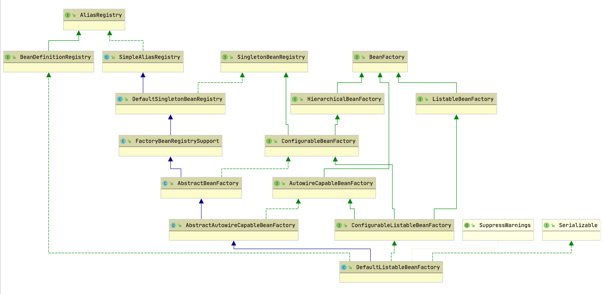


#### BeanFactory创建

```java
这是文件AbstractRefreshableApplicationContext的方法####################
/**
* Create an internal bean factory for this context.
* Called for each {@link #refresh()} attempt.
* <p>The default implementation creates a
* {@link org.springframework.beans.factory.support.DefaultListableBeanFactory}
* with the {@linkplain #getInternalParentBeanFactory() internal bean factory} of this
* context's parent as parent bean factory. Can be overridden in subclasses,
* for example to customize DefaultListableBeanFactory's settings.
* @return the bean factory for this context
* @see org.springframework.beans.factory.support.DefaultListableBeanFactory#setAllowBeanDefinitionOverriding
* @see org.springframework.beans.factory.support.DefaultListableBeanFactory#setAllowEagerClassLoading
* @see org.springframework.beans.factory.support.DefaultListableBeanFactory#setAllowCircularReferences
* @see org.springframework.beans.factory.support.DefaultListableBeanFactory#setAllowRawInjectionDespiteWrapping
*/
protected DefaultListableBeanFactory createBeanFactory() {
	return new DefaultListableBeanFactory(getInternalParentBeanFactory());
}
org.springframework.context.support.AbstractApplicationContext#getInternalParentBeanFactory
    
这是文件AbstractApplicationContext的方法#############################
    /**
     * 返回如果它实现ConfigurableApplicationContext父上下文的内部bean工厂; 否则，返回自己的父上下文。
	 * Return the internal bean factory of the parent context if it implements
	 * ConfigurableApplicationContext; else, return the parent context itself.
	 * @see org.springframework.context.ConfigurableApplicationContext#getBeanFactory
	 */
    @Nullable
    protected BeanFactory getInternalParentBeanFactory() {
    return (getParent() instanceof ConfigurableApplicationContext ?
            ((ConfigurableApplicationContext) getParent()).getBeanFactory() : getParent());
	}

这是文件DefaultListableBeanFactory的方法方法#####################
	/**
	 * Create a new DefaultListableBeanFactory with the given parent.
	 * @param parentBeanFactory the parent BeanFactory
	 */
	public DefaultListableBeanFactory(@Nullable BeanFactory parentBeanFactory) {
		super(parentBeanFactory);
	}
```

这个实现有点绕。在这个例子中是返回了个null给DefaultListableBeanFactory。

最终AbstractRefreshableApplicationContext是调用new DefaultListableBeanFactory(null)，创造的方法。

```java
这是文件AbstractAutowireCapableBeanFactory的方法方法#####################
	/**
	 * autowire : 自动装配<br/>
	 * Create a new AbstractAutowireCapableBeanFactory.
	 */
	public AbstractAutowireCapableBeanFactory() {
		super();
		ignoreDependencyInterface(BeanNameAware.class);
		ignoreDependencyInterface(BeanFactoryAware.class);
		ignoreDependencyInterface(BeanClassLoaderAware.class);
	}

	/**
	 * Create a new AbstractAutowireCapableBeanFactory with the given parent.
	 * @param parentBeanFactory parent bean factory, or {@code null} if none
	 */
	public AbstractAutowireCapableBeanFactory(@Nullable BeanFactory parentBeanFactory) {
		this();
		setParentBeanFactory(parentBeanFactory);
	}


	/**
	 * Dependency interfaces to ignore on dependency check and autowire, as Set of
	 * Class objects. By default, only the BeanFactory interface is ignored.
	 */
	private final Set<Class<?>> ignoredDependencyInterfaces = new HashSet<>();
	/**
	 * Ignore the given dependency interface for autowiring.
	 * <p>This will typically be used by application contexts to register
	 * dependencies that are resolved in other ways, like BeanFactory through
	 * BeanFactoryAware or ApplicationContext through ApplicationContextAware.
	 * <p>By default, only the BeanFactoryAware interface is ignored.
	 * For further types to ignore, invoke this method for each type.
	 * @see org.springframework.beans.factory.BeanFactoryAware
	 * @see org.springframework.context.ApplicationContextAware
	 */
	public void ignoreDependencyInterface(Class<?> ifc) {
		this.ignoredDependencyInterfaces.add(ifc);
	}


	@Override
	public void setParentBeanFactory(@Nullable BeanFactory parentBeanFactory) {
		if (this.parentBeanFactory != null && this.parentBeanFactory != parentBeanFactory) {
			throw new IllegalStateException("Already associated with parent BeanFactory: " + this.parentBeanFactory);
		}
		if (this == parentBeanFactory) {
			throw new IllegalStateException("Cannot set parent bean factory to self");
		}
		this.parentBeanFactory = parentBeanFactory;
	}

这是文件AbstractBeanFactory############################ 组合模式。
	/** Parent bean factory, for bean inheritance support. */
	@Nullable
	private BeanFactory parentBeanFactory;

这是文件AbstractBeanFactory############################
public AbstractBeanFactory() {
}

//追踪到这里算是完结了。
```

最终AbstractBeanFactory初始化，连带着父类们一起初始化。


BeanFactory先到这里，因为这里面的东西太复杂，不容易一下子吃下这个大胖子。

继续回来看这段代码。

```java
@Override
protected final void refreshBeanFactory() throws BeansException {
    if (hasBeanFactory()) {
        destroyBeans();
        closeBeanFactory();
    }
    try {
        DefaultListableBeanFactory beanFactory = createBeanFactory();
        //看到这里。
        beanFactory.setSerializationId(getId()); //beanFactory命名。使用的是applicationcontext的id。
        customizeBeanFactory(beanFactory);
        loadBeanDefinitions(beanFactory);
        this.beanFactory = beanFactory;
    }
    catch (IOException ex) {
        throw new ApplicationContextException("I/O error parsing bean definition source for " + getDisplayName(), ex);
    }
}
```

#### BeanFactory定制

AbstractRefreshableApplicationContext.customizeBeanFactory方法用于给子类提供一个自由配置的机会，默认实现:

```java
protected void customizeBeanFactory(DefaultListableBeanFactory beanFactory) {
    if (this.allowBeanDefinitionOverriding != null) {
        //默认false，不允许覆盖
        beanFactory.setAllowBeanDefinitionOverriding(this.allowBeanDefinitionOverriding);
    }
    if (this.allowCircularReferences != null) {
        //默认false，不允许循环引用
        beanFactory.setAllowCircularReferences(this.allowCircularReferences);
    }
}
```

#### Bean加载

AbstractXmlApplicationContext.loadBeanDefinitions，这个便是**核心的bean加载**了:

```java
@Override
protected void loadBeanDefinitions(DefaultListableBeanFactory beanFactory) {
    // Create a new XmlBeanDefinitionReader for the given BeanFactory.
    XmlBeanDefinitionReader beanDefinitionReader = new XmlBeanDefinitionReader(beanFactory);
    // Configure the bean definition reader with this context's
    // resource loading environment.
    beanDefinitionReader.setEnvironment(this.getEnvironment());
    beanDefinitionReader.setResourceLoader(this);
    beanDefinitionReader.setEntityResolver(new ResourceEntityResolver(this));
    // Allow a subclass to provide custom initialization of the reader,
    // then proceed with actually loading the bean definitions.
    initBeanDefinitionReader(beanDefinitionReader);
    loadBeanDefinitions(beanDefinitionReader);
}


	/**
	 * Initialize the bean definition reader used for loading the bean
	 * definitions of this context. Default implementation is empty.
	 * <p>Can be overridden in subclasses, e.g. for turning off XML validation
	 * or using a different XmlBeanDefinitionParser implementation.
	 * @param reader the bean definition reader used by this context
	 * @see org.springframework.beans.factory.xml.XmlBeanDefinitionReader#setDocumentReaderClass
	 */
protected void initBeanDefinitionReader(XmlBeanDefinitionReader reader) {
    reader.setValidating(this.validating);
}
```

Environment我们都讲过了，ResourceLoader也说了。


##### EntityResolver

此处只说明用到的部分继承体系:


```java
public class ResourceEntityResolver extends DelegatingEntityResolver {

	private static final Log logger = LogFactory.getLog(ResourceEntityResolver.class);

	private final ResourceLoader resourceLoader;


	/**
	 * Create a ResourceEntityResolver for the specified ResourceLoader
	 * (usually, an ApplicationContext).
	 * @param resourceLoader the ResourceLoader (or ApplicationContext)
	 * to load XML entity includes with
	 */
	public ResourceEntityResolver(ResourceLoader resourceLoader) {
		super(resourceLoader.getClassLoader());
		this.resourceLoader = resourceLoader;
	}
```


```java
public class DelegatingEntityResolver implements EntityResolver {

	/** Suffix for DTD files. */
	public static final String DTD_SUFFIX = ".dtd";

	/** Suffix for schema definition files. */
	public static final String XSD_SUFFIX = ".xsd";


	private final EntityResolver dtdResolver;

	private final EntityResolver schemaResolver;


	/**
	 * Create a new DelegatingEntityResolver that delegates to
	 * a default {@link BeansDtdResolver} and a default {@link PluggableSchemaResolver}.
	 * <p>Configures the {@link PluggableSchemaResolver} with the supplied
	 * {@link ClassLoader}.
	 * @param classLoader the ClassLoader to use for loading
	 * (can be {@code null}) to use the default ClassLoader)
	 */
	public DelegatingEntityResolver(@Nullable ClassLoader classLoader) {
		this.dtdResolver = new BeansDtdResolver();
		this.schemaResolver = new PluggableSchemaResolver(classLoader);
	}
```


EntityResolver接口在org.xml.sax中定义。DelegatingEntityResolver用于schema和dtd的解析。

EntityResolver就不多看了。

##### BeanDefinitionReader

继承体系:


##### 路径解析(Ant)

```java
protected void loadBeanDefinitions(XmlBeanDefinitionReader reader) {
    Resource[] configResources = getConfigResources();
    if (configResources != null) {
        reader.loadBeanDefinitions(configResources);
    }
    String[] configLocations = getConfigLocations();
    //here
    if (configLocations != null) {
        reader.loadBeanDefinitions(configLocations);
    }
}

/**
	 * Return an array of Resource objects, referring to the XML bean definition
	 * files that this context should be built with.
	 * <p>The default implementation returns {@code null}. Subclasses can override
	 * this to provide pre-built Resource objects rather than location Strings.
	 * @return an array of Resource objects, or {@code null} if none
	 * @see #getConfigLocations()
	 */
@Nullable
protected Resource[] getConfigResources() {
    return null;
}
```

调用的是reader.loadBeanDefinitions(configResources);

AbstractBeanDefinitionReader.loadBeanDefinitions:

```java
@Override
public int loadBeanDefinitions(Resource... resources) throws BeanDefinitionStoreException {
    Assert.notNull(resources, "Resource array must not be null");
    int count = 0;
    for (Resource resource : resources) {
        count += loadBeanDefinitions(resource); // 标记#2
    }
    return count;
}
```

这里有一个陷阱：标记#2处的方法其实是可以加载自己的，但是这样就存在着逻辑错误：自旋了。但是idea也没有显示圈圈。如下图：

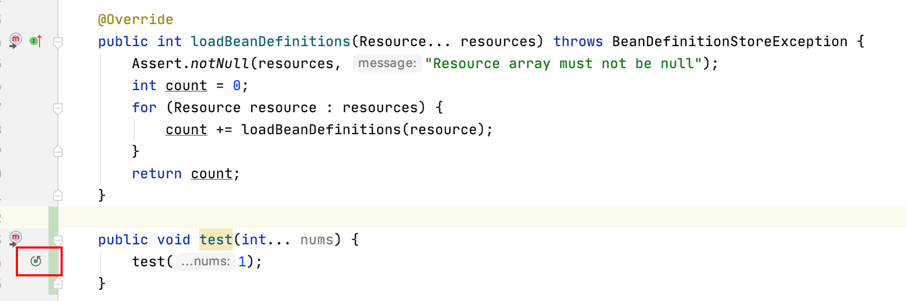

这样就很尴尬了😅。

点击loadBeanDefinitions方法跳到org.springframework.beans.factory.support.BeanDefinitionReader#loadBeanDefinitions(org.springframework.core.io.Resource)

发现这个方法被重载了。

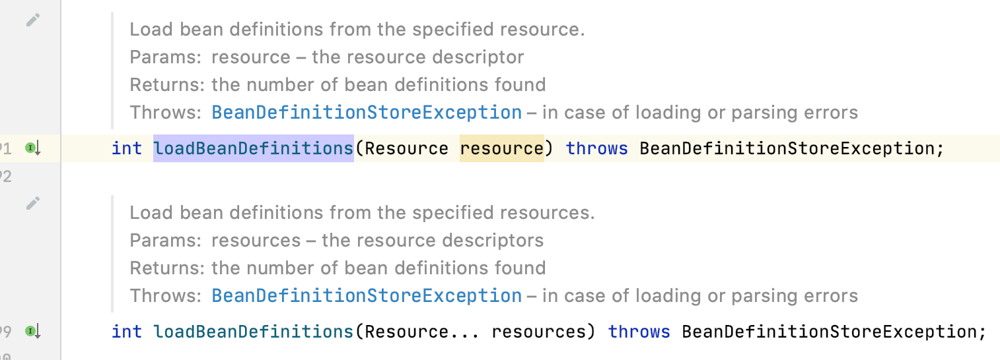

重载的arrays优先级比较低。所以优先加载上面那个，上面那个是

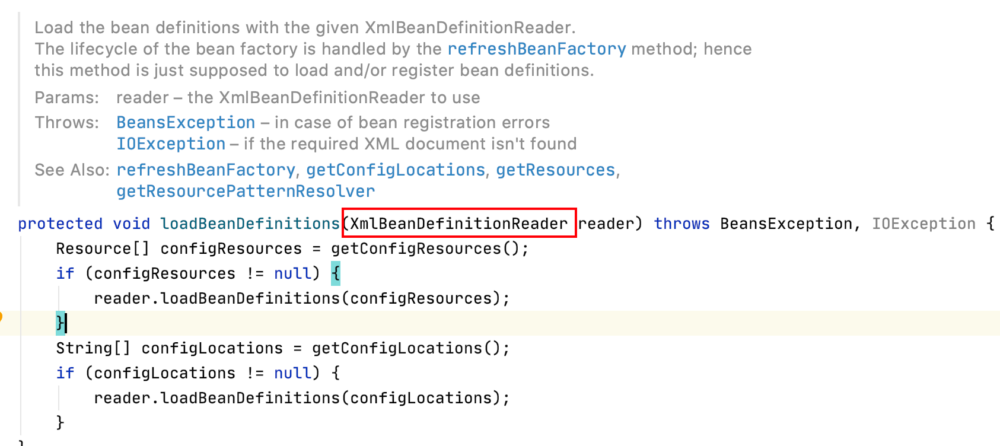

`XmlBeanDefinitionReader` 文件。

之后调用org.springframework.beans.factory.xml.XmlBeanDefinitionReader#loadBeanDefinitions(org.springframework.core.io.support.EncodedResource):

```java
/**
	 * Load bean definitions from the specified XML file.
	 * @param resource the resource descriptor for the XML file
	 * @return the number of bean definitions found
	 * @throws BeanDefinitionStoreException in case of loading or parsing errors
	 */
@Override
public int loadBeanDefinitions(Resource resource) throws BeanDefinitionStoreException {
    return loadBeanDefinitions(new EncodedResource(resource));
}


	/**
	 * Load bean definitions from the specified XML file.
	 * @param encodedResource the resource descriptor for the XML file,
	 * allowing to specify an encoding to use for parsing the file
	 * @return the number of bean definitions found
	 * @throws BeanDefinitionStoreException in case of loading or parsing errors
	 */
	public int loadBeanDefinitions(EncodedResource encodedResource) throws BeanDefinitionStoreException {
		Assert.notNull(encodedResource, "EncodedResource must not be null");
		if (logger.isTraceEnabled()) {
			logger.trace("Loading XML bean definitions from " + encodedResource);
		}

		Set<EncodedResource> currentResources = this.resourcesCurrentlyBeingLoaded.get();

		if (!currentResources.add(encodedResource)) {
			throw new BeanDefinitionStoreException(
					"Detected cyclic loading of " + encodedResource + " - check your import definitions!");
		}

		try (InputStream inputStream = encodedResource.getResource().getInputStream()) {
			InputSource inputSource = new InputSource(inputStream);
			if (encodedResource.getEncoding() != null) {
				inputSource.setEncoding(encodedResource.getEncoding());
			}
			return doLoadBeanDefinitions(inputSource, encodedResource.getResource());
		}
		catch (IOException ex) {
			throw new BeanDefinitionStoreException(
					"IOException parsing XML document from " + encodedResource.getResource(), ex);
		}
		finally {
			currentResources.remove(encodedResource);
			if (currentResources.isEmpty()) {
				this.resourcesCurrentlyBeingLoaded.remove();
			}
		}
	}
```

看注解是解析xml文件的方法，现在大家都想去掉xml文件，没心情看下面了。这里的重点是doLoadBeanDefinitions方法。

```java

/**
	 * Load the bean definitions with the given XmlBeanDefinitionReader.
	 * <p>The lifecycle of the bean factory is handled by the {@link #refreshBeanFactory}
	 * method; hence this method is just supposed to load and/or register bean definitions.
	 * @param reader the XmlBeanDefinitionReader to use
	 * @throws BeansException in case of bean registration errors
	 * @throws IOException if the required XML document isn't found
	 * @see #refreshBeanFactory
	 * @see #getConfigLocations
	 * @see #getResources
	 * @see #getResourcePatternResolver
	 */
protected void loadBeanDefinitions(XmlBeanDefinitionReader reader) throws BeansException, IOException {
    Resource[] configResources = getConfigResources();
    if (configResources != null) {
        reader.loadBeanDefinitions(configResources);
    }
    String[] configLocations = getConfigLocations();
    if (configLocations != null) {
        reader.loadBeanDefinitions(configLocations); // # 标记3
    }
}
```

标记3处执行的代码如下：

```java
@Override
public int loadBeanDefinitions(String... locations) throws BeanDefinitionStoreException {
    Assert.notNull(locations, "Location array must not be null");
    int count = 0;
    for (String location : locations) {
        count += loadBeanDefinitions(location);
    }
    return count;
}

@Override
public int loadBeanDefinitions(String location) throws BeanDefinitionStoreException {
    return loadBeanDefinitions(location, null);
}

//第二个参数为空
public int loadBeanDefinitions(String location, Set<Resource> actualResources) {
    ResourceLoader resourceLoader = getResourceLoader();
    //参见ResourceLoader类图，ClassPathXmlApplicationContext实现了此接口
    if (resourceLoader instanceof ResourcePatternResolver) {
        // Resource pattern matching available.
        try {
            Resource[] resources = ((ResourcePatternResolver) resourceLoader).getResources(location);
            int loadCount = loadBeanDefinitions(resources);
            if (actualResources != null) {
                for (Resource resource : resources) {
                    actualResources.add(resource);
                }
            }
            return loadCount;
        }
        catch (IOException ex) {
            throw new BeanDefinitionStoreException(
                    "Could not resolve bean definition resource pattern [" + location + "]", ex);
        }
    }
    else {
        // Can only load single resources by absolute URL.
        Resource resource = resourceLoader.getResource(location);
        int loadCount = loadBeanDefinitions(resource); // 这里还是调用上面的代码👆，同样的。
        if (actualResources != null) {
            actualResources.add(resource);
        }
        return loadCount;
    }
}
```

getResource的实现在AbstractApplicationContext：

```java
@Override
public Resource[] getResources(String locationPattern) throws IOException {
    //构造器中初始化，PathMatchingResourcePatternResolver对象
    return this.resourcePatternResolver.getResources(locationPattern);
}
```

PathMatchingResourcePatternResolver是ResourceLoader继承体系的一部分。这部分在上面分析过了。其中最主要的方法如下：

```java
@Override
public Resource[] getResources(String locationPattern) throws IOException {
    Assert.notNull(locationPattern, "Location pattern must not be null");
    //classpath:
    if (locationPattern.startsWith(CLASSPATH_ALL_URL_PREFIX)) {
        // a class path resource (multiple resources for same name possible)
        //matcher是一个AntPathMatcher对象
        if (getPathMatcher().isPattern(locationPattern
            .substring(CLASSPATH_ALL_URL_PREFIX.length()))) {
            // a class path resource pattern
            return findPathMatchingResources(locationPattern);
        } else {
            // all class path resources with the given name
            return findAllClassPathResources(locationPattern
                .substring(CLASSPATH_ALL_URL_PREFIX.length()));
        }
    } else {
        // Only look for a pattern after a prefix here
        // (to not get fooled by a pattern symbol in a strange prefix).
        int prefixEnd = locationPattern.indexOf(":") + 1;
        if (getPathMatcher().isPattern(locationPattern.substring(prefixEnd))) {
            // a file pattern
            return findPathMatchingResources(locationPattern);
        }
        else {
            // a single resource with the given name
            return new Resource[] {getResourceLoader().getResource(locationPattern)};
        }
    }
}

protected Resource[] findPathMatchingResources(String locationPattern) throws IOException {
		String rootDirPath = determineRootDir(locationPattern);
		String subPattern = locationPattern.substring(rootDirPath.length());
		Resource[] rootDirResources = getResources(rootDirPath);
		Set<Resource> result = new LinkedHashSet<>(16);
		for (Resource rootDirResource : rootDirResources) {
			rootDirResource = resolveRootDirResource(rootDirResource);
			URL rootDirUrl = rootDirResource.getURL();
			if (equinoxResolveMethod != null && rootDirUrl.getProtocol().startsWith("bundle")) {
				URL resolvedUrl = (URL) ReflectionUtils.invokeMethod(equinoxResolveMethod, null, rootDirUrl);
				if (resolvedUrl != null) {
					rootDirUrl = resolvedUrl;
				}
				rootDirResource = new UrlResource(rootDirUrl);
			}
			if (rootDirUrl.getProtocol().startsWith(ResourceUtils.URL_PROTOCOL_VFS)) {
				result.addAll(VfsResourceMatchingDelegate.findMatchingResources(rootDirUrl, subPattern, getPathMatcher()));
			}
			else if (ResourceUtils.isJarURL(rootDirUrl) || isJarResource(rootDirResource)) {
				result.addAll(doFindPathMatchingJarResources(rootDirResource, rootDirUrl, subPattern));
			}
			else {
				result.addAll(doFindPathMatchingFileResources(rootDirResource, subPattern));
			}
		}
		if (logger.isTraceEnabled()) {
			logger.trace("Resolved location pattern [" + locationPattern + "] to resources " + result);
		}
		return result.toArray(new Resource[0]);
	}
```

isPattern:

```java
@Override
public boolean isPattern(String path) {
    return (path.indexOf('*') != -1 || path.indexOf('?') != -1);
}
```

可以看出配置文件路径是支持ant风格的，也就是可以这么写:

```java
new ClassPathXmlApplicationContext("con*.xml");
```

具体怎么解析ant风格的就不写了。

##### 配置文件加载

入口方法在AbstractBeanDefinitionReader的217行:

```java
//加载
Resource[] resources = ((ResourcePatternResolver) resourceLoader).getResources(location);
//解析
int loadCount = loadBeanDefinitions(resources);
```

最终逐个调用XmlBeanDefinitionReader的loadBeanDefinitions方法:

```java
@Override
public int loadBeanDefinitions(Resource resource) {
    return loadBeanDefinitions(new EncodedResource(resource));
}
```

Resource是代表一种资源的接口，其类图:


EncodedResource扮演的其实是一个装饰器的模式，为InputStreamSource添加了字符编码(虽然默认为null)。这样为我们自定义xml配置文件的编码方式提供了机会。

之后关键的源码只有两行:

```java
public int loadBeanDefinitions(EncodedResource encodedResource) throws BeanDefinitionStoreException {
    InputStream inputStream = encodedResource.getResource().getInputStream();
    InputSource inputSource = new InputSource(inputStream);
    return doLoadBeanDefinitions(inputSource, encodedResource.getResource());
}
```

InputSource是org.xml.sax的类。

doLoadBeanDefinitions：

```java
protected int doLoadBeanDefinitions(InputSource inputSource, Resource resource) {
    Document doc = doLoadDocument(inputSource, resource);
    return registerBeanDefinitions(doc, resource);
}
```

doLoadDocument:

```java
protected Document doLoadDocument(InputSource inputSource, Resource resource) {
    return this.documentLoader.loadDocument(inputSource, getEntityResolver(), this.errorHandler,
        getValidationModeForResource(resource), isNamespaceAware());
}
```

documentLoader是一个DefaultDocumentLoader对象，此类是DocumentLoader接口的唯一实现。getEntityResolver方法返回ResourceEntityResolver，上面说过了。errorHandler是一个SimpleSaxErrorHandler对象。

校验模型其实就是确定xml文件使用xsd方式还是dtd方式来校验，忘了的话左转度娘。Spring会通过读取xml文件的方式判断应该采用哪种。

NamespaceAware默认false，因为默认配置了校验为true。

DefaultDocumentLoader.loadDocument:

```java
@Override
public Document loadDocument(InputSource inputSource, EntityResolver entityResolver,
    ErrorHandler errorHandler, int validationMode, boolean namespaceAware) {
    //这里就是老套路了，可以看出，Spring还是使用了dom的方式解析，即一次全部load到内存
    DocumentBuilderFactory factory = createDocumentBuilderFactory(validationMode, namespaceAware);
    DocumentBuilder builder = createDocumentBuilder(factory, entityResolver, errorHandler);
    return builder.parse(inputSource);
}
```

createDocumentBuilderFactory比较有意思:

```java
protected DocumentBuilderFactory createDocumentBuilderFactory(int validationMode, boolean namespaceAware{
    DocumentBuilderFactory factory = DocumentBuilderFactory.newInstance();
    factory.setNamespaceAware(namespaceAware);
    if (validationMode != XmlValidationModeDetector.VALIDATION_NONE) {
        //此方法设为true仅对dtd有效，xsd(schema)无效
        factory.setValidating(true);
        if (validationMode == XmlValidationModeDetector.VALIDATION_XSD) {
            // Enforce namespace aware for XSD...
             //开启xsd(schema)支持
            factory.setNamespaceAware(true);
             //这个也是Java支持Schema的套路，可以问度娘
            factory.setAttribute(SCHEMA_LANGUAGE_ATTRIBUTE, XSD_SCHEMA_LANGUAGE);
        }
    }
    return factory;
}
```

##### Bean解析

XmlBeanDefinitionReader.registerBeanDefinitions:

```java
public int registerBeanDefinitions(Document doc, Resource resource) {
    BeanDefinitionDocumentReader documentReader = createBeanDefinitionDocumentReader();
    int countBefore = getRegistry().getBeanDefinitionCount();
    documentReader.registerBeanDefinitions(doc, createReaderContext(resource));
    return getRegistry().getBeanDefinitionCount() - countBefore;
}
```

createBeanDefinitionDocumentReader:

```java
protected BeanDefinitionDocumentReader createBeanDefinitionDocumentReader() {
    return BeanDefinitionDocumentReader.class.cast
      //反射
      (BeanUtils.instantiateClass(this.documentReaderClass));
}
```

documentReaderClass默认是DefaultBeanDefinitionDocumentReader，这其实也是策略模式，通过setter方法可以更换其实现。

注意cast方法，代替了强转。

createReaderContext：

```java
public XmlReaderContext createReaderContext(Resource resource) {
    return new XmlReaderContext(resource, this.problemReporter, this.eventListener,
        this.sourceExtractor, this, getNamespaceHandlerResolver());
}
```

problemReporter是一个FailFastProblemReporter对象。

eventListener是EmptyReaderEventListener对象，此类里的方法都是空实现。

sourceExtractor是NullSourceExtractor对象，直接返回空，也是空实现。

getNamespaceHandlerResolver默认返回DefaultNamespaceHandlerResolver对象，用来获取xsd对应的处理器。

XmlReaderContext的作用感觉就是这一堆参数的容器，糅合到一起传给DocumentReader，并美其名为Context。可以看出，Spring中到处都是策略模式，大量操作被抽象成接口。

DefaultBeanDefinitionDocumentReader.registerBeanDefinitions:

```java
@Override
public void registerBeanDefinitions(Document doc, XmlReaderContext readerContext) {
    this.readerContext = readerContext;
    Element root = doc.getDocumentElement();
    doRegisterBeanDefinitions(root);
}
```

doRegisterBeanDefinitions:

```java
protected void doRegisterBeanDefinitions(Element root) {
    BeanDefinitionParserDelegate parent = this.delegate;
    this.delegate = createDelegate(getReaderContext(), root, parent);
    //默认的命名空间即
    //http://www.springframework.org/schema/beans
    if (this.delegate.isDefaultNamespace(root)) {
        //检查profile属性
        String profileSpec = root.getAttribute(PROFILE_ATTRIBUTE);
        if (StringUtils.hasText(profileSpec)) {
            //profile属性可以以,分割
            String[] specifiedProfiles = StringUtils.tokenizeToStringArray(
                    profileSpec, BeanDefinitionParserDelegate.MULTI_VALUE_ATTRIBUTE_DELIMITERS);
            if (!getReaderContext().getEnvironment().acceptsProfiles(specifiedProfiles)) {
                return;
            }
        }
    }
    preProcessXml(root);
    parseBeanDefinitions(root, this.delegate);
    postProcessXml(root);
    this.delegate = parent;
}
```

delegate的作用在于处理beans标签的嵌套，其实Spring配置文件是可以写成这样的:

```xml
<?xml version="1.0" encoding="UTF-8"?>    
<beans>    
    <bean class="base.SimpleBean"></bean>
    <beans>
        <bean class="java.lang.Object"></bean>
    </beans>
</beans>
```

xml(schema)的命名空间其实类似于java的报名，命名空间采用URL，比如Spring的是这样:

```xml
<?xml version="1.0" encoding="UTF-8"?>    
<beans xmlns="http://www.springframework.org/schema/beans"></beans>
```

xmlns属性就是xml规范定义的用来设置命名空间的。这样设置了之后其实里面的bean元素全名就相当于http://www.springframework.org/schema/beans:bean，可以有效的防止命名冲突。命名空间可以通过规范定义的org.w3c.dom.Node.getNamespaceURI方法获得。

注意一下profile的检查, AbstractEnvironment.acceptsProfiles:

```java
@Override
public boolean acceptsProfiles(String... profiles) {
    Assert.notEmpty(profiles, "Must specify at least one profile");
    for (String profile : profiles) {
        if (StringUtils.hasLength(profile) && profile.charAt(0) == '!') {
            if (!isProfileActive(profile.substring(1))) {
                return true;
            }
        } else if (isProfileActive(profile)) {
            return true;
        }
    }
    return false;
}
```

原理很简单，注意从源码可以看出，**profile属性支持!取反**。

preProcessXml方法是个空实现，供子类去覆盖，**目的在于给子类一个把我们自定义的标签转为Spring标准标签的机会**, 想的真周到。

DefaultBeanDefinitionDocumentReader.parseBeanDefinitions：

```java
protected void parseBeanDefinitions(Element root, BeanDefinitionParserDelegate delegate) {
    if (delegate.isDefaultNamespace(root)) {
        NodeList nl = root.getChildNodes();
        for (int i = 0; i < nl.getLength(); i++) {
            Node node = nl.item(i);
            if (node instanceof Element) {
                Element ele = (Element) node;
                if (delegate.isDefaultNamespace(ele)) {
                    parseDefaultElement(ele, delegate);
                } else {
                    delegate.parseCustomElement(ele);
                }
            }
        }
    } else {
        delegate.parseCustomElement(root);
    }
}
```

可见，对于非默认命名空间的元素交由delegate处理。

#### 默认命名空间解析

即import, alias, bean, 嵌套的beans四种元素。parseDefaultElement:

```java
private void parseDefaultElement(Element ele, BeanDefinitionParserDelegate delegate) {
    //"import"
    if (delegate.nodeNameEquals(ele, IMPORT_ELEMENT)) {
        importBeanDefinitionResource(ele);
    }
    else if (delegate.nodeNameEquals(ele, ALIAS_ELEMENT)) {
        processAliasRegistration(ele);
    }
    else if (delegate.nodeNameEquals(ele, BEAN_ELEMENT)) {
        processBeanDefinition(ele, delegate);
    }
    else if (delegate.nodeNameEquals(ele, NESTED_BEANS_ELEMENT)) {
        // recurse
        doRegisterBeanDefinitions(ele);
    }
}
```

##### import

写法示例:

```xml
<import resource="CTIContext.xml" />
<import resource="customerContext.xml" />
```

importBeanDefinitionResource套路和之前的配置文件加载完全一样，不过注意被import进来的文件是先于当前文件 被解析的。

##### alias

加入有一个bean名为componentA-dataSource，但是另一个组件想以componentB-dataSource的名字使用，就可以这样定义:

```xml
<alias name="componentA-dataSource" alias="componentB-dataSource"/>
```

processAliasRegistration核心源码:

```java
protected void processAliasRegistration(Element ele) {
    String name = ele.getAttribute(NAME_ATTRIBUTE);
    String alias = ele.getAttribute(ALIAS_ATTRIBUTE);
    getReaderContext().getRegistry().registerAlias(name, alias);
    getReaderContext().fireAliasRegistered(name, alias, extractSource(ele));
}
```


暂时看到这里，转向看spring boot 加载的三个context。因为现在大家都是用spring boot做web开发，context使用的beanfactory体系都一样，所以不会减少对beanfactory的理解。顺应开发潮流。

看一下springboot的经过我精简的源码：

```java

public static final String DEFAULT_CONTEXT_CLASS = "org.springframework.context."
    + "annotation.AnnotationConfigApplicationContext";

public static final String DEFAULT_WEB_CONTEXT_CLASS = "org.springframework.boot."
    + "web.servlet.context.AnnotationConfigServletWebServerApplicationContext";

public static final String DEFAULT_REACTIVE_WEB_CONTEXT_CLASS = "org.springframework."
"boot.web.reactive.context.AnnotationConfigReactiveWebServerApplicationContext";

private static final String[] WEB_ENVIRONMENT_CLASSES = { "javax.servlet.Servlet", "org.springframework.web.context.ConfigurableWebApplicationContext" };

switch (this.webApplicationType) {
    case SERVLET:
        contextClass = Class.forName(DEFAULT_WEB_CONTEXT_CLASS);
        break;
    case REACTIVE:
        contextClass = Class.forName(DEFAULT_REACTIVE_WEB_CONTEXT_CLASS);
        break;
    default:
        contextClass = Class.forName(DEFAULT_CONTEXT_CLASS);
}

```


从上面可以看出 Spring boot中

默认模式使用的context是这个—>AnnotationConfigApplicationContext，

SERVLET模式使用的context --->  AnnotationConfigServletWebServerApplicationContext，

REACTIVE模式使用的context—>AnnotationConfigReactiveWebServerApplicationContext

。

其中AnnotationConfigApplicationContext是spring-framework的，其它的都是spring-boot拓展的context。

所有的web都会实现这个接口ConfigurableWebApplicationContext。


AnnotationConfigServletWebServerApplicationContext 是继承是spring-framework的GenericApplicationContext实现的。

AnnotationConfigServletWebServerApplicationContext 是继承spring-framework的GenericWebApplicationContext实现的。

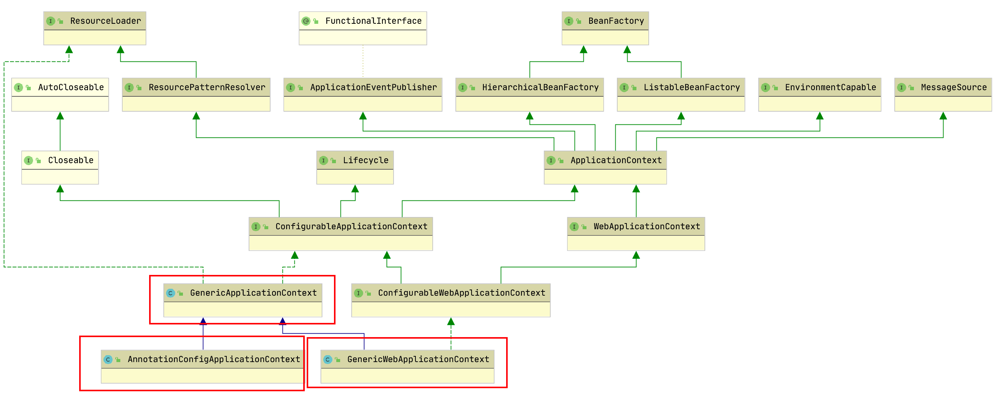

我们先看：AnnotationConfigApplicationContext类。

我找到 `AnnotationConfigApplicationContextTests` 来看看。

例子一：

```java
class AnnotationConfigApplicationContextTests {

	@Test
	void scanAndRefresh() {
		AnnotationConfigApplicationContext context = new AnnotationConfigApplicationContext();
		context.scan("org.springframework.context.annotation6");
		context.refresh();

		context.getBean(uncapitalize(ConfigForScanning.class.getSimpleName()));
		context.getBean("testBean"); // contributed by ConfigForScanning
		context.getBean(uncapitalize(ComponentForScanning.class.getSimpleName()));
		context.getBean(uncapitalize(Jsr330NamedForScanning.class.getSimpleName()));
		Map<String, Object> beans = context.getBeansWithAnnotation(Configuration.class);
		assertThat(beans).hasSize(1);
	}
```

这里先介绍`uncapitalize` 方法：

```java

	public static String capitalize(String str) {
		return changeFirstCharacterCase(str, true);
	}

	//Uncapitalize一个String ，改变第一个字母为小写按照Character.toLowerCase(char) 。 没有其他的字母改变
	public static String uncapitalize(String str) {
		return changeFirstCharacterCase(str, false);
	}
```

这个方法以后可能会用得到记下来。

回归这个测试用例：

居然有这么骚的用法：`Map<String, Object> beans = context.getBeansWithAnnotation(Configuration.class);` 记一下，后面来看这个是怎么实现的。

第一步：

```java
AnnotationConfigApplicationContext context = new AnnotationConfigApplicationContext();
```

先看看这个类的继承体系。

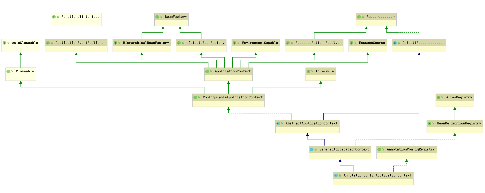

比较一下前面的classXmlPath


从前面的源码可以发现，registry其实就是DefaultListableBeanFactory，它实现了BeanDefinitionRegistry接口。registerAlias方法的实现在SimpleAliasRegistry:

```java
@Override
public void registerAlias(String name, String alias) {
    Assert.hasText(name, "'name' must not be empty");
    Assert.hasText(alias, "'alias' must not be empty");
    //名字和别名一样
    if (alias.equals(name)) {
        //ConcurrentHashMap
        this.aliasMap.remove(alias);
    } else {
        String registeredName = this.aliasMap.get(alias);
        if (registeredName != null) {
            if (registeredName.equals(name)) {
                // An existing alias - no need to re-register
                return;
            }
            if (!allowAliasOverriding()) {
                throw new IllegalStateException
                    ("Cannot register alias '" + alias + "' for name '" +
                    name + "': It is already registered for name '" + registeredName + "'.");
            }
        }
        checkForAliasCircle(name, alias);
        this.aliasMap.put(alias, name);
    }
}
```

所以别名关系的保存使用Map完成，key为别名，value为本来的名字。

##### bean

bean节点是Spring最最常见的节点了。

DefaultBeanDefinitionDocumentReader.processBeanDefinition:

```java
protected void processBeanDefinition(Element ele, BeanDefinitionParserDelegate delegate) {
    BeanDefinitionHolder bdHolder = delegate.parseBeanDefinitionElement(ele);
    if (bdHolder != null) {
        bdHolder = delegate.decorateBeanDefinitionIfRequired(ele, bdHolder);
        try {
            // Register the final decorated instance.
            BeanDefinitionReaderUtils.registerBeanDefinition
                (bdHolder, getReaderContext().getRegistry());
        }
        catch (BeanDefinitionStoreException ex) {
            getReaderContext().error("Failed to register bean definition with name '" +
                    bdHolder.getBeanName() + "'", ele, ex);
        }
        // Send registration event.
        getReaderContext().fireComponentRegistered(new BeanComponentDefinition(bdHolder));
    }
}
```

###### id & name处理

最终调用BeanDefinitionParserDelegate.parseBeanDefinitionElement(Element ele, BeanDefinition containingBean)，源码较长，分部分说明。

首先获取到id和name属性，**name属性支持配置多个，以逗号分隔，如果没有指定id，那么将以第一个name属性值代替。id必须是唯一的，name属性其实是alias的角色，可以和其它的bean重复，如果name也没有配置，那么其实什么也没做**。

```java
String id = ele.getAttribute(ID_ATTRIBUTE);
String nameAttr = ele.getAttribute(NAME_ATTRIBUTE);
List<String> aliases = new ArrayList<String>();
if (StringUtils.hasLength(nameAttr)) {
    //按,分隔
    String[] nameArr = StringUtils.tokenizeToStringArray
        (nameAttr, MULTI_VALUE_ATTRIBUTE_DELIMITERS);
    aliases.addAll(Arrays.asList(nameArr));
}
String beanName = id;
if (!StringUtils.hasText(beanName) && !aliases.isEmpty()) {
    //name的第一个值作为id
    beanName = aliases.remove(0);
}
//默认null
if (containingBean == null) {
    //校验id是否已重复，如果重复直接抛异常
    //校验是通过内部一个HashSet完成的，出现过的id都会保存进此Set
    checkNameUniqueness(beanName, aliases, ele);
}
```

###### beanName生成

如果name和id属性都没有指定，那么Spring会自己生成一个, BeanDefinitionParserDelegate.parseBeanDefinitionElement:

```java
beanName = this.readerContext.generateBeanName(beanDefinition);
String beanClassName = beanDefinition.getBeanClassName();
aliases.add(beanClassName);
```

可见，Spring同时会把类名作为其别名。

最终调用的是BeanDefinitionReaderUtils.generateBeanName:

```java
public static String generateBeanName(
        BeanDefinition definition, BeanDefinitionRegistry registry, boolean isInnerBean) {
    String generatedBeanName = definition.getBeanClassName();
    if (generatedBeanName == null) {
        if (definition.getParentName() != null) {
            generatedBeanName = definition.getParentName() + "$child";
             //工厂方法产生的bean
        } else if (definition.getFactoryBeanName() != null) {
            generatedBeanName = definition.getFactoryBeanName() + "$created";
        }
    }
    String id = generatedBeanName;
    if (isInnerBean) {
        // Inner bean: generate identity hashcode suffix.
        id = generatedBeanName + GENERATED_BEAN_NAME_SEPARATOR + 
            ObjectUtils.getIdentityHexString(definition);
    } else {
        // Top-level bean: use plain class name.
        // Increase counter until the id is unique.
        int counter = -1;
         //用类名#自增的数字命名
        while (counter == -1 || registry.containsBeanDefinition(id)) {
            counter++;
            id = generatedBeanName + GENERATED_BEAN_NAME_SEPARATOR + counter;
        }
    }
    return id;
}
```

###### bean解析

还是分部分说明(parseBeanDefinitionElement)。

首先获取到bean的class属性和parent属性，配置了parent之后，当前bean会继承父bean的属性。之后根据class和parent创建BeanDefinition对象。

```java
String className = null;
if (ele.hasAttribute(CLASS_ATTRIBUTE)) {
    className = ele.getAttribute(CLASS_ATTRIBUTE).trim();
}
String parent = null;
if (ele.hasAttribute(PARENT_ATTRIBUTE)) {
    parent = ele.getAttribute(PARENT_ATTRIBUTE);
}
AbstractBeanDefinition bd = createBeanDefinition(className, parent);
```

BeanDefinition的创建在BeanDefinitionReaderUtils.createBeanDefinition:

```java
public static AbstractBeanDefinition createBeanDefinition(
        String parentName, String className, ClassLoader classLoader) {
    GenericBeanDefinition bd = new GenericBeanDefinition();
    bd.setParentName(parentName);
    if (className != null) {
        if (classLoader != null) {
            bd.setBeanClass(ClassUtils.forName(className, classLoader));
        }
        else {
            bd.setBeanClassName(className);
        }
    }
    return bd;
}
```

之后是解析bean的其它属性，其实就是读取其配置，调用相应的setter方法保存在BeanDefinition中:

```java
parseBeanDefinitionAttributes(ele, beanName, containingBean, bd);
```

之后解析bean的decription子元素:

```xml
<bean id="b" name="one, two" class="base.SimpleBean">
    <description>SimpleBean</description>
</bean>
```

就仅仅是个描述。

然后是meta子元素的解析，meta元素在xml配置文件里是这样的:

```xml
<bean id="b" name="one, two" class="base.SimpleBean">
    <meta key="name" value="skywalker"/>
</bean>
```

注释上说，这样可以将任意的元数据附到对应的bean definition上。解析过程源码:

```java
public void parseMetaElements(Element ele, BeanMetadataAttributeAccessor attributeAccessor) {
    NodeList nl = ele.getChildNodes();
    for (int i = 0; i < nl.getLength(); i++) {
        Node node = nl.item(i);
        if (isCandidateElement(node) && nodeNameEquals(node, META_ELEMENT)) {
            Element metaElement = (Element) node;
            String key = metaElement.getAttribute(KEY_ATTRIBUTE);
            String value = metaElement.getAttribute(VALUE_ATTRIBUTE);
             //就是一个key, value的载体，无他
            BeanMetadataAttribute attribute = new BeanMetadataAttribute(key, value);
             //sourceExtractor默认是NullSourceExtractor，返回的是空
            attribute.setSource(extractSource(metaElement));
            attributeAccessor.addMetadataAttribute(attribute);
        }
    }
}
```

AbstractBeanDefinition继承自BeanMetadataAttributeAccessor类，底层使用了一个LinkedHashMap保存metadata。这个metadata具体是做什么暂时还不知道。

lookup-method解析：

此标签的作用在于当一个bean的某个方法被设置为lookup-method后，**每次调用此方法时，都会返回一个新的指定bean的对象**。用法示例:

```xml
<bean id="apple" class="cn.com.willchen.test.di.Apple" scope="prototype"/>
<!--水果盘-->
<bean id="fruitPlate" class="cn.com.willchen.test.di.FruitPlate">
    <lookup-method name="getFruit" bean="apple"/>
</bean>
```

数据保存在Set中，对应的类是MethodOverrides。可以参考:

[Spring - lookup-method方式实现依赖注入](http://www.cnblogs.com/ViviChan/p/4981619.html)

replace-mothod解析:

此标签用于替换bean里面的特定的方法实现，替换者必须实现Spring的MethodReplacer接口，有点像aop的意思。

配置文件示例:

```xml
<bean name="replacer" class="springroad.deomo.chap4.MethodReplace" />  
<bean name="testBean" class="springroad.deomo.chap4.LookupMethodBean">
    <replaced-method name="test" replacer="replacer">
        <arg-type match="String" />
    </replaced-method>  
</bean> 
```

arg-type的作用是指定替换方法的参数类型，因为接口的定义参数都是Object的。参考: [SPRING.NET 1.3.2 学习20--方法注入之替换方法注入](http://blog.csdn.net/lee576/article/details/8725548)

解析之后将数据放在ReplaceOverride对象中，里面有一个LinkedList<String>专门用于保存arg-type。

构造参数(constructor-arg)解析:

作用一目了然，使用示例:

```xml
<bean class="base.SimpleBean">
    <constructor-arg>
        <value type="java.lang.String">Cat</value>
    </constructor-arg>
</bean>
```

type一般不需要指定，除了泛型集合那种。除此之外，constructor-arg还支持name, index, ref等属性，可以具体的指定参数的位置等。构造参数解析后保存在BeanDefinition内部一个ConstructorArgumentValues对象中。如果设置了index属性，那么以Map<Integer, ValueHolder>的形式保存，反之，以List<ValueHolder>的形式保存。

property解析:

非常常用的标签，用以为bean的属性赋值，支持value和ref两种形式，示例:

```xml
<bean class="base.SimpleBean">
    <property name="name" value="skywalker" />
</bean>
```

value和ref属性不能同时出现，如果是ref，那么将其值保存在不可变的RuntimeBeanReference对象中，其实现了BeanReference接口，此接口只有一个getBeanName方法。如果是value，那么将其值保存在TypedStringValue对象中。最终将对象保存在BeanDefinition内部一个MutablePropertyValues对象中(内部以ArrayList实现)。

qualifier解析:

配置示例:

```xml
<bean class="base.Student">
    <property name="name" value="skywalker"></property>
    <property name="age" value="12"></property>
    <qualifier type="org.springframework.beans.factory.annotation.Qualifier" value="student" />
</bean>	
<bean class="base.Student">
    <property name="name" value="seaswalker"></property>
    <property name="age" value="15"></property>
    <qualifier value="student_2"></qualifier>
</bean>
<bean class="base.SimpleBean" />
```

SimpleBean部分源码:

```java
@Autowired
@Qualifier("student")
private Student student;
```

此标签和@Qualifier, @Autowired两个注解一起使用才有作用。@Autowired注解采用按类型查找的方式进行注入，如果找到多个需要类型的bean便会报错，有了@Qualifier标签就可以再按照此注解指定的名称查找。两者结合相当于实现了按类型+名称注入。type属性可以不指定，因为默认就是那个。qualifier标签可以有attribute子元素，比如:

```xml
<qualifier type="org.springframework.beans.factory.annotation.Qualifier" value="student">
    <attribute key="id" value="1"/>
</qualifier>
```

貌似是用来在qualifier也区分不开的时候使用。attribute键值对保存在BeanMetadataAttribute对象中。整个qualifier保存在AutowireCandidateQualifier对象中。

###### Bean装饰

这部分是针对其它schema的属性以及子节点，比如:

```xml
<bean class="base.Student" primary="true">
    <context:property-override />
</bean>
```

没见过这种用法，留个坑。

###### Bean注册

BeanDefinitionReaderUtils.registerBeanDefinition:

```java
public static void registerBeanDefinition(
    BeanDefinitionHolder definitionHolder, BeanDefinitionRegistry registry) {
    // Register bean definition under primary name.
    String beanName = definitionHolder.getBeanName();
    registry.registerBeanDefinition(beanName, definitionHolder.getBeanDefinition());
    // Register aliases for bean name, if any.
    String[] aliases = definitionHolder.getAliases();
    if (aliases != null) {
        for (String alias : aliases) {
            registry.registerAlias(beanName, alias);
        }
    }
}
```

registry其实就是DefaultListableBeanFactory对象，registerBeanDefinition方法主要就干了这么两件事:

```java
@Override
public void registerBeanDefinition(String beanName, BeanDefinition beanDefinition) {
    this.beanDefinitionMap.put(beanName, beanDefinition);
    this.beanDefinitionNames.add(beanName);
}
```

一个是Map，另一个是List，一目了然。registerAlias方法的实现在其父类SimpleAliasRegistry，就是把键值对放在了一个ConcurrentHashMap里。

ComponentRegistered事件触发:

默认是个空实现，前面说过了。

###### BeanDefiniton数据结构

BeanDefiniton数据结构如下图:


##### beans

beans元素的嵌套直接递归调用DefaultBeanDefinitionDocumentReader.parseBeanDefinitions。

#### 其它命名空间解析

入口在DefaultBeanDefinitionDocumentReader.parseBeanDefinitions->BeanDefinitionParserDelegate.parseCustomElement(第二个参数为空):

```java
public BeanDefinition parseCustomElement(Element ele, BeanDefinition containingBd) {
    String namespaceUri = getNamespaceURI(ele);
    NamespaceHandler handler = this.readerContext.getNamespaceHandlerResolver().resolve(namespaceUri);
    return handler.parse(ele, new ParserContext(this.readerContext, this, containingBd));
}
```

NamespaceHandlerResolver由XmlBeanDefinitionReader初始化，是一个DefaultNamespaceHandlerResolver对象，也是NamespaceHandlerResolver接口的唯一实现。

其resolve方法:

```java
@Override
public NamespaceHandler resolve(String namespaceUri) {
    Map<String, Object> handlerMappings = getHandlerMappings();
    Object handlerOrClassName = handlerMappings.get(namespaceUri);
    if (handlerOrClassName == null) {
        return null;
    } else if (handlerOrClassName instanceof NamespaceHandler) {
        return (NamespaceHandler) handlerOrClassName;
    } else {
        String className = (String) handlerOrClassName;
        Class<?> handlerClass = ClassUtils.forName(className, this.classLoader);
        NamespaceHandler namespaceHandler = (NamespaceHandler) BeanUtils.instantiateClass(handlerClass);
        namespaceHandler.init();
        handlerMappings.put(namespaceUri, namespaceHandler);
        return namespaceHandler;
    }
}
```

容易看出，Spring其实使用了一个Map了保存其映射关系，key就是命名空间的uri，value是**NamespaceHandler对象或是Class完整名，如果发现是类名，那么用反射的方法进行初始化，如果是NamespaceHandler对象，那么直接返回**。

NamespaceHandler映射关系来自于各个Spring jar包下的META-INF/spring.handlers文件，以spring-context包为例:

```html
http\://www.springframework.org/schema/context=org.springframework.context.config.ContextNamespaceHandler
http\://www.springframework.org/schema/jee=org.springframework.ejb.config.JeeNamespaceHandler
http\://www.springframework.org/schema/lang=org.springframework.scripting.config.LangNamespaceHandler
http\://www.springframework.org/schema/task=org.springframework.scheduling.config.TaskNamespaceHandler
http\://www.springframework.org/schema/cache=org.springframework.cache.config.CacheNamespaceHandler
```

##### NamespaceHandler继承体系


##### init

resolve中调用了其init方法，此方法用以向NamespaceHandler对象注册BeanDefinitionParser对象。**此接口用以解析顶层(beans下)的非默认命名空间元素，比如`<context:annotation-config />`**。

所以这样逻辑就很容易理解了: **每种子标签的解析仍是策略模式的体现，init负责向父类NamespaceHandlerSupport注册不同的策略，由父类的NamespaceHandlerSupport.parse方法根据具体的子标签调用相应的策略完成解析的过程**。

此部分较为重要，所以重新开始大纲。 

##### BeanFactory数据结构

BeanDefinition在BeanFactory中的主要数据结构如下图:


### prepareBeanFactory

此方法负责对BeanFactory进行一些特征的设置工作，"特征"包含这么几个方面:

#### BeanExpressionResolver

此接口只有一个实现: StandardBeanExpressionResolver。接口只含有一个方法:

```java
Object evaluate(String value, BeanExpressionContext evalContext)
```

prepareBeanFactory将一个此对象放入BeanFactory:

```java
beanFactory.setBeanExpressionResolver(new 						 			StandardBeanExpressionResolver(beanFactory.getBeanClassLoader()));
```

StandardBeanExpressionResolver对象内部有一个关键的成员: SpelExpressionParser,其整个类图:


这便是Spring3.0开始出现的Spel表达式的解释器。

#### PropertyEditorRegistrar

此接口用于向Spring注册java.beans.PropertyEditor，只有一个方法:

```java
registerCustomEditors(PropertyEditorRegistry registry)
```

实现也只有一个: ResourceEditorRegistrar。

在编写xml配置时，我们设置的值都是字符串形式，所以在使用时肯定需要转为我们需要的类型，PropertyEditor接口正是定义了这么个东西。

prepareBeanFactory:

```java
beanFactory.addPropertyEditorRegistrar(new ResourceEditorRegistrar(this, getEnvironment()));
```

BeanFactory也暴露了registerCustomEditors方法用以添加自定义的转换器，所以这个地方是组合模式的体现。

我们有两种方式可以添加自定义PropertyEditor:

- 通过`context.getBeanFactory().registerCustomEditor`

- 通过Spring配置文件:

  ```xml
  <bean class="org.springframework.beans.factory.config.CustomEditorConfigurer">
    <property name="customEditors">
            <map>
                <entry key="base.Cat" value="base.CatEditor" /> 
        </map>
    </property>
  </bean>
  ```

参考: [深入理解JavaBean(2)：属性编辑器PropertyEditor](http://blog.csdn.net/zhoudaxia/article/details/36247883)

#### 环境注入

在Spring中我们自己的bean可以通过实现EnvironmentAware等一系列Aware接口获取到Spring内部的一些对象。prepareBeanFactory:

```java
beanFactory.addBeanPostProcessor(new ApplicationContextAwareProcessor(this));
```

ApplicationContextAwareProcessor核心的invokeAwareInterfaces方法:

```java
private void invokeAwareInterfaces(Object bean) {
    if (bean instanceof Aware) {
        if (bean instanceof EnvironmentAware) {
            ((EnvironmentAware) bean).setEnvironment(this.applicationContext.getEnvironment());
        }
        if (bean instanceof EmbeddedValueResolverAware) {
            ((EmbeddedValueResolverAware) bean).setEmbeddedValueResolver(this.embeddedValueResolver);
        }
        //....
    }
}
```

#### 依赖解析忽略

此部分设置哪些接口在进行依赖注入的时候应该被忽略:

```java
beanFactory.ignoreDependencyInterface(ResourceLoaderAware.class);
beanFactory.ignoreDependencyInterface(ApplicationEventPublisherAware.class);
beanFactory.ignoreDependencyInterface(MessageSourceAware.class);
beanFactory.ignoreDependencyInterface(ApplicationContextAware.class);
beanFactory.ignoreDependencyInterface(EnvironmentAware.class);
```

#### bean伪装

有些对象并不在BeanFactory中，但是我们依然想让它们可以被装配，这就需要伪装一下:

```java
beanFactory.registerResolvableDependency(BeanFactory.class, beanFactory);
beanFactory.registerResolvableDependency(ResourceLoader.class, this);
beanFactory.registerResolvableDependency(ApplicationEventPublisher.class, this);
beanFactory.registerResolvableDependency(ApplicationContext.class, this);
```

伪装关系保存在一个Map<Class<?>, Object>里。

#### LoadTimeWeaver

如果配置了此bean，那么：

```java
if (beanFactory.containsBean(LOAD_TIME_WEAVER_BEAN_NAME)) {
    beanFactory.addBeanPostProcessor(new LoadTimeWeaverAwareProcessor(beanFactory));
    // Set a temporary ClassLoader for type matching.
    beanFactory.setTempClassLoader(new ContextTypeMatchClassLoader(beanFactory.getBeanClassLoader()));
}
```

这个东西具体是干什么的在后面context:load-time-weaver中说明。

#### 注册环境

源码:

```java
if (!beanFactory.containsLocalBean(ENVIRONMENT_BEAN_NAME)) {
    beanFactory.registerSingleton(ENVIRONMENT_BEAN_NAME, getEnvironment());
}
if (!beanFactory.containsLocalBean(SYSTEM_PROPERTIES_BEAN_NAME)) {
    beanFactory.registerSingleton(SYSTEM_PROPERTIES_BEAN_NAME, getEnvironment().getSystemProperties());
}
if (!beanFactory.containsLocalBean(SYSTEM_ENVIRONMENT_BEAN_NAME)) {
    beanFactory.registerSingleton(SYSTEM_ENVIRONMENT_BEAN_NAME, getEnvironment().
        getSystemEnvironment());
}
```

containsLocalBean特殊之处在于不会去父BeanFactory寻找。

### postProcessBeanFactory

此方法允许子类在所有的bean尚未初始化之前注册BeanPostProcessor。空实现且没有子类覆盖。

### invokeBeanFactoryPostProcessors

BeanFactoryPostProcessor接口允许我们在bean正是初始化之前改变其值。此接口只有一个方法:

```java
void postProcessBeanFactory(ConfigurableListableBeanFactory beanFactory);
```

有两种方式可以向Spring添加此对象:

- 通过代码的方式:

  ```java
  context.addBeanFactoryPostProcessor
  ```

- 通过xml配置的方式:

  ```xml
  <bean class="base.SimpleBeanFactoryPostProcessor" />
  ```

注意此时尚未进行bean的初始化工作，初始化是在后面的finishBeanFactoryInitialization进行的，所以在BeanFactoryPostProcessor对象中获取bean会导致提前初始化。

此方法的关键源码:

```java
protected void invokeBeanFactoryPostProcessors(ConfigurableListableBeanFactory beanFactory) {
    PostProcessorRegistrationDelegate.invokeBeanFactoryPostProcessors(beanFactory,
        getBeanFactoryPostProcessors());
}
```

getBeanFactoryPostProcessors获取的就是AbstractApplicationContext的成员beanFactoryPostProcessors(ArrayList)，但是很有意思，**只有通过context.addBeanFactoryPostProcessor这种方式添加的才会出现在这个List里，所以对于xml配置方式，此List其实没有任何元素。玄机就在PostProcessorRegistrationDelegate里**。

核心思想就是使用BeanFactory的getBeanNamesForType方法获取相应的BeanDefinition的name数组，之后逐一调用getBean方法获取到bean(初始化)，getBean方法后面再说。

注意此处有一个优先级的概念，如果你的BeanFactoryPostProcessor同时实现了Ordered或者是PriorityOrdered接口，那么会被首先执行。

### BeanPostProcessor注册

此部分实质上是在BeanDefinitions中寻找BeanPostProcessor，之后调用BeanFactory.addBeanPostProcessor方法保存在一个List中，注意添加时仍然有优先级的概念，优先级高的在前面。

### MessageSource

此接口用以支持Spring国际化。继承体系如下:


AbstractApplicationContext的initMessageSource()方法就是在BeanFactory中查找MessageSource的bean，如果配置了此bean，那么调用getBean方法完成其初始化并将其保存在AbstractApplicationContext内部messageSource成员变量中，用以处理ApplicationContext的getMessage调用，因为从继承体系上来看，ApplicationContext是MessageSource的子类，此处是委托模式的体现。如果没有配置此bean，那么初始化一个DelegatingMessageSource对象，此类是一个空实现，同样用以处理getMessage调用请求。

参考: [学习Spring必学的Java基础知识(8)----国际化信息](http://stamen.iteye.com/blog/1541732)


### 事件驱动

此接口代表了Spring的事件驱动(监听器)模式。一个事件驱动包含三部分:

#### 事件

java的所有事件对象一般都是java.util.EventObject的子类，Spring的整个继承体系如下:


#### 发布者

##### ApplicationEventPublisher


一目了然。

##### ApplicationEventMulticaster

ApplicationEventPublisher实际上正是将请求委托给ApplicationEventMulticaster来实现的。其继承体系:


#### 监听器

所有的监听器是jdk EventListener的子类，这是一个mark接口。继承体系:


可以看出SmartApplicationListener和GenericApplicationListener是高度相似的，都提供了事件类型检测和顺序机制，而后者是从Spring4.2加入的，Spring官方文档推荐使用后者代替前者。

#### 初始化

前面说过ApplicationEventPublisher是通过委托给ApplicationEventMulticaster实现的，所以refresh方法中完成的是对ApplicationEventMulticaster的初始化:

```java
// Initialize event multicaster for this context.
initApplicationEventMulticaster();
```

initApplicationEventMulticaster则首先在BeanFactory中寻找ApplicationEventMulticaster的bean，如果找到，那么调用getBean方法将其初始化，如果找不到那么使用SimpleApplicationEventMulticaster。

#### 事件发布

AbstractApplicationContext.publishEvent核心代码:

```java
protected void publishEvent(Object event, ResolvableType eventType) {
    getApplicationEventMulticaster().multicastEvent(applicationEvent, eventType);
}
```

SimpleApplicationEventMulticaster.multicastEvent:

```java
@Override
public void multicastEvent(final ApplicationEvent event, ResolvableType eventType) {
    ResolvableType type = (eventType != null ? eventType : resolveDefaultEventType(event));
    for (final ApplicationListener<?> listener : getApplicationListeners(event, type)) {
        Executor executor = getTaskExecutor();
        if (executor != null) {
            executor.execute(new Runnable() {
                @Override
                public void run() {
                    invokeListener(listener, event);
                }
            });
        } else {
            invokeListener(listener, event);
        }
    }
}
```

##### 监听器获取

获取当然还是通过beanFactory的getBean来完成的，值得注意的是Spring在此处使用了缓存(ConcurrentHashMap)来加速查找的过程。

##### 同步/异步

可以看出，如果executor不为空，那么监听器的执行实际上是异步的。那么如何配置同步/异步呢?

###### 全局

```xml
<task:executor id="multicasterExecutor" pool-size="3"/>
<bean class="org.springframework.context.event.SimpleApplicationEventMulticaster">
    <property name="taskExecutor" ref="multicasterExecutor"></property>
</bean>
```

task schema是Spring从3.0开始加入的，使我们可以不再依赖于Quartz实现定时任务，源码在org.springframework.core.task包下，使用需要引入schema：

```xml
xmlns:task="http://www.springframework.org/schema/task"
xsi:schemaLocation="http://www.springframework.org/schema/task http://www.springframework.org/schema/task/spring-task-4.0.xsd"
```

可以参考: [Spring定时任务的几种实现](http://gong1208.iteye.com/blog/1773177)

###### 注解

开启注解支持:

```xml
<!-- 开启@AspectJ AOP代理 -->  
<aop:aspectj-autoproxy proxy-target-class="true"/>  
<!-- 任务调度器 -->  
<task:scheduler id="scheduler" pool-size="10"/>  
<!-- 任务执行器 -->  
<task:executor id="executor" pool-size="10"/>  
<!--开启注解调度支持 @Async @Scheduled-->  
<task:annotation-driven executor="executor" scheduler="scheduler" proxy-target-class="true"/>  
```

在代码中使用示例:

```java
@Component  
public class EmailRegisterListener implements ApplicationListener<RegisterEvent> {  
    @Async  
    @Override  
    public void onApplicationEvent(final RegisterEvent event) {  
        System.out.println("注册成功，发送确认邮件给：" + ((User)event.getSource()).getUsername());  
    }  
}  
```

参考: [详解Spring事件驱动模型](http://jinnianshilongnian.iteye.com/blog/1902886)


### onRefresh

这又是一个模版方法，允许子类在进行bean初始化之前进行一些定制操作。默认空实现。

### ApplicationListener注册

registerListeners方法干的，没什么好说的。

### singleton初始化

finishBeanFactoryInitialization：

```java
protected void finishBeanFactoryInitialization(ConfigurableListableBeanFactory beanFactory) {
    if (beanFactory.containsBean(CONVERSION_SERVICE_BEAN_NAME) &&
            beanFactory.isTypeMatch(CONVERSION_SERVICE_BEAN_NAME, ConversionService.class)) {
        beanFactory.setConversionService(
                beanFactory.getBean(CONVERSION_SERVICE_BEAN_NAME, ConversionService.class));
    }
    if (!beanFactory.hasEmbeddedValueResolver()) {
        beanFactory.addEmbeddedValueResolver(new StringValueResolver() {
            @Override
            public String resolveStringValue(String strVal) {
                return getEnvironment().resolvePlaceholders(strVal);
            }
        });
    }
    String[] weaverAwareNames = beanFactory.getBeanNamesForType
        (LoadTimeWeaverAware.class, false, false);
    for (String weaverAwareName : weaverAwareNames) {
        getBean(weaverAwareName);
    }
    // Allow for caching all bean definition metadata, not expecting further changes.
    beanFactory.freezeConfiguration();
    // Instantiate all remaining (non-lazy-init) singletons.
    beanFactory.preInstantiateSingletons();
}
```

分部分说明。

#### ConversionService

此接口用于类型之间的转换，在Spring里其实就是把配置文件中的String转为其它类型，从3.0开始出现，目的和jdk的PropertyEditor接口是一样的，参考ConfigurableBeanFactory.setConversionService注释:

> >Specify a Spring 3.0 ConversionService to use for converting
> > property values, as an alternative to JavaBeans PropertyEditors.
> > @since 3.0

#### StringValueResolver

用于解析注解的值。接口只定义了一个方法:

```java
String resolveStringValue(String strVal);
```

#### LoadTimeWeaverAware

实现了此接口的bean可以得到LoadTimeWeaver，此处仅仅初始化。

#### 初始化

DefaultListableBeanFactory.preInstantiateSingletons:

```java
@Override
public void preInstantiateSingletons() throws BeansException {
    List<String> beanNames = new ArrayList<String>(this.beanDefinitionNames);
    for (String beanName : beanNames) {
        RootBeanDefinition bd = getMergedLocalBeanDefinition(beanName);
        if (!bd.isAbstract() && bd.isSingleton() && !bd.isLazyInit()) {
            if (isFactoryBean(beanName)) {
                final FactoryBean<?> factory = (FactoryBean<?>) getBean(FACTORY_BEAN_PREFIX 
                    + beanName);
                boolean isEagerInit;
                if (System.getSecurityManager() != null && factory instanceof SmartFactoryBean) {
                    isEagerInit = AccessController.doPrivileged(new PrivilegedAction<Boolean>() {
                        @Override
                        public Boolean run() {
                            return ((SmartFactoryBean<?>) factory).isEagerInit();
                        }
                    }, getAccessControlContext());
                }
                else {
                    isEagerInit = (factory instanceof SmartFactoryBean &&
                            ((SmartFactoryBean<?>) factory).isEagerInit());
                }
                if (isEagerInit) {
                    getBean(beanName);
                }
            }
            else {
                getBean(beanName);
            }
        }
    }

    // Trigger post-initialization callback for all applicable beans...
    for (String beanName : beanNames) {
        Object singletonInstance = getSingleton(beanName);
        if (singletonInstance instanceof SmartInitializingSingleton) {
            final SmartInitializingSingleton smartSingleton = 
                (SmartInitializingSingleton) singletonInstance;
            if (System.getSecurityManager() != null) {
                AccessController.doPrivileged(new PrivilegedAction<Object>() {
                    @Override
                    public Object run() {
                        smartSingleton.afterSingletonsInstantiated();
                        return null;
                    }
                }, getAccessControlContext());
            }
            else {
                smartSingleton.afterSingletonsInstantiated();
            }
        }
    }
}
```

首先进行Singleton的初始化，其中如果bean是FactoryBean类型(注意，只定义了factory-method属性的普通bean并不是FactoryBean)，并且还是SmartFactoryBean类型，那么需要判断是否需要eagerInit(isEagerInit是此接口定义的方法)。

# getBean

这里便是bean初始化的核心逻辑。源码比较复杂，分开说。以getBean(String name)为例。AbstractBeanFactory.getBean:

```java
@Override
public Object getBean(String name) throws BeansException {
    return doGetBean(name, null, null, false);
}
```

第二个参数表示bean的Class类型，第三个表示创建bean需要的参数，最后一个表示不需要进行类型检查。

## beanName转化

```java
final String beanName = transformedBeanName(name);
```

这里是将FactoryBean的前缀去掉以及将别名转为真实的名字。

## 手动注册bean检测

前面注册环境一节说过，Spring其实手动注册了一些单例bean。这一步就是检测是不是这些bean。如果是，那么再检测是不是工厂bean，如果是返回其工厂方法返回的实例，如果不是返回bean本身。

```java
Object sharedInstance = getSingleton(beanName);
if (sharedInstance != null && args == null) {
    bean = getObjectForBeanInstance(sharedInstance, name, beanName, null);
}
```

## 检查父容器

如果父容器存在并且存在此bean定义，那么交由其父容器初始化:

```java
BeanFactory parentBeanFactory = getParentBeanFactory();
if (parentBeanFactory != null && !containsBeanDefinition(beanName)) {
    // Not found -> check parent.
    //此方法其实是做了前面beanName转化的逆操作，因为父容器同样会进行转化操作
    String nameToLookup = originalBeanName(name);
    if (args != null) {
        // Delegation to parent with explicit args.
        return (T) parentBeanFactory.getBean(nameToLookup, args);
    } else {
        // No args -> delegate to standard getBean method.
        return parentBeanFactory.getBean(nameToLookup, requiredType);
    }
}
```

## 依赖初始化

bean可以由depends-on属性配置依赖的bean。Spring会首先初始化依赖的bean。

```java
String[] dependsOn = mbd.getDependsOn();
if (dependsOn != null) {
    for (String dependsOnBean : dependsOn) {
         //检测是否存在循环依赖
        if (isDependent(beanName, dependsOnBean)) {
            throw new BeanCreationException(mbd.getResourceDescription(), beanName,
            "Circular depends-on relationship between '" + beanName + "' and '" + dependsOnBean + "'");
        }
        registerDependentBean(dependsOnBean, beanName);
        getBean(dependsOnBean);
    }
}
```

registerDependentBean进行了依赖关系的注册，这么做的原因是Spring在即进行bean销毁的时候会首先销毁被依赖的bean。依赖关系的保存是通过一个ConcurrentHashMap<String, Set<String>>完成的，key是bean的真实名字。

## Singleton初始化

虽然这里大纲是Singleton初始化，但是getBean方法本身是包括所有scope的初始化，在这里一次说明了。

```java
if (mbd.isSingleton()) {
    sharedInstance = getSingleton(beanName, new ObjectFactory<Object>() {
        @Override
        public Object getObject() throws BeansException {
            return createBean(beanName, mbd, args);
        }
    });
    bean = getObjectForBeanInstance(sharedInstance, name, beanName, mbd);
}
```

### getSingleton方法

#### 是否存在

首先会检测是否已经存在，如果存在，直接返回:

```java
synchronized (this.singletonObjects) {
    Object singletonObject = this.singletonObjects.get(beanName);
}
```

所有的单例bean都保存在这样的数据结构中: `ConcurrentHashMap<String, Object>`。

#### bean创建

源码位于AbstractAutowireCapableBeanFactory.createBean，主要分为几个部分:

##### lookup-method检测

此部分用于检测lookup-method标签配置的方法是否存在:

```java
RootBeanDefinition mbdToUse = mbd;
mbdToUse.prepareMethodOverrides();
```

prepareMethodOverrides:

```java
public void prepareMethodOverrides() throws BeanDefinitionValidationException {
    // Check that lookup methods exists.
    MethodOverrides methodOverrides = getMethodOverrides();
    if (!methodOverrides.isEmpty()) {
        Set<MethodOverride> overrides = methodOverrides.getOverrides();
        synchronized (overrides) {
            for (MethodOverride mo : overrides) {
                prepareMethodOverride(mo);
            }
        }
    }
}
```

prepareMethodOverride:

```java
protected void prepareMethodOverride(MethodOverride mo)  {
    int count = ClassUtils.getMethodCountForName(getBeanClass(), mo.getMethodName());
    if (count == 0) {
        throw new BeanDefinitionValidationException(
                "Invalid method override: no method with name '" + mo.getMethodName() +
                "' on class [" + getBeanClassName() + "]");
    } else if (count == 1) {
        // Mark override as not overloaded, to avoid the overhead of arg type checking.
        mo.setOverloaded(false);
    }
}
```

##### InstantiationAwareBeanPostProcessor触发

在这里触发的是其postProcessBeforeInitialization和postProcessAfterInstantiation方法。

```java
Object bean = resolveBeforeInstantiation(beanName, mbdToUse);
if (bean != null) {
    return bean;
}
Object beanInstance = doCreateBean(beanName, mbdToUse, args);
return beanInstance;
```

继续:

```java
protected Object resolveBeforeInstantiation(String beanName, RootBeanDefinition mbd) {
    Object bean = null;
    if (!Boolean.FALSE.equals(mbd.beforeInstantiationResolved)) {
        // Make sure bean class is actually resolved at this point.
        if (!mbd.isSynthetic() && hasInstantiationAwareBeanPostProcessors()) {
            Class<?> targetType = determineTargetType(beanName, mbd);
            if (targetType != null) {
                bean = applyBeanPostProcessorsBeforeInstantiation(targetType, beanName);
                if (bean != null) {
                    bean = applyBeanPostProcessorsAfterInitialization(bean, beanName);
                }
            }
        }
        mbd.beforeInstantiationResolved = (bean != null);
    }
    return bean;
}
```

从这里可以看出，**如果InstantiationAwareBeanPostProcessor返回的不是空，那么将不会继续执行剩下的Spring初始化流程，此接口用于初始化自定义的bean，主要是在Spring内部使用**。

##### doCreateBean

同样分为几部分。

###### 创建(createBeanInstance)

关键代码:

```java
BeanWrapper instanceWrapper = null;
if (instanceWrapper == null) {
    instanceWrapper = createBeanInstance(beanName, mbd, args);
}
```

createBeanInstance的创建过程又分为以下几种情况:

- 工厂bean:

  调用instantiateUsingFactoryMethod方法:

  ```java
  protected BeanWrapper instantiateUsingFactoryMethod(
    String beanName, RootBeanDefinition mbd, Object[] explicitArgs) {
    return new ConstructorResolver(this).instantiateUsingFactoryMethod(beanName, mbd, explicitArgs);
  }
  ```

  注意，此处的工厂bean指的是配置了factory-bean/factory-method属性的bean，不是实现了FacrotyBean接口的bean。如果没有配置factory-bean属性，那么factory-method指向的方法必须是静态的。此方法主要做了这么几件事:

  - 初始化一个BeanWrapperImpl对象。

  - 根据设置的参数列表使用反射的方法寻找相应的方法对象。

  - InstantiationStrategy:

    bean的初始化在此处又抽成了策略模式，类图:

    

    instantiateUsingFactoryMethod部分源码:

    ```java
    beanInstance = this.beanFactory.getInstantiationStrategy().instantiate(
        mbd, beanName, this.beanFactory, factoryBean, factoryMethodToUse, argsToUse);
    ```

    getInstantiationStrategy返回的是CglibSubclassingInstantiationStrategy对象。此处instantiate实现也很简单，就是调用工厂方法的Method对象反射调用其invoke即可得到对象，SimpleInstantiationStrategy.

    instantiate核心源码:

    ```java
    @Override
    public Object instantiate(RootBeanDefinition bd, String beanName, BeanFactory owner,
        Object factoryBean, final Method factoryMethod, Object... args) {
        return factoryMethod.invoke(factoryBean, args);
    }
    ```

- 构造器自动装配

  createBeanInstance部分源码:

  ```java
  // Need to determine the constructor...
  Constructor<?>[] ctors = determineConstructorsFromBeanPostProcessors(beanClass, beanName);
  if (ctors != null ||
    mbd.getResolvedAutowireMode() == RootBeanDefinition.AUTOWIRE_CONSTRUCTOR ||
      //配置了<constructor-arg>子元素
    mbd.hasConstructorArgumentValues() || !ObjectUtils.isEmpty(args))  {
    return autowireConstructor(beanName, mbd, ctors, args);
  }
  ```

  determineConstructorsFromBeanPostProcessors源码:

  ```java
  protected Constructor<?>[] determineConstructorsFromBeanPostProcessors(Class<?> beanClass, String beanName) {
    if (beanClass != null && hasInstantiationAwareBeanPostProcessors()) {
        for (BeanPostProcessor bp : getBeanPostProcessors()) {
            if (bp instanceof SmartInstantiationAwareBeanPostProcessor) {
                SmartInstantiationAwareBeanPostProcessor ibp = 
                    (SmartInstantiationAwareBeanPostProcessor) bp;
                Constructor<?>[] ctors = ibp.determineCandidateConstructors(beanClass, beanName);
                if (ctors != null) {
                    return ctors;
                }
            }
        }
    }
    return null;
  }
  ```

  可见是由SmartInstantiationAwareBeanPostProcessor决定的，默认是没有配置这种东西的。

  之后就是判断bean的自动装配模式，可以通过如下方式配置:

  ```xml
  <bean id="student" class="base.Student" primary="true" autowire="default" />
  ```

  autowire共有以下几种选项:

  - no: 默认的，不进行自动装配。在这种情况下，只能通过ref方式引用其它bean。
  - byName: 根据bean里面属性的名字在BeanFactory中进行查找并装配。
  - byType: 按类型。
  - constructor: 以byType的方式查找bean的构造参数列表。
  - default: 由父bean决定。

  参考: [Spring - bean的autowire属性(自动装配)](http://www.cnblogs.com/ViviChan/p/4981539.html)

  autowireConstructor调用的是ConstructorResolver.autowireConstructor，此方法主要做了两件事:

  - 得到合适的构造器对象。

  - 根据构造器参数的类型去BeanFactory查找相应的bean:

    入口方法在ConstructorResolver.resolveAutowiredArgument:

    ```java
    protected Object resolveAutowiredArgument(
            MethodParameter param, String beanName, Set<String> autowiredBeanNames, 
            TypeConverter typeConverter) {
        return this.beanFactory.resolveDependency(
                new DependencyDescriptor(param, true), beanName, 
                autowiredBeanNames, typeConverter);
    }
    ```

  最终调用的还是CglibSubclassingInstantiationStrategy.instantiate方法，关键源码:

  ```java
  @Override
  public Object instantiate(RootBeanDefinition bd, String beanName, BeanFactory owner,
        final Constructor<?> ctor, Object... args) {
    if (bd.getMethodOverrides().isEmpty()) {
             //反射调用
        return BeanUtils.instantiateClass(ctor, args);
    } else {
        return instantiateWithMethodInjection(bd, beanName, owner, ctor, args);
    }
  }
  ```

  可以看出，如果配置了lookup-method标签，**得到的实际上是用Cglib生成的目标类的代理子类**。

  CglibSubclassingInstantiationStrategy.instantiateWithMethodInjection:

  ```java
  @Override
  protected Object instantiateWithMethodInjection(RootBeanDefinition bd, String beanName, BeanFactory 	owner,Constructor<?> ctor, Object... args) {
    // Must generate CGLIB subclass...
    return new CglibSubclassCreator(bd, owner).instantiate(ctor, args);
  }
  ```

- 默认构造器

  一行代码，很简单:

  ```java
  // No special handling: simply use no-arg constructor.
  return instantiateBean(beanName, mbd);
  ```

###### MergedBeanDefinitionPostProcessor

触发源码:

```java
synchronized (mbd.postProcessingLock) {
    if (!mbd.postProcessed) {
        applyMergedBeanDefinitionPostProcessors(mbd, beanType, beanName);
        mbd.postProcessed = true;
    }
}
```

此接口也是Spring内部使用的，不管它了。

###### 属性解析

入口方法: AbstractAutowireCapableBeanFactory.populateBean，它的作用是: 根据autowire类型进行autowire by name，by type 或者是直接进行设置，简略后的源码:

```java
protected void populateBean(String beanName, RootBeanDefinition mbd, BeanWrapper bw) {
    //所有<property>的值
    PropertyValues pvs = mbd.getPropertyValues();

    if (mbd.getResolvedAutowireMode() == RootBeanDefinition.AUTOWIRE_BY_NAME ||
            mbd.getResolvedAutowireMode() == RootBeanDefinition.AUTOWIRE_BY_TYPE) {
        MutablePropertyValues newPvs = new MutablePropertyValues(pvs);

        // Add property values based on autowire by name if applicable.
        if (mbd.getResolvedAutowireMode() == RootBeanDefinition.AUTOWIRE_BY_NAME) {
            autowireByName(beanName, mbd, bw, newPvs);
        }

        // Add property values based on autowire by type if applicable.
        if (mbd.getResolvedAutowireMode() == RootBeanDefinition.AUTOWIRE_BY_TYPE) {
            autowireByType(beanName, mbd, bw, newPvs);
        }

        pvs = newPvs;
    }
    //设值
    applyPropertyValues(beanName, mbd, bw, pvs);
}
```

autowireByName源码:

```java
protected void autowireByName(
        String beanName, AbstractBeanDefinition mbd, BeanWrapper bw, MutablePropertyValues pvs) {
    //返回所有引用(ref="XXX")的bean名称
    String[] propertyNames = unsatisfiedNonSimpleProperties(mbd, bw);
    for (String propertyName : propertyNames) {
        if (containsBean(propertyName)) {
             //从BeanFactory获取
            Object bean = getBean(propertyName);
            pvs.add(propertyName, bean);
            registerDependentBean(propertyName, beanName);
        }
    }
}
```

autowireByType也是同样的套路，所以可以得出结论: **autowireByName和autowireByType方法只是先获取到引用的bean，真正的设值是在applyPropertyValues中进行的。**

###### 属性设置

Spring判断一个属性可不可以被设置(存不存在)是通过java bean的内省操作来完成的，也就是说，属性可以被设置的条件是**此属性拥有public的setter方法，并且注入时的属性名应该是setter的名字**。

###### 初始化

此处的初始化指的是bean已经构造完成，执行诸如调用其init方法的操作。相关源码:

```java
// Initialize the bean instance.
Object exposedObject = bean;
try {
    populateBean(beanName, mbd, instanceWrapper);
    if (exposedObject != null) {
        exposedObject = initializeBean(beanName, exposedObject, mbd);
    }
}
```

initializeBean:

```java
protected Object initializeBean(final String beanName, final Object bean, RootBeanDefinition mbd) {
    if (System.getSecurityManager() != null) {
        AccessController.doPrivileged(new PrivilegedAction<Object>() {
            @Override
            public Object run() {
                invokeAwareMethods(beanName, bean);
                return null;
            }
        }, getAccessControlContext());
    }
    else {
        invokeAwareMethods(beanName, bean);
    }

    Object wrappedBean = bean;
    if (mbd == null || !mbd.isSynthetic()) {
        wrappedBean = applyBeanPostProcessorsBeforeInitialization(wrappedBean, beanName);
    }

    invokeInitMethods(beanName, wrappedBean, mbd);

    if (mbd == null || !mbd.isSynthetic()) {
        wrappedBean = applyBeanPostProcessorsAfterInitialization(wrappedBean, beanName);
    }
    return wrappedBean;
}
```

主要的操作步骤一目了然。

- Aware方法触发:

  我们的bean有可能实现了一些XXXAware接口，此处就是负责调用它们:

  ```java
  private void invokeAwareMethods(final String beanName, final Object bean) {
    if (bean instanceof Aware) {
        if (bean instanceof BeanNameAware) {
            ((BeanNameAware) bean).setBeanName(beanName);
        }
        if (bean instanceof BeanClassLoaderAware) {
            ((BeanClassLoaderAware) bean).setBeanClassLoader(getBeanClassLoader());
        }
        if (bean instanceof BeanFactoryAware) {
            ((BeanFactoryAware) bean).setBeanFactory(AbstractAutowireCapableBeanFactory.this);
        }
    }
  }
  ```

- BeanPostProcessor触发，没什么好说的

- 调用init方法:

  在XML配置中，bean可以有一个init-method属性来指定初始化时调用的方法。从原理来说，其实就是一个反射调用。不过注意这里有一个InitializingBean的概念。

  此接口只有一个方法：

  ```java
  void afterPropertiesSet() throws Exception;
  ```

  如果我们的bean实现了此接口，那么此方法会首先被调用。此接口的意义在于: 当此bean的所有属性都被设置(注入)后，给bean一个利用现有属性重新组织或是检查属性的机会。感觉和init方法有些冲突，不过此接口在Spring被广泛使用。

### getObjectForBeanInstance

位于AbstractBeanFactory，此方法的目的在于如果bean是FactoryBean，那么返回其工厂方法创建的bean，而不是自身。

## Prototype初始化

AbstractBeanFactory.doGetBean相关源码:

```java
else if (mbd.isPrototype()) {
    // It's a prototype -> create a new instance.
    Object prototypeInstance = null;
    try {
        beforePrototypeCreation(beanName);
        prototypeInstance = createBean(beanName, mbd, args);
    }
    finally {
        afterPrototypeCreation(beanName);
    }
    bean = getObjectForBeanInstance(prototypeInstance, name, beanName, mbd);
}
```

### beforePrototypeCreation

此方法用于确保在同一时刻只能有一个此bean在初始化。

### createBean

和单例的是一样的，不在赘述。

### afterPrototypeCreation

和beforePrototypeCreation对应的，你懂的。

### 总结

可以看出，初始化其实和单例是一样的，只不过单例多了一个是否已经存在的检查。

## 其它Scope初始化

其它就指的是request、session。此部分源码:

```java
else {
    String scopeName = mbd.getScope();
    final Scope scope = this.scopes.get(scopeName);
    if (scope == null) {
        throw new IllegalStateException("No Scope registered for scope name '" + scopeName + "'");
    }
    Object scopedInstance = scope.get(beanName, new ObjectFactory<Object>() {
        @Override
        public Object getObject() throws BeansException {
            beforePrototypeCreation(beanName);
            try {
                return createBean(beanName, mbd, args);
            }
            finally {
                afterPrototypeCreation(beanName);
            }
        }
    });
    bean = getObjectForBeanInstance(scopedInstance, name, beanName, mbd);
}
```

scopes是一个LinkedHashMap<String, Scope>，可以调用 ConfigurableBeanFactory定义的registerScope方法注册其值。

Scope接口继承体系:


根据socpe.get的注释，此方法如果找到了叫做beanName的bean，那么返回，如果没有，将调用ObjectFactory创建之。Scope的实现参考类图。


